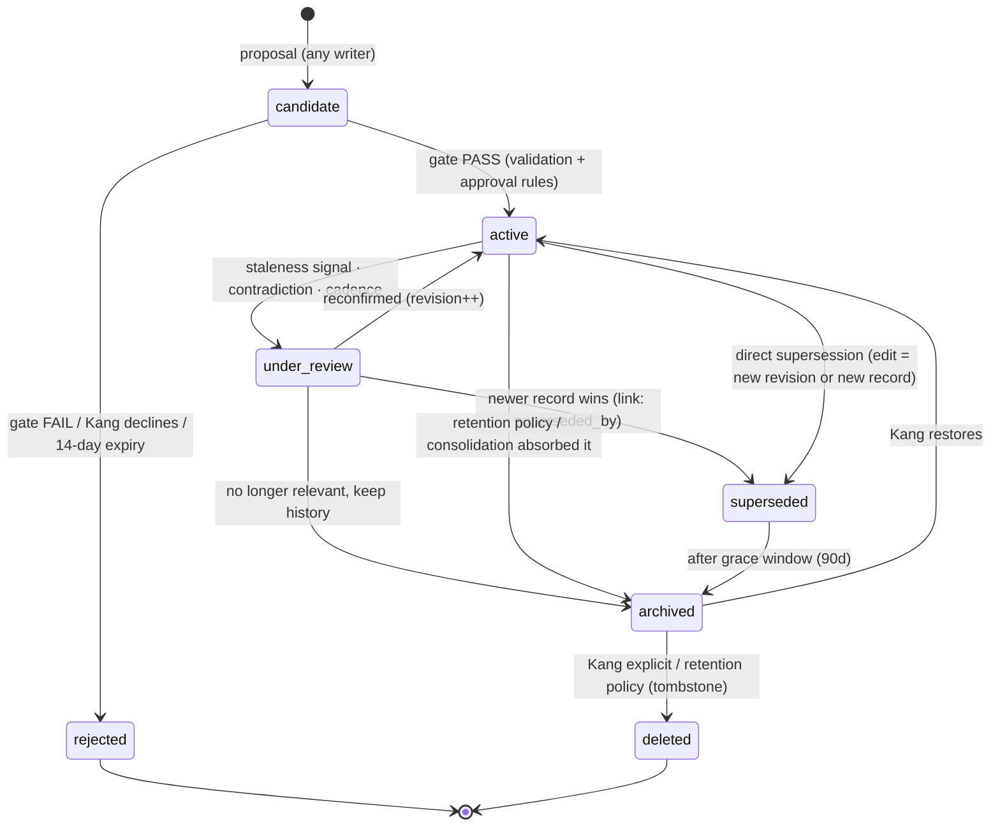
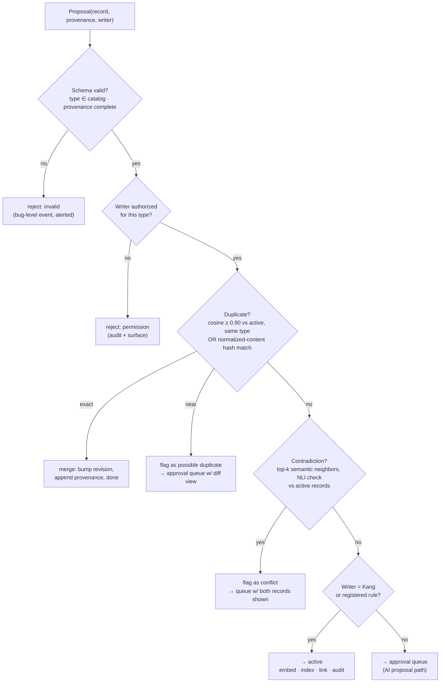

# KANG — Memory System Specification

**Document:** 06_MEMORY.md
**Version:** 0.1
**Author:** Kang, with Claude (Founding Architect)
**Status:** Living — changes require an ADR; this document is normative for all memory behavior
**Last updated:** 2026-07-11
**Upstream (immutable):** `00_VISION.md`, `01_PRINCIPLES.md`, `02_PRODUCT_REQUIREMENTS.md`, `04_ARCHITECTURE.md` (esp. Decision 007)
**Downstream (will depend on this):** `07_DATABASE.md`, `05_AGENTS.md`, `08_PLUGIN_SYSTEM.md`, `12_API.md`

> **Normative language:** MUST / MUST NOT are hard requirements enforced in code. SHOULD is a strong default requiring written justification to violate. MAY is discretionary.

---

## Part I — Philosophy

### 1.1 Why memory is the foundation

Every KANG capability is a function of memory:

- The **Planner** is memory of commitments, projected forward.
- The **Critic** is memory of past failures, applied to new ideas.
- The **Competition Agent** is memory of deadlines, patterns, and prior results.
- The **Second Brain** is memory made navigable.
- **Trust itself** is memory: Kang trusts KANG exactly as far as KANG's recall is accurate.

The models are rented. The UI is replaceable. The agents are disposable configurations (AR5). **Memory is the only component whose value compounds and cannot be repurchased.** Ten years of curated, provenance-carrying, trustworthy memory is the moat identified in `00_VISION.md §8` — and one year of corrupted memory is the fastest route to R9 (trust collapse).

Therefore this subsystem is held to the highest standard in KANG: correctness over convenience, auditability over cleverness, explicit behavior over emergent behavior.

### 1.2 What memory means in KANG

A **memory** is a discrete, typed, provenance-carrying record that KANG is entitled to treat as true (to a stated confidence) about Kang, his work, his world, or his history — and that survives across sessions.

Operative words:

- **Discrete** — one record, one assertion. Not blobs of transcript.
- **Typed** — every record has exactly one type from the taxonomy (Part II), which determines its lifecycle, retention, and retrieval behavior.
- **Provenance-carrying** — a record without origin, author, and reason is invalid *at the schema level* (Part VIII).
- **Entitled to treat as true** — memory is the trusted tier. Things KANG merely *saw* are not memory; things KANG *verified or Kang sanctioned* are.

### 1.3 What memory is NOT

| Not memory | It is | Lives in |
|---|---|---|
| Conversation transcripts | History (queryable, but untrusted raw material) | Conversation store, retention-limited |
| The Obsidian vault | Knowledge (Kang's authored content; source of truth M7) | Vault; memory holds *references + index*, never master copies |
| Model weights / fine-tunes | Prohibited as a memory mechanism (violates M2: not editable, not deletable, not inspectable) | — |
| Caches, embeddings, indexes | Derived, disposable, rebuildable (AR6) | `cache/`, index tables |
| Structured operational state (tasks, deadlines) | Exact state — a *sibling store* queried deterministically, never approximated | Structured store (D004) |
| Anything the model "remembers" in-context | Working memory: assembled, used, discarded (never persisted as-is) | RAM only |

The last row is a hard rule: **an LLM's in-context impression never becomes a memory record without passing the write gate.** This single rule prevents the entire class of "the model quietly convinced itself of something" corruption.

### 1.4 Trust model

Memory operates on a three-tier trust ladder:

```
Tier 0 — UNTRUSTED   : external content (web, email, fetched pages).
                       May be cited, never asserted. Cannot become memory
                       without Kang's sanction or a validation rule.
Tier 1 — OBSERVED    : KANG's own observations (task completed at 14:32,
                       plan generated, quiz scored 7/10). Machine-generated,
                       machine-verifiable. Auto-admissible with provenance.
Tier 2 — SANCTIONED  : Kang said so, confirmed so, or wrote so (vault).
                       Highest trust. Only Kang can create Tier 2.
```

Every record carries its tier. Retrieval exposes it. Agents MUST phrase Tier-0-derived content as attributed claims ("according to the competition page…"), Tier-1 as observations, Tier-2 as facts.

### 1.5 Ownership, explainability, deletion, forgetting — the four covenants

1. **Ownership (M2, P2).** Every record is viewable, editable, and deletable by Kang through the memory browser and API. There are no hidden stores. A memory KANG has that Kang cannot see is a critical bug.
2. **Explainability (P5).** Every record can answer: *where did you come from, why were you kept, who wrote you, when, and what do you link to?* Every retrieval can answer: *why were you included in this context?* Both answers are mechanical (stored metadata + logged scoring), not reconstructed narrative.
3. **Deletion is real.** Delete removes the record, its embedding, its index entries, and its future retrievability. What remains: a tombstone (id + deletion timestamp + actor — no content) so sync and audit stay coherent. Audit log entries that *quoted* the memory before deletion are not retroactively edited (append-only integrity, S5) — this is documented behavior, not a loophole: the audit log is Kang-visible only and is part of Kang's owned data.
4. **Forgetting is designed (M3).** A memory system that only accumulates becomes a landfill; retrieval quality drowns in noise. KANG forgets by *policy* (Part VII): candidates expire, episodes compress into lessons, superseded facts retire. Forgetting is curation, and curation is a feature.

---

## Part II — Memory Taxonomy

### Decision M-001 — A closed, small type system

**Decision.** Memory types are a **closed enumeration** (below). New types require an ADR. Each type fixes: trust tier expectations, default retention, review cadence, write permissions, and retrieval weighting.

**Why.** Types are the control surface for every policy in this document. An open/freeform type system ("just tag it") makes lifecycle, retention, and permission rules unenforceable — every policy would degrade into per-record judgment calls.

**Alternatives.** Freeform tags (rejected: policy anarchy); deep ontology with inheritance (rejected: ceremony without a user; E1); single generic "memory" type with attributes (rejected: policies become attribute soup).

**Trade-offs.** Some records will fit imperfectly; the `observation` and `fact` types absorb edge cases. Accepted.

**Scaling implications.** Ten years of policy evolution happens by *adjusting per-type parameters* (retention days, review cadence, weights), not by schema surgery.

### 2.1 The type catalog

**A. Semantic store types** (table `memory_record`; embedded + FTS-indexed):

| Type | Definition | Exists when… | Trust tier | Default retention |
|---|---|---|---|---|
| `profile` | Durable identity: skills, stack, schools, roles, faith practices | Kang states it, or consolidation promotes a stable pattern (with approval) | 2 | Permanent (review yearly) |
| `preference` | How Kang likes things: coding style, tone, formats, scheduling habits | Kang states it, or ≥3 consistent observations consolidated (approval) | 2 (stated) / 1→2 (promoted) | Permanent until superseded |
| `fact` | Discrete true statement about Kang's world ("school term ends June 12") | Kang states it or verifies a Tier-0 claim | 2 | Type-specific; review on staleness signal |
| `relationship` | People/orgs and their relevance ("Dr. Lee — robotics mentor") | Kang introduces them in a durable role | 2 | Permanent (review yearly) |
| `lesson` | Extracted, reusable conclusion ("I underestimate report time ~2×") | Retrospectives, reviews, consolidation | 1→2 (Kang confirms) | Permanent |
| `rule` | Standing instruction to KANG ("never schedule deep work before 09:00") | Only Kang, explicitly | 2 | Permanent until revoked |
| `observation` | Machine-noted signal, pre-pattern ("3rd Tuesday deadline slip") | System rules during reviews/monitors | 1 | 180 days, then consolidate-or-expire |
| `reflection` | Kang's own recorded thoughts from reviews | Kang writes during review flows | 2 | Permanent (archived after consolidation) |

**B. Episodic store types** (table `episode`; time-indexed; FTS; selectively embedded):

| Type | Definition | Written by | Retention |
|---|---|---|---|
| `episode.plan` | A day's plan as generated + as completed | Planner (Tier 1, rule) | 400 days raw → compressed summary |
| `episode.review` | Evening/weekly/monthly review outputs | Planner/Kang | Permanent (source of lessons) |
| `episode.retrospective` | Project/competition post-mortems | Project/Competition services + Kang | Permanent |
| `episode.session` | Notable learning/research session records | Learning/Research services (rule-gated) | 400 days → compressed |
| `episode.decision` | Significant decisions + reasoning ("skipped competition X because…") | Any service via rule; Kang confirmable | Permanent |

**C. Domain memory views** (NOT new stores — this is important):

"Project memory," "competition memory," and "learning memory" are **views**: the join of structured-store entities with their linked semantic records and episodes (via the link layer, Part IX). They have no independent existence and therefore no independent consistency problems.

**D. Non-persistent tiers:**

- `working` — the assembled context for one invocation. RAM only. Logged by *reference* (record ids) for reproducibility, never persisted as content.
- `candidate` — a lifecycle **status**, not a type: a proposed record awaiting the write gate (Part IV). Candidates live in a quarantine table, excluded from all retrieval.

### 2.2 Structured store (for completeness)

Projects, tasks, milestones, competitions, deadlines, goals, quiz results are **exact state**, specified in `07_DATABASE.md`. They participate in memory via (a) deterministic retrieval in context assembly (always-correct, never vector-approximated) and (b) links. This document governs their *retrieval role*, not their schemas.

---

## Part III — Memory Lifecycle

### Decision M-002 — Explicit state machine, enforced in the store layer



**Transition rules (normative):**

| Transition | Trigger | Actor allowed | Side effects |
|---|---|---|---|
| → `candidate` | Any write proposal | Kang, system rule, AI proposal | Quarantined; invisible to retrieval |
| `candidate` → `active` | Gate pass (Part IV) | Write gate only | Embedding computed; FTS indexed; links resolved; audit entry |
| `candidate` → `rejected` | Gate fail, Kang decline, or 14-day timeout | Gate / Kang / janitor job | Kept 30 days for "why was this rejected?", then purged |
| `active` → `under_review` | Contradiction detected; staleness probe; per-type review cadence | Consolidator, retrieval-time detector | Flagged in memory browser; still retrievable but marked ⚠ contested |
| `under_review` → `superseded` | Resolution names a winner | Kang, or consolidator per resolution rules (Part VI) | Loser gets `superseded_by` link; excluded from default retrieval; history intact |
| `active/superseded` → `archived` | Retention policy or consolidation | Consolidator / Kang | Removed from default retrieval + vector index; FTS-searchable in "deep search" mode |
| `archived` → `deleted` | Kang explicit; or per-type purge policy | Kang / janitor (policy-cited) | Content destroyed; tombstone remains; embedding + index rows removed |

**Why a strict machine.** Every downstream guarantee (no fabrication, explainability, trustworthy retrieval) depends on knowing exactly which records are "live." Fuzzy liveness = fuzzy truth.

**Alternatives.** Soft flags without enforced transitions (rejected: rots into inconsistency); event-sourced memory (append-only versions of every record — considered seriously; rejected as primary model for complexity, but every transition *is* audit-logged, which gives the reconstruction benefit at policy level).

**Trade-offs.** More states = more code paths. Mitigated: transitions are one store-layer function with exhaustive tests (E5).

**Scaling implications.** New policies attach to transitions (e.g., future: "notify on supersession of `rule` types") without new states.

---

## Part IV — The Write Gate

The single most safety-critical component. **All writes — no exceptions, including Kang's — pass through the gate.** For Kang the gate is a formality (auto-pass); for machines it is a checkpoint.

### 4.1 Writers and their rights

| Writer class | Examples | May write | Approval |
|---|---|---|---|
| **Kang (explicit)** | "Remember that…", memory browser, review flows | Any type | Auto-approved (Tier 2) |
| **System rules** | Project archived → retrospective; quiz scored → result; plan generated → episode | Only the types their **registered rule** declares | Auto-approved (Tier 1), rule id recorded as provenance |
| **AI proposal** | Agent believes something is worth remembering | `fact`, `preference`, `lesson`, `observation` candidates ONLY | **Never auto-approved.** Queued for Kang (see 4.3) |
| **Plugins** | Future (v0.4+) | Namespaced types (`plugin:{id}:*`) within granted scopes | Per-plugin grant; consequential = queued |
| **Consolidator** | Merge, compress, promote | Merge products; promotions to `lesson`/`preference` | Merges of same-content auto; **promotions always queued** |

**Hard prohibitions (MUST NOT):**

- No writer may create `rule` or `profile` records except Kang. (A model must never be able to instruct future-KANG or redefine Kang.)
- No AI proposal may reach `active` without an explicit Kang action. There is **no confidence threshold that bypasses this** — see Decision M-003.
- Nothing writes memory from raw conversation automatically (FR-014). A chat message becomes memory only via Kang's explicit save or a registered rule acting on a *structured outcome* (e.g., task created), never on prose.

### Decision M-003 — AI proposals never auto-commit, at any confidence

**Decision.** AI-proposed memories are always queued for Kang's approval. Confidence scores affect *queue ordering and presentation*, never *bypass*.

**Why.** The upstream prompt for this document suggested confidence thresholds for auto-approval. Rejected. A confidence number produced by the same class of system whose reliability is in question cannot be the authorization to write to the trust store — that is the fox scoring its own henhouse audit. A4 ("never fabricate memory") is only enforceable if the model's route into memory has a human valve. The approval cost is bounded and small (see 4.3); the corruption cost is unbounded (R4, R9).

**Alternatives.** Threshold auto-commit ≥0.9 (rejected above); auto-commit low-stakes types only (rejected: "low-stakes" drifts; preferences steer behavior daily); commit-then-review (rejected: poisoned retrieval during the review window is exactly the failure mode).

**Trade-offs.** Genuine insights can sit unapproved; some will expire. Accepted: KANG re-proposes patterns that persist (consolidation), so real signal resurfaces.

**Scaling implications.** If years of data show near-zero rejection for a narrow class, relaxation is *possible* by ADR — the gate architecture doesn't change, one rule does. Start strict; loosen deliberately. (Loosening is easy; re-earning trust is not.)

### 4.2 Gate pipeline



**Required metadata at the gate (schema-enforced, rejection on absence):**

```
id            UUIDv7                    type        ∈ catalog
content       text (1 assertion)       trust_tier  0|1|2
source        enum+detail (see Part VIII)
reason        why this is worth keeping (writer-supplied, human-readable)
created_by    principal id (kang | rule:{id} | agent:{id} | plugin:{id})
created_at    UTC                      device_id   (sync, D009)
confidence    [0,1] (writer's own; display + ordering only)
sensitivity   normal | sensitive | private   (Part XII)
links[]       optional typed links (Part IX)
```

**Duplicate detection.** Two probes: (1) normalized-content hash (case/whitespace-folded) for exact dupes → silent merge with provenance append; (2) embedding cosine ≥ 0.90 against active records *of the same type* → human-visible near-dup flag. Threshold is config (`memory.toml`), tuned after real data; 0.90 is the starting point, chosen conservative-high to avoid false merges (false merge = data loss; false non-merge = mild clutter the consolidator catches later).

**Conflict detection.** For `fact`/`preference`/`rule` proposals: retrieve top-8 same-type semantic neighbors; run a cheap NLI/contradiction check (task class `classification`, D010 — local-model eligible). Contradiction → both records to the queue with a side-by-side. The *proposal* never silently replaces the incumbent, and the incumbent never silently blocks the proposal: **conflicts are surfaced, not resolved by machine** (PRD §12 conflict rule extended to memory).

### 4.3 The approval queue (UX contract)

- Surfaces in dashboard ("Memory: 3 pending") and during weekly review — **never** as interrupting notifications (U7; states, FR-074).
- Each item: content · type · source · reason · confidence · dup/conflict context · one-tap approve / edit-then-approve / reject / "never propose this again" (writes a suppression rule).
- Queue latency target: median < 7 days (weekly review clears it). Items expire to `rejected` at 14 days — silence is a veto, not consent.

---

## Part V — Retrieval Pipeline

### 5.1 Two retrieval regimes (never confused)

| Regime | For | Mechanism | Error mode |
|---|---|---|---|
| **Deterministic** | Exact state: today's tasks, active deadlines, competition dates, grants/rules | SQL over structured store + `rule` records (always included for the acting agent) | None tolerated. A deadline retrieved "approximately" is a critical bug |
| **Relevance** | Semantic/episodic/vault content | Hybrid search + scoring + budgeting | Ranked, degradable, tunable |

The Context Assembler composes both; they never substitute for each other. (This is the load-bearing wall from D007: *vectors are for meaning, not truth.*)

### 5.2 Hybrid relevance scoring

For query context $q$ and record $m$:

$$score(m) = w_s \cdot sim(q,m) + w_x \cdot bm25_n(q,m) + w_r \cdot e^{-\lambda \Delta t} + w_i \cdot imp(m) + w_c \cdot ctx(m)$$

| Term | Meaning | Default weight | Notes |
|---|---|---|---|
| $sim$ | cosine similarity (sqlite-vec), normalized | 0.40 | semantic meaning |
| $bm25_n$ | FTS5 BM25, min-max normalized per query | 0.20 | exact terms, names, codes — vectors miss these |
| $e^{-\lambda \Delta t}$ | recency decay; per-type half-life (episodes 30d; facts 180d; **lessons/rules/profile: λ=0**, no decay) | 0.15 | recent context matters; principles don't age |
| $imp$ | importance ∈ [0,1]: type prior + Kang pin (pin ⇒ 1.0) + access frequency (bounded) | 0.15 | pinning is Kang's thumb on the scale |
| $ctx$ | contextual affinity: link-distance ≤ 2 to the active entity (project/competition/topic) via link index (Part IX) | 0.10 | the graph earning its keep |

All weights + λ live in `memory.toml`. **Retrieval logs the per-term scores for every included record** (see 5.4) — tuning is data-driven, and "why was this included?" is answerable to the decimal.

Filters applied *before* scoring: `status = active` (unless deep-search), sensitivity ≤ caller clearance (Part XII), type ∈ caller's allowed views (Part XI), tier constraints if caller demands (e.g., Critic may request Tier ≥1 only).

**Alternatives considered (scoring).** Pure vector top-k (rejected: misses exact terms, no recency/importance semantics — the standard RAG failure); LLM-as-reranker over large candidate sets (deferred: cost/latency per assembly; MAY be added as an optional final stage for `deep_reasoning` tasks — the pipeline has the slot); learned ranking model (rejected for now: no training data exists; revisit year 2+ with retrieval logs as the dataset — this is a designed future, see Part XV).

### 5.3 Vault retrieval

- The vault indexer (background job) chunks Markdown at heading/paragraph boundaries (target 200–400 tokens, 15% overlap), embeds + FTS-indexes chunks with `note path + heading anchor + mtime`.
- Retrieval returns **excerpt + citation (path#anchor)**, never whole notes by default; the assembler MAY pull the full note when the excerpt's note is the active subject and budget allows.
- Index is derived and disposable (AR6): rebuildable from the vault at any time; staleness detected via mtime sweep + filesystem watcher.
- The vault is never modified by retrieval. Read path and write path (Second Brain filing, FR-062) are separate components with separate permissions.

### 5.4 Citations and the reproducibility contract

Every context assembly produces a **context manifest**, logged with the invocation's correlation id (D015):

```
manifest {
  invocation_id, agent, task_class, model, budget,
  deterministic: [entity ids + query names],
  relevance: [{record_id, score_terms, tier, tokens}],
  vault: [{path#anchor, score_terms, tokens}],
  truncated: [what was cut and why],
  suppressed: [what was filtered: sensitivity/scope/status]
}
```

This is the mechanical substance behind P5: *any* KANG statement traces to invocation → manifest → records → provenance. Manifests retain 180 days (config), content-free (ids only) thereafter.

Agent-facing formatting: memory enters the prompt as quoted, id-tagged blocks (`[MEM:01H…] content — source, date, tier`). The agent contract (`05_AGENTS.md`) requires attributing memory-derived claims to their tags; the runtime spot-checks attribution on `deep_reasoning` outputs (sampled, logged).

---

## Part VI — Consolidation

Consolidation is how memory gets **better** instead of merely bigger. It is also the only component permitted to *create* insight from existing records — which makes it the second-most-dangerous writer after the AI-proposal path, and it is bound by the same gate.

### 6.1 The consolidation jobs

| Job | Cadence | Does | Writes |
|---|---|---|---|
| **Janitor** | Nightly | Expire candidates (14d) / rejected (30d); archive per retention; detect stale facts (staleness probes: date-bearing facts past their date); recompute importance from access stats; index hygiene (orphaned embeddings, mtime sweep) | Status transitions only — never content |
| **Deduplicator** | Nightly | Cluster active same-type records at cosine ≥ 0.90; exact merges auto (provenance union); near merges → queue | Merge products (auto only for exact) |
| **Weekly reviewer** | Weekly (with Kang's weekly review) | Compress week's episodes → `episode.review` summary; surface the approval queue; surface contested records; propose `observation`s from recurring signals | Summaries (rule, Tier 1); observations → **queue** |
| **Pattern extractor** | Monthly | Mine episodes + observations for stable patterns (≥3 occurrences over ≥3 weeks): estimation biases, schedule adherence, win/loss factors from retrospectives; propose promotions `observation → lesson`, repeated stated choices → `preference` | Proposals only → **queue**, evidence-linked |
| **Abstraction pass** | Quarterly | Roll old raw episodes into period summaries (400d policy); propose retiring lessons contradicted by newer retrospectives | Summaries auto; retirements → **queue** |

### 6.2 Rules of consolidation (normative)

1. **Evidence links are mandatory.** Every consolidation product links `derived_from` → its source records. A lesson that can't show its episodes is invalid at the gate.
2. **Compression preserves recoverability windows.** Raw episodes are archived (not deleted) for 90 days after their summary is approved-by-silence (visible in weekly review, no objection). Deletion of raw material follows retention policy, never eagerness.
3. **Promotions are proposals.** `observation → lesson`, inferred `preference`, retirements: always through the queue (M-003). The pattern extractor's job is to make the weekly review *insightful*, not to self-modify KANG's beliefs.
4. **Contradiction resolution protocol:** newer Tier-2 beats older Tier-2 (supersede, keep history); Tier-2 beats Tier-1 beats Tier-0 regardless of age; same-tier ambiguity → `under_review`, surfaced. The machine applies the protocol; Kang can override any outcome.

**Decision M-004 — Consolidation is scheduled, never inline.**
**Why:** inline consolidation (merging during writes/retrievals) creates unpredictable latency and, worse, *unreproducible* retrieval (the store mutating under the reader). Scheduled jobs give stable snapshots between runs, and every run is audit-logged as a batch.
**Alternatives:** continuous background merging (rejected: reproducibility); LLM-driven free-form "memory reflection" (MemGPT-style; rejected: unbounded, ungated self-modification — precisely what M-003 exists to prevent).
**Trade-off:** insights lag by up to a month. Accepted: KANG is a decade system; a month is noise.
**Scaling:** job cadences and batch sizes are config; at 10-year scale, jobs shard by time-window (they're already incremental by design).

---

## Part VII — Forgetting

### 7.1 Retention policy table (the single source of truth; `memory.toml`)

| Class | Active life | Then | Never expires? |
|---|---|---|---|
| `rule`, `profile`, `relationship` | Until revoked/superseded | archived on supersession | Effectively permanent |
| `lesson`, `reflection`, `episode.retrospective`, `episode.review`, `episode.decision` | Permanent | — | **Yes** — these are the compounding asset |
| `preference` | Until superseded | archive superseded after 90d grace | Current one permanent |
| `fact` | Until stale/superseded (staleness probe for date-bearing facts) | `under_review` → archive | No |
| `observation` | 180d | consolidated into lesson, or archived | No |
| `episode.plan`, `episode.session` | 400d raw | compressed to summaries; raw archived → purged at 2y | Summaries permanent |
| `candidate` / `rejected` | 14d / 30d | purged | No |
| Conversation transcripts (non-memory) | 90d default (config) | purged; **explicit saves extracted first** | No |
| Tombstones | Permanent (id + timestamp only) | — | Yes (sync/audit coherence) |
| Context manifests | 180d full → ids-only | — | ids-only permanent |

### 7.2 Decay vs. deletion — kept distinct

- **Decay** = retrieval demotion (recency term, §5.2). Reversible, continuous, automatic. A decayed record is *findable* (deep search), just not *volunteered*.
- **Archival** = out of default retrieval + vector index; in FTS deep search. Reversible by Kang in one click.
- **Deletion** = destruction + tombstone. Only Kang, or a purge policy that was itself Kang-visible in `memory.toml`. **The janitor cites the policy line in its audit entry for every purge.**

**Recovery:** daily DB snapshots (D016) mean a mistaken deletion is recoverable for 30 days via backup restore of the record (memory browser: "restore from snapshot" for single records — implemented as snapshot-attach + row copy). After 30 days, deletion is final. This window is documented to Kang in the deletion confirmation.

### 7.3 What never expires — stated plainly

Lessons, retrospectives, reviews, decisions, rules, profile, relationships, and reflections are **permanent by default**. They are the distilled decade. Everything else exists to eventually produce them or to serve the operational present. If storage ever mattered (it won't — Part XIII), everything *except* these classes is negotiable.

---

## Part VIII — Provenance

### 8.1 The six questions, mapped to schema

| Question | Field(s) | Enforced |
|---|---|---|
| Where from? | `source` = `{kind: stated \| observed \| vault \| web \| rule \| consolidation, detail: url/path/rule-id/invocation-id, quote?: original text}` | NOT NULL, kind-specific detail validation |
| Why kept? | `reason` (writer-supplied, human-readable) | NOT NULL, non-empty |
| Who created? | `created_by` principal | NOT NULL, must be a registered principal |
| When? | `created_at`, plus full `revision` history (prior contents on edit) | Automatic |
| Trusted? | `trust_tier` + `confidence` + current `status` | NOT NULL |
| Reproducible? | For derived records: `derived_from` links; for retrievals: context manifests | Gate-enforced for consolidation products |

**Missing provenance is not a warning — it is a schema violation.** A record cannot exist without it (M4 made mechanical). Migration note for the far future: if a store version ever changes provenance shape, migrations must map old→new losslessly or refuse to run.

### 8.2 Revision semantics

Edits never overwrite silently: `revision` increments; prior content is retained in `memory_revision` (id, revision, content, edited_by, edited_at). Kang's memory browser shows history per record. This is cheap (edits are rare) and buys total auditability of the trust store.

---

## Part IX — Relationships (the Link Layer)

Per D008: links live in their sources of truth; the `link_index` is a derived merge. This section fixes the **type vocabulary** and the memory-side rules.

### 9.1 Link types (closed enum, ADR to extend)

| Type | Meaning | Typical endpoints |
|---|---|---|
| `relates_to` | Generic relevance (weakest; use sparingly) | any ↔ any |
| `derived_from` | Consolidation/extraction evidence chain | lesson → episodes; summary → raws |
| `supersedes` / `superseded_by` | Truth succession | fact↔fact, preference↔preference |
| `contradicts` | Unresolved tension (drives `under_review`) | fact↔fact, lesson↔lesson |
| `about_project` / `about_competition` / `about_goal` | Domain anchoring (powers the domain views, §2.1C) | memory/episode → structured entity |
| `about_person` | Relationship anchoring | memory → relationship record |
| `references_note` | Memory ↔ vault | memory → path#anchor |
| `from_conversation` | Origin pointer | memory → conversation id (survives transcript purge as id-only) |
| `evidence_for` / `evidence_against` | Critic's substrate — lets critique cite memory both ways | any → lesson/claim |

Rules: links are typed, directed, provenance-carrying (who created the link, when, why — same discipline as records). AI-*proposed* links (FR-063) queue like AI-proposed memories, except `relates_to` suggestions inside the memory browser, which are accept/dismiss inline (low stakes, high volume — the one deliberate ergonomic exception, recorded here).

### 9.2 Graph duties of the memory system

- Maintain `link_index` freshness for memory-originated edges (indexer contract with D008).
- Serve the `ctx` scoring term (§5.2): link-distance ≤2 queries, answered from the index in <10ms (recursive CTE, verified in `07_DATABASE.md` benchmarks).
- Power "what do I know about X?" (FR-064): resolve X → entities/notes/records; expand 1–2 hops; assemble a cited digest via the standard pipeline. This query is the flagship consumer of the whole Part.

---

## Part X — Search (Kang-facing)

Distinct from agent retrieval: Kang searching his own memory in the browser UI.

- **Default mode:** hybrid (same scorer as §5.2, `ctx` weight 0 unless an entity filter is set), across active records, with type/tier/date/sensitivity filters as first-class UI facets.
- **Deep mode:** includes archived + superseded (badged), FTS-weighted (exact recall over semantic vibes — when Kang is hunting, terms beat themes).
- **Structured mode:** direct filters/queries over structured entities (no scoring — exact).
- **Failure honesty:** zero-hit ⇒ "nothing in memory matches" + nearest-miss suggestions clearly labeled as *not matches*. The search UI never pads results to seem useful (P3 applies to interfaces too).
- Latency budgets: §XIII.

---

## Part XI — Context Assembly Recipes (per agent)

The Context Assembler executes a **recipe** per agent/task: which deterministic queries, which memory views, which weights override, what budget split. Recipes are config (`assembly/*.toml`), versioned, and logged in manifests.

**Budget model.** Token budget B per invocation (from TaskSpec, D010). Split by priority classes; unused budget cascades downward; truncation is bottom-up (P4 cut first), always recorded in the manifest.

| Class | Content | Share of B |
|---|---|---|
| P0 | Deterministic state (exact, never truncated — if P0 alone exceeds B, the invocation *fails loudly* rather than truncating truth) | up to 30% |
| P1 | Standing context: applicable `rule`s (always), pinned records, relevant `profile`/`preference` | 15% |
| P2 | Task-relevant semantic (scored) | 30% |
| P3 | Vault excerpts (scored) | 15% |
| P4 | Episodic background (scored) | 10% |

**Recipes (initial set; tuned by manifest data later):**

| Agent | P0 deterministic | Views allowed | Weight overrides | Notes |
|---|---|---|---|---|
| **Planner** | today+7d tasks/deadlines/events; active projects; capacity signals | preferences, lessons(planning), observations, recent plan-episodes | recency ↑ (0.25) | Plan quality lives on P0 + calibration lessons |
| **Competition** | the competition entity, its deadlines, linked project state | competition view (links), lessons(competitions), retrospectives, profile(skills) | ctx ↑ (0.20) | Retrospectives are the differentiator — surface prior wins/losses |
| **Learning** | active learning goals, quiz history (aggregates), repetition queue | learning view, preferences(study), lessons(learning) | importance ↑ | Quiz aggregates are P0 (exact), not vibes |
| **Research** | the research question entity, linked project | vault-heavy (P3 ↑ to 30%), prior briefs, lessons(research) | bm25 ↑ (0.30) | Terminology precision matters; external content stays Tier-0-framed |
| **Critic** | the artifact under review + its stated goals | `evidence_for/against` expansions, lessons, retrospectives, contested records **included** (⚠-tagged) | tier-filter ≥1 | The Critic deliberately sees contradictions others are shielded from |
| **Chat (general)** | today's plan, active entities mentioned | broad but shallow: k small per view | defaults | Escalates to a specialist recipe when routed (D011) |
| **Faith** | reading plan state, memorization queue | faith-scoped records ONLY; `private` clearance per grant | — | Hard-isolated view; see Part XII |

**Conflict handling in assembly:** if retrieved records contradict (`contradicts` link or NLI flag), the assembler includes **both** with the ⚠ marker and the agent contract requires acknowledging the tension — agents never get a silently pre-resolved world. (Exception: P0 exact state has no contradictions by construction — single source of truth.)

---

## Part XII — Security & Privacy of Memory

### 12.1 Sensitivity levels

| Level | Meaning | Behavior |
|---|---|---|
| `normal` | Default | Standard scoping |
| `sensitive` | Kang-flagged or rule-flagged (health, grades, finances, relationships) | Only agents with explicit `memory.read:sensitive` grant; **never** to Tier-0-adjacent contexts (web-tool-holding agents); redacted in logs/manifests (ids only) |
| `private` | Prayer journal; anything Kang marks private | **Encrypted at rest** (app-level, age/libsodium, key in OS keychain — decision deferred to `07_DATABASE.md §encryption` per D013); excluded from *all* retrieval and consolidation except the explicitly-granted agent (Faith) under a `private`-tier TaskSpec, which routes **local-model-only or fail-closed** (D010) |

### 12.2 Memory scopes (permission engine, D013)

Grants are `memory.read:{type-list or view}` and `memory.write:{type-list}` per principal, default-deny. Concrete floor: the Research agent holds `web.fetch` and therefore MUST NOT hold `memory.read:sensitive` — **the read/act separation from D013 §14.2 applied to memory**: no principal combines untrusted-input tools with sensitive-memory reads. This pairing rule is validated at grant time (permissions.toml linter), not just at runtime.

### 12.3 Audit specifics for memory

Audited: every gate decision (incl. rejections), every transition, every deletion (with policy citation), every sensitive/private access (principal + invocation), every consolidation batch (inputs → outputs), every export. Not audited at content level: routine `normal` reads (manifest ids suffice — volume would drown the log's usefulness).

---

## Part XIII — Performance & Scale

### 13.1 Honest scale estimates (one prolific human)

| Horizon | memory_record | episodes | vault chunks | links | DB size (incl. vectors) |
|---|---|---|---|---|---|
| 1 year | 2–5k | 3–6k | 20–50k | 10–30k | 0.5–1.5 GB |
| 5 years | 15–30k | 15–30k | 100–250k | 80–200k | 3–8 GB |
| 10 years | 30–60k | 30–60k | 200–500k | 150–400k | 6–15 GB |

(Assumptions: ~5–15 gated memories/day peak, heavy consolidation compression, 384–768-dim embeddings quantized where supported. These are generous; reality will likely run lower.)

**Conclusion the estimates force:** this is *small data*. Every architectural temptation toward heavier machinery (vector servers, graph DBs) dies against this table. SQLite + sqlite-vec at 10-year scale is operating at a fraction of capacity. The scaling axis that matters is **retrieval quality under noise** — solved by curation (Parts VI–VII), not infrastructure.

### 13.2 Latency budgets (measured in CI on 5-year synthetic corpus)

| Operation | Target |
|---|---|
| Deterministic P0 queries | < 20 ms |
| Hybrid relevance (k=64 candidates → scored) | < 300 ms |
| Full context assembly (typical recipe) | < 800 ms |
| Kang search (default mode) | < 1 s (FR: "search is fast") |
| Gate pipeline (excl. human queue) | < 2 s incl. NLI check |
| Link-distance ≤2 query | < 10 ms |
| Janitor/dedup nightly batch | < 5 min, off-hours (Sleeping state) |

A **synthetic corpus generator** (5-/10-year profiles) is part of the memory test suite from v0.2 — performance claims are tested claims (E5), not hopes.

### 13.3 Maintenance jobs (roll-up)

Nightly: janitor, dedup, index hygiene, vault mtime sweep. Weekly: reviewer, queue surfacing. Monthly: pattern extraction, restore-test (D016), embedding-drift sample check (XIV-6). Quarterly: abstraction pass, retention audit (policy vs. reality diff, reported).

---

## Part XIV — Failure Scenarios & Recovery

| # | Failure | Detection | Response | Recovery |
|---|---|---|---|---|
| 1 | **DB corruption** | SQLite integrity_check (daily, pre-backup) | Fail loudly; freeze writes; dashboard alert | Restore last good snapshot (≤24h loss); event log replays newer Tier-1 writes where possible |
| 2 | **Missing provenance** (should be impossible) | Schema + weekly consistency scan | Quarantine record (retrieval-excluded), alert as **bug-severity** | Kang triage: repair provenance or delete; root-cause the writer |
| 3 | **Duplicate flood** (e.g., a misbehaving rule) | Gate dup-rate metric spike | Auto-disable the offending rule (quarantine, D014 pattern); queue the batch | Batch-reject UI; rule fixed before re-enable |
| 4 | **Conflicting facts accumulate** | `under_review` count metric | Weekly review surfaces top conflicts; assembler ⚠-tags | Kang resolves; protocol (§6.2.4) handles tier-clear cases |
| 5 | **Vault note deleted/moved** → dangling `references_note` | Indexer sweep | Link marked `broken` (not deleted — the *fact that it linked* is information); excerpt cache dropped | Kang: relink or accept; bulk-fix UI for moves (path-prefix rewrite) |
| 6 | **Embedding model change/drift** | Version stamp on every embedding; drift sample check monthly | Dual-index during migration: re-embed in background (cache-friendly batches), cut over atomically, drop old | Rebuildable-by-design (AR6); FTS carries retrieval during re-embed |
| 7 | **Model hallucination reaches an answer** (not memory — gate blocks memory) | Attribution spot-checks (§5.4); Kang reports | Correction flow: Kang's correction becomes a Tier-2 record; the wrong claim, if from a record, drives that record to `under_review` | The system *learns from being wrong* — corrections are first-class memory |
| 8 | **Approval queue neglect** (weeks away — NFR-008) | Queue age metric | Items expire per policy (silence = veto); nothing auto-commits *because* of neglect | Catch-up: weekly review shows "expired while away" digest; re-proposal by consolidator if patterns persist |
| 9 | **Clock skew / device time wrong** | Monotonic checks vs. last-known timestamps | Refuse gate writes with past-dated `created_at` beyond tolerance; alert | Manual clock fix; UUIDv7 ordering degrades gracefully |
| 10 | **Sync conflict (future, D009)** | Revision divergence on same record | Field-level LWW + conflict record surfaced (never silent) | Kang adjudicates; both versions preserved in revision history |

**The meta-rule:** every failure mode resolves toward *visible degradation* (fewer/flagged memories) and never toward *silent corruption* (wrong memories). When in doubt, the system quarantines and asks.

---

## Part XV — Future Evolution (designed-for, not built)

| Future | What's already in place | What gets added (later ADR) |
|---|---|---|
| **Local models take over** | Task classes route gate NLI, embeddings, classification (D010); privacy tiers exist | Config drift, no redesign — the Ten-Year Dream path |
| **Mobile/multi-device** | UUIDv7 + revision + device_id on every record; outbox (D009); tombstones | Sync engine v0.5; read-mostly mobile hits the same API |
| **Plugin memory** | Namespaced types, scoped grants, same gate | SDK surface in `08_PLUGIN_SYSTEM.md`; plugin data is Kang's data (export includes it) |
| **Learned retrieval ranking** | Every manifest logs per-term scores + (implicitly) usefulness signals; correction flow labels errors | Year-2+: train a small reranker on Kang's own retrieval history — the logs *are* the dataset, by design |
| **Long-term reasoning / pattern learning** | Permanent lesson/retrospective classes; evidence-linked consolidation; episodic store shaped for mining | Richer extractors as models improve — all still gate-bound (M-003 holds forever) |
| **Knowledge extraction from vault** | Chunk index, link vocabulary, `references_note` | Permanent-note suggestion flows (PRD §10.10 future) |

**The invariant across all evolution:** new intelligence changes what can be *proposed*, never what can be *committed*. The gate, provenance, ownership, and the four covenants (§1.5) are the constitution of this subsystem — everything else is amendable.

---

## Appendix A — Configuration surface (`memory.toml`, excerpt)

```toml
[gate]
duplicate_cosine = 0.90
candidate_expiry_days = 14
rejected_purge_days = 30

[scoring]
weights = { semantic = 0.40, lexical = 0.20, recency = 0.15, importance = 0.15, context = 0.10 }
half_life_days = { episode = 30, fact = 180, lesson = 0, rule = 0, profile = 0 }  # 0 = no decay

[retention]
observation_days = 180
episode_raw_days = 400
conversation_days = 90
manifest_full_days = 180

[assembly]
budget_shares = { p0 = 0.30, p1 = 0.15, p2 = 0.30, p3 = 0.15, p4 = 0.10 }
```

Every number above is a starting hypothesis, tunable with data, and *documented as such*. The structure is the commitment; the constants are not.

---

*This document is normative for `07_DATABASE.md` (schemas/encryption), `05_AGENTS.md` (recipes/attribution contract), `08_PLUGIN_SYSTEM.md` (plugin memory), `12_API.md` (memory endpoints).*
