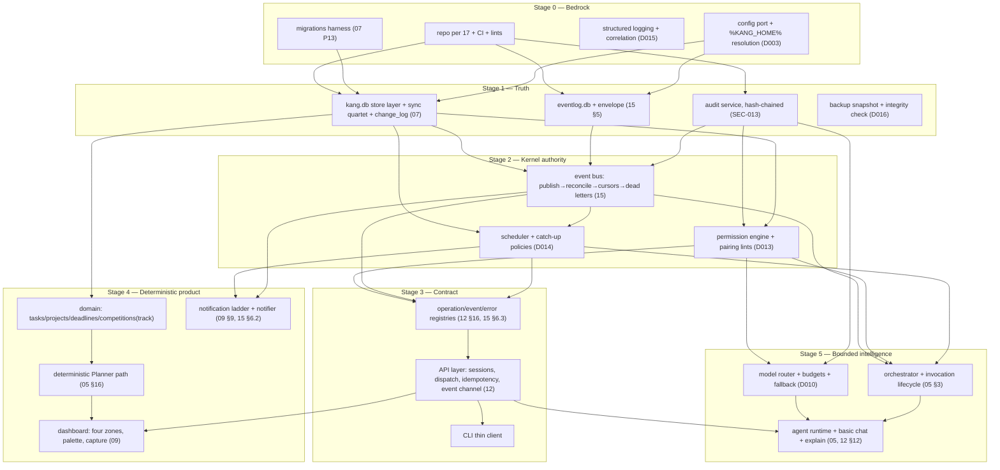

# KANG — Implementation Master Plan

**Document:** 18_IMPLEMENTATION_MASTER_PLAN.md
**Version:** 0.1
**Author:** Kang, with Claude (Founding Architect)
**Status:** Normative for build order and engineering process — RFC-2119 throughout; changes require an ADR; decision prefix `IM-*` (claimed in `docs/INDEX.md` §4.4)
**Last updated:** 2026-07-12
**Upstream (binding):** the entire constitution, transitively; directly: `03_ROADMAP.md` (phase law), `11_CODING_STANDARDS.md` (DoD, CI, debt), `13_TESTING.md` (suites, gates), `17_PROJECT_STRUCTURE.md` (where everything lands), `04_ARCHITECTURE.md` (D001–D016), `15_EVENT_BUS.md`, `07_DATABASE.md`, `05_AGENTS.md`, `12_API.md`
**Role:** the bridge between architecture and engineering. It answers exactly one question: **"If a new engineer cloned the repository today, what should be built, in what order, and why?"**

---

## 0. IM-001 — Boundary With the Roadmap (so two documents never fight)

**Decision.** `03_ROADMAP` owns **product phases**: what each version means in Kang's life, its objectives, and its *product* exit criteria (e.g., "two consecutive weeks of daily use"). This document owns **build order and engineering process**: the dependency-true construction sequence inside and across those phases, the integration checkpoints, and the policies of building. Where 03 says *what a phase delivers and when it's truly done*, 18 says *in what order its parts rise and what gates each part*. Neither restates the other; both cite.

**Why.** A roadmap and a build plan drift into contradiction the moment they both describe the same thing at different resolutions. One resolution per document (the anti-duplication rule, 15/INDEX §4.1).

**Implication.** 03's phase exit criteria are cited here as **phase gates** and never rewritten. This document adds **stage gates** (engineering criteria) *inside* phases — a finer grain 03 deliberately does not carry.

---

## 1. Build Philosophy

1. **Walking skeleton first (IM-002).** The first buildable milestone is the thinnest possible end-to-end system — one command through API → kernel → store → event → audit → explain — with every architectural discipline already active. Breadth of the spine before depth of any organ. **Why:** every constitutional mechanism (imports, audit, correlation, idempotency, migrations) is cheapest at 500 lines and ruinous to retrofit at 50,000 (03 §2's stated risk, made the plan's first principle).
2. **Disciplines ship at commit zero.** Import-linter contracts, size lints, banned-pattern lints, the sync quartet, correlation ids, structured logging, migrations harness, CI commit tier — all active **before the first feature line** (03 §2 required infrastructure; 11 §17). A lint adopted late is a lint fighting history.
3. **Deterministic before cognitive (§7.6).** Every stage that can be proven with zero model calls is built and gated before the stage that spends judgment or money.
4. **Infrastructure precedes its consumer by one phase, never more** (03 §1.3 — cited as binding on all sequencing below).
5. **Every stage pays its own testing bill** (03 §1.5): the 13_TESTING suites guarding a component arrive in the same stage as the component. A stage without its suites cannot pass its gate by definition.
6. **Order is dependency-true, not excitement-true.** The sequence below is derived from the constitution's own dependency edges (§2). Deviating from it MUST cite which edge changed.

---

## 2. The Build Graph

Nodes are constitutional components; edges are *hard build dependencies* ("cannot be built correctly before"). This graph — not enthusiasm, not difficulty — determines order.



**Critical path (the chain that cannot compress):**
`repo+lints → store layer + eventlog → event bus (with reconciliation) → permission engine → registries → API → deterministic Planner + dashboard → two-week daily-use gate (03 §2)`.
Everything else in Phase 1 hangs off this chain in parallelizable branches (§5). The single longest-lead risk item *off* the path is the **Tauri spike** (§10.4), which MUST complete before UI1 work commits.

---

## 3. Milestones and Stage Gates (Phase 1 / v0.1, at build resolution)

Each milestone: **Builds / Proves / Gate (CI + checkpoint that MUST be green to advance).** Product-level exit for the whole phase remains 03 §2's, cited, never restated.

### M0 — Bedrock
- **Builds:** repository exactly per 17 §2 (empty packages legal only with their import-contract entries); CI commit tier (11 §17: format → lint contracts → unit); migrations harness with migration 0001; config port; structured logging with correlation ids; `tools/` linters.
- **Proves:** a trivial domain entity travels migration → store → test, with every lint enforcing on real code.
- **Gate:** import-linter red-tests (deliberate violations fail); 13 §2.1 architecture suite skeleton green; tree-hygiene lint (PS-002) active.

### M1 — Truth exists and survives
- **Builds:** `kang.db` store layer (repositories over ports; sync quartet + change_log triggers from migration one — D009); `eventlog.db` per 15 §5.2; audit service (append-only, hash-chained, the only writer — SEC-013); daily snapshot + integrity check + restore verification harness.
- **Proves:** **Checkpoint C1 — the restore drill:** snapshot → corrupt live → restore → field-equality → gap replay (13 §2.15/07 P12) passes synthetically.
- **Gate:** schema linter (quartet presence, enum CHECKs, index citations); migration up-tests; audit chain verification test.

### M2 — Facts move and survive murder
- **Builds:** the bus complete: publish path with envelope validation, per-subscriber cursors, retry→dead-letter, **ghost-event reconciliation caged in one module** (15 §4), event-type registry with `recovery_grade`.
- **Proves:** **Checkpoint C2 — first kill:** fault-injected kill between every write-order step pair → restart → convergence, no partial truth (15 §16.1; 03 §2 milestone "first event replayed after a kill").
- **Gate:** replay suite (13 §2.5) green; payload-sufficiency tests for every recovery-grade type (15 §16.2); poison-event test (15 §16.4).

### M3 — Authority exists before anything can act
- **Builds:** permission engine (default-deny, scopes, pairing lints at grant time); scheduler with the three catch-up policies; the consequential-action gate plumbing (held actions as data, even before UI renders them).
- **Proves:** **Checkpoint C3 — catch-up after simulated downtime** (03 §2 milestone); property suite: every principal × ungranted scope ⇒ typed denial + audit + zero side effects (13 §2.7).
- **Gate:** permission property suite green; denial paths audited; kill-switch command exists and is tested.

### M4 — The contract precedes its clients
- **Builds:** operation/event/error registries as served truth (12 §16); API layer (sessions, schema validation, idempotency keys, correlation at ingress, event channel with cursor resume); CLI as first client.
- **Proves:** conformance suite: every registered operation vs. schema/idempotency/scopes/errors (13 §2.4); a scripted CLI session exercises command→event→query end to end.
- **Gate:** API conformance green; registry diff gate armed (removals without deprecation fail); **Checkpoint C4 — first `kang explain`** reconstructs a full chain from persisted data alone (03 §2 milestone; 12 §12).

### M5 — The deterministic secretary
- **Builds:** domain areas tasks/projects/deadlines/competitions-tracking; the deterministic Planner path (**release-blocking zero-model path, built before any model exists to fall back from** — 05 §16); notification queue + ladder + notifier; calendar-read stub.
- **Proves:** determinism suite: same inputs ⇒ identical plan, byte-identical ordering (13 §2.6); deadline lifecycle: create → approach event → notification per ladder → acknowledge, fully offline.
- **Gate:** determinism suite green; a full simulated week (fixture scenario) produces every morning plan with zero model calls.

### M6 — Kang can see it
- **Builds:** dashboard (four constitutional zones, palette navigation, quick capture, permission screen, unique confirm dialog — 09); Tauri shell (spike §10.4 already passed); UI on the generated client only.
- **Proves:** capture < 5 s measured; "what can KANG touch?" answerable from the permission screen (03 §2 exit items, verified at build level now, in life later).
- **Gate:** client contract tests (unknown-field tolerance); UI render-tree snapshots (13 §2.6); zero non-client imports (structural, verified).

### M7 — Bounded intelligence enters a finished envelope
- **Builds:** model router (one provider + fallback-to-deterministic + budget ledger); orchestrator (admission, idempotency, caps); agent runtime; basic chat with basic context; degraded-mode marker end to end (04 §18.2's walkthrough, automated).
- **Proves:** provider-outage scenario: plan generates degraded-with-marker, non-AI content exact; ledger reconciles.
- **Gate:** recorded/replayed HTTP only in CI (13 §2.3); budget cap enforcement tested; **then Phase 1's product gate begins: 03 §2's two-week daily-use exit, which no CI can green** — it is lived, not run.

---

## 4. Phases 2–5 at Build Resolution (delta over 03, no restatement)

| Phase | Build-order law added by this document | Phase gate |
|---|---|---|
| **2 — Memory** | Order within: synthetic corpus generator **first** (every later suite stands on it — 03 §3); then store schema for memory/episodes/queue → write gate + provenance enforcement → embeddings + dual-index versioning protocol (tested on the corpus **before** first real embedding) → hybrid retrieval → Context Assembler + manifests → memory browser UI → Obsidian read/index → evening review. The gate (M-003) is built before retrieval is wired to any agent — **policy before power** | 03 §3 exit + memory integrity suite (13 §2.8) green on corpus + byte-identical manifest proof |
| **3 — Specialists** | Order within: multi-provider routing + budget ladders + emergency reserve **before** the first cognitive agent that can spend (03 §4); injection red-team suite joins CI **with** the first Tier-0-input agent, not after; agents arrive as definitions in dependency order of their pipelines (scout → strategist → critic → researcher → tutor); each agent's zero-model degradation path is built and tested **with** the agent | 03 §4 exit + provoked-quarantine drill passed + budget ladder tests green |
| **4 — Platform** | SDK surface extracted **from** the stabilized Phase-3 interfaces (never invented ahead of them); fixture plugin + conformance suite **before** the first real plugin; the 2–3 real plugins built **inside** this phase are the SDK's acceptance test (03 §5's mitigation, sequenced as law); PL-004 deprecation duties activate only at v0.4 tag | 03 §5 exit + zero-core-diff plugin proof + conformance catches a planted SDK break |
| **5 — Expansion** | `16_SYNC.md` written **before** any sync code (03 §6; the change_log has by now years of exercised capture); sync convergence suites extend the replay harness (13 §7) before the engine lands; each objective (sync, local models, voice, email/Chrome, consolidation, automation) is its own release with its own trigger-readiness — **calendar order between them is explicitly not defined here** | Per-objective; v1.0 readiness per §9.8 |

---

## 5. Parallelizable Work (and what MUST NOT be parallelized)

**Legal parallel tracks** (disjoint owners per 17 §3, no shared gate):
- Within M1: audit service ∥ store layer (meet at M2's bus).
- M4's CLI ∥ M5's domain services (both ride the registry).
- M6 UI ∥ M7 router/orchestrator (UI needs neither).
- Fixture/corpus tooling ∥ everything (tests/fixtures has no inbound edges).
- Documentation deltas (15 §17, 17 §18) ∥ any stage.

**Illegal to parallelize (IM-003):** anything with its gate-dependency still red. Concretely: no domain service before M1's store gate; no bus consumer before M2's reconciliation checkpoint; **no UI screen before M4's registry serves its operations** (a screen built against an imagined contract *is* a second contract); no agent before M7's envelope; no plugin before Phase 4's fixture-plugin suite. Parallelism is taken from the graph's independent branches, never stolen from its edges.

---

## 6. Integration Checkpoints (the named proofs)

C1–C4 (§3) plus the standing rhythm: **every stage ends by running the full scripted-week scenario as it exists so far** — the scenario grows with the system (13 §2.5's fixture is cumulative, not per-stage). A stage that passes its own suites but breaks the scenario has integrated a lie; the scenario is the arbiter.

---

## 7. The Explicit Questions, Answered With Citations

### 7.1 Why Event Bus before Agents?
Three dependency-true reasons. (1) Agents' trigger modes, idempotency keys, and at-least-once tolerance are defined *on* bus semantics (05 §6, AGP-3) — building agents first means building them against an imagined bus. (2) The bus is half of the durability story: the DB-001 pairing (07) makes eventlog-before-state the crash-recovery mechanism; agents writing truth before that net exists would write unprotected truth. (3) The bus is deterministic and kill-testable; agents are cognitive. Validating the substrate that *carries* judgment before the judgment arrives is §7.6 applied. The Orchestrator (agents' authority) also composes bus + scheduler + permissions — all three must exist first (§2's edges).

### 7.2 Why Database before Memory?
Because Memory is **policy over a store**, not a store (06's layered model rides 07's schema). The write gate needs transactions + provenance-rejecting constraints + audit to enforce M-003 mechanically; the Context Assembler needs the structured/semantic/episodic tables to assemble from. And the parts of the database that Memory (and later Sync) depend on — sync quartet, change_log, revision discipline — are constitutionally *unretrofittable* (D009: "cheap now, impossible later"). Schema-bearing truth precedes every policy that governs it.

### 7.3 Why API before UI?
UI-P1: the UI is a **pure client**. The registry is the contract's single source of truth (12 §16), and clients are *generated/verified against it, never against prose* — which is only possible if the registry exists first. A UI built first necessarily invents an informal second contract that the real API must then honor — inverted authority, permanent drift (the "temporary direct DB access" debt 03 §2 names as never-start). The CLI lands first among clients deliberately: it is the cheapest full exercise of the contract.

### 7.4 When should Plugins begin?
**Interfaces at Stage 0; SDK at Phase 4** — both halves are law. The extension-point *ports* exist from the first commit because retrofitting extension points into a closed core is a rewrite (D012: "the interfaces are drawn now"). But the SDK — the frozen, semver-bound public surface (08 §6) — is extracted only after Phase 3 stabilizes the agents/pipelines/recipes it exposes (03 §5's dependency), and it is validated by Kang's own real plugins before PL-004's deprecation duties begin. Freezing an interface over unstable abstractions is the roadmap's named costliest mistake; this split is its prevention.

### 7.5 When should Sync begin?
**Its data discipline at migration 0001; its document at Phase 5 entry; its engine after the document** (D009, 03 §6). The quartet, change_log, and tombstones ship with the very first schema and are *exercised and tested from day one* (07 §5.6) — so v0.5 builds on years-proven capture. The engine itself is the highest-risk subsystem (silent corruption = trust collapse) and is deliberately last, informed by real single-device experience. Building sync earlier is the constitution's canonical example of speculation (R6).

### 7.6 How are deterministic systems validated before AI systems?
Structurally, in three enforced ways. (1) **Order:** M0–M6 contain no model call; the entire kernel, contract, and product spine pass kill-tests, determinism suites, and a lived scenario before M7 introduces a provider. (2) **Degradation paths are built forward, not backward:** the deterministic Planner path exists *before* the model path (M5 before M7), so "fallback" is demonstrably the original, tested artifact — release-blocking per 05 §16. (3) **The determinism suite (13 §2.6) is a permanent gate**, so later cognitive features cannot erode the deterministic floor without a red build. AI is admitted only into an envelope that already ran for weeks without it.

### 7.7 What absolutely MUST NOT be built early?
The 04 §19 anti-overengineering contract, plus this document's additions, as one binding list:
brokers/microservices · vector DB server · graph database · CRDT engine · plugin sandboxing (before a third-party plugin) · sidecar transport (before a sidecar) · multi-user anything · auto-updater (never) · **the sync engine before 16_SYNC** (§7.5) · **the SDK freeze before real internal consumers** (§7.4) · **any UI before its operations exist in the registry** (§7.3) · **cognitive agents before their deterministic floors** (§7.6) · consolidation intelligence before years of episodes (03 §6) · `email.send`/`shell` tools (not deferred — absent by decision, 05 §12) · speculative reserved folders (PS-006) · a second dispatch abstraction (EB's §2, "no internal command bus").
Each entry carries its trigger in its cited source; between triggers, "shouldn't we…" is a lookup (03 §1.4).

---

## 8. Engineering Policies During Implementation

1. **Definition of Done** — 11 §16's nine gates, cited whole, plus this document's addition: the stage's checkpoint (§3/§6) green, and the cumulative scenario passing. No stage-local redefinitions of done exist.
2. **Rollback strategy (IM-004).** Three scopes, all pre-decided: *code* — revert the PR; every merge is revertible because features carry file manifests (AR8, 11 §5) and registries version additively. *Schema* — migrations are forward-only with a tested downgrade note per release (D016); rollback of shipped schema = restore-from-snapshot + gap replay (07 P12), which is why C1 gates M1. *Release* — the staged update path (back up → migrate copy → verify → swap) is itself the rollback mechanism: a failed verify never swaps. There is no fourth scope; "roll back by patching forward under pressure" is forbidden.
3. **Technical debt** — 11's regime governs (visible `DEBT(#)` markers with issues; no TODO; hard-limit exceptions reported). This document adds: **debt raised against a stage gate blocks the gate** — a stage cannot exit owing debt to its own checkpoint; it can owe polish, never proofs.
4. **ADR policy during implementation.** Implementation discovering a constitutional error follows the closing line: *one of them is wrong on purpose — file the ADR.* Code MUST NOT quietly diverge "to be fixed in docs later"; the deltas-table mechanism (INDEX §6.5) is the only sanctioned holding state. During Phase 1, expect ADR density to be highest — that is the constitution being load-tested, not failing.
5. **Prototype policy (IM-005).** Spikes are legal, bounded, and **never merge**: a spike answers one named question, lives on a branch or scratch tree, and its output is a decision (ADR or config), not code. Two spikes are already constitutionally mandated *before* their dependents: the **Tauri global-hotkey/tray spike before M6 commits** and the **embedding benchmark on Kang's real vault before Phase 2's model choice** (04 §20). Promoting spike code by cleanup is forbidden; rewrite under the lints or don't ship it.
6. **Migration policy** — 07 Part 13 governs (versioned, forward-only, checksummed, tested on backup copies). Addition: every stage that adds schema lands it as numbered migrations from the start — there is no "pre-release schema flattening"; the migration chain from 0001 is permanent and is itself test history.
7. **Refactoring policy.** Behavior-preserving refactors ride green suites and need no ceremony (that is what the suites are *for* — fearless refactoring is D016's stated payoff). Refactors that move files follow 17 §17.15 (moves = ADRs); refactors that touch a Decision's mechanism are ADRs by definition.
8. **Feature freeze policy.** The last stage before any version tag is a freeze: only gate-red fixes, docs, and tests merge. Phase 1's freeze begins when M7 gates green and lasts through the two-week lived exit — **new features during the lived exit invalidate the exit** (it measures a stable system, or it measures nothing).
9. **Release readiness** — 13 §4's nine release gates, cited whole, are the only definition. This document adds nothing to them deliberately: a second readiness list would fork the truth.
10. **Long-term maintenance.** Post-v0.1, the standing rhythm is constitutional already: daily snapshots, monthly restore drills (D016), weekly injection suites, nightly corpus performance runs (13 §3), registry truthfulness as a standing objective (03 §1.6), and the version-boundary review ritual (03 §9). Maintenance is not a phase; it is the floor every phase stands on from M1 onward.

---

## 9. Risk Register (implementation-specific; product risks live in 02 §R1–R10)

| # | Risk | Window | Mitigation (sequenced above) |
|---|---|---|---|
| I1 | Retrofit-impossible disciplines skipped "for v0.1 speed" (quartet, audit, lints, correlation) | M0–M1 | They are M0/M1 gate contents, not backlog (03 §2 risk, promoted to gate) |
| I2 | Reconciliation module (15 §4) grows features or spreads | M2+ forever | Caged: one module, crash-suite guarded, "re-applies and reports, never decides" |
| I3 | UI built against imagined contract during API delays | M4–M6 | §5's illegal-parallelism rule; registry-first is a gate, not a preference |
| I4 | SDK freezes wrong abstractions | Phase 4 | §7.4's split; real internal plugins as acceptance tests before PL-004 duties |
| I5 | Deterministic floor erodes as AI features accrete | M7+ forever | Determinism suite is a permanent commit-tier gate; zero-model paths release-blocking |
| I6 | Tauri spike fails (hotkey/tray on Win11) | pre-M6 | Spike mandated before UI commitment; fallback decision (alternative shell) is an ADR, not a scramble |
| I7 | Embedding model churn mid-Phase-2 | Phase 2 | Dual-index versioning protocol tested on corpus before first real embedding (03 §3) |
| I8 | Single developer, part-time: long gaps between sessions | always | The catch-up design (NFR-008) applies to the *builder* too: registries, CLAIMS.md, handoff docs, and this plan are the resume-from-cursor for a human; stages are sized to be individually completable |
| I9 | Scope creep inside stages ("while I'm here…") | always | A stage's Builds list is closed; additions are the next stage's or an ADR — same discipline as the closed taxonomies everywhere else |
| I10 | Planner trigger times still unvalidated (daily routine unknown — asked ten times) | M5 | **Contained, not blocking:** trigger times are `config` values (D014 schedules), not architecture. M5 ships with placeholder times; the two-week lived exit *will* surface real ones — but tuning during the exit window weakens the exit. Providing the routine before M5 remains the cheap fix |

---

## 10. The Complete Implementation Sequence (repository creation → v1.0)

Numbered, dependency-true, gate-punctuated. **This list is the answer to the document's question.**

```
 1. Create repository exactly per 17 §2; commit zero includes CI commit
    tier, import contracts, size/pattern lints, tree-hygiene lint.
 2. Migrations harness + migration 0001 (quartet + change_log discipline).
 3. Config port (%KANG_HOME% resolution); structured logging + correlation.
        ── M0 gate: architecture suite green on real code ──
 4. kang.db store layer (ports + sqlite adapter + fakes, contract-paired).
 5. Audit service (append-only, hash-chained, sole writer).   [∥ with 4]
 6. eventlog.db (15 §5.2 DDL) + envelope validation.
 7. Backup snapshot + integrity + restore-verification harness.
        ── M1 gate incl. Checkpoint C1 (restore drill) ──
 8. Event bus: publish path, cursors, retries, dead letters.
 9. Ghost-event reconciliation (caged) + event-type registry.
        ── M2 gate incl. Checkpoint C2 (kill-convergence) ──
10. Permission engine (default-deny, pairing lints, held-action plumbing).
11. Scheduler + three catch-up policies + kill-switch.
        ── M3 gate incl. Checkpoint C3 (catch-up) + property suite ──
12. Operation/event/error registries served; API layer; event channel.
13. CLI client (first full contract exercise).
        ── M4 gate incl. Checkpoint C4 (first `kang explain`) ──
14. Domain: tasks/projects/deadlines/competitions-tracking.
15. Deterministic Planner path (zero-model, release-blocking).
16. Notification queue + ladder + notifier; calendar-read stub.
        ── M5 gate: determinism suite; offline simulated week ──
17. [Spike, pre-committed] Tauri hotkey/tray on Win11 → ADR.
18. Dashboard (four zones, palette, capture, permission screen,
    confirm dialog) on the generated client only.
        ── M6 gate: client contract + capture <5s measured ──
19. Model router (one provider, fallback, ledger, caps).
20. Orchestrator + agent runtime + basic chat; degraded-mode E2E.
        ── M7 gate → feature freeze → 03 §2 lived exit (two weeks) ──
        ══ v0.1 TAG ══
21. [Spike] embedding benchmark on the real vault → model ADR.
22. Synthetic corpus generator (first — everything after stands on it).
23. Memory schema → write gate + queue → embeddings + dual-index
    versioning → hybrid retrieval → Context Assembler + manifests →
    memory browser → Obsidian read/index → evening review.
        ── Phase 2 gates (03 §3 + 13 §2.8 + manifest determinism) ══ v0.2 ══
24. Multi-provider routing + budget ladders + emergency reserve.
25. Injection red-team suite joins CI (with first Tier-0-input agent).
26. Agents by pipeline dependency order: scout → strategist → critic →
    researcher → tutor; pipelines; spaced repetition; GitHub read;
    each with its degradation path, in the same PR.
        ── Phase 3 gates (03 §4 + provoked quarantine) ══ v0.3 ══
27. SDK extracted from stabilized surfaces; fixture plugin + conformance.
28. 2–3 real first-party plugins (the SDK's acceptance test);
    permission manager UI; PL-004 duties activate at tag.
        ── Phase 4 gates (03 §5 + zero-core-diff proof) ══ v0.4 ══
29. Write 16_SYNC.md (constitutional process per INDEX §8).
30. Sync convergence suites on the replay harness → sync engine →
    mobile companion; then, trigger-ready order: local-model migration,
    voice client, email/Chrome integrations, consolidation intelligence,
    workflow automation — each its own release and freeze.
        ── per-objective gates (03 §6) ══ v0.5 … v1.0 ══
31. v1.0 = 03's Phase-5 completion state with all nine release gates
    green and the registries truthful. Not a feature count — a trust state.
```

---

## 11. Deltas to Upstream Documents

| Doc | Delta | Nature |
|---|---|---|
| `docs/INDEX.md` | 18: status planned → frozen v0.1; prefix `IM-*` confirmed | Registry |
| 03_ROADMAP | Cross-reference note in §1: "build-resolution sequencing lives in 18" (one line, prevents future resolution creep into 03) | Additive |
| Prior deltas | 15 §17 (six) and 17 §18 (three) remain owed; first sanctioned window to apply them: M0, as documentation PRs alongside repository creation | Reminder |

---

## 12. Closing

The constitution says what KANG is; this document says in what order it becomes true. Bedrock, then truth, then facts-in-motion, then authority, then contract, then the deterministic secretary, then — only then — intelligence, memory, specialists, platform, expansion. Every arrow in the build graph is a citation; every gate is a suite; every "later" has a trigger; and the first milestone is small enough to start tomorrow morning.

Phase 0 ends here. Open the editor.

*When code and this document disagree, one of them is wrong on purpose — file the ADR.*
