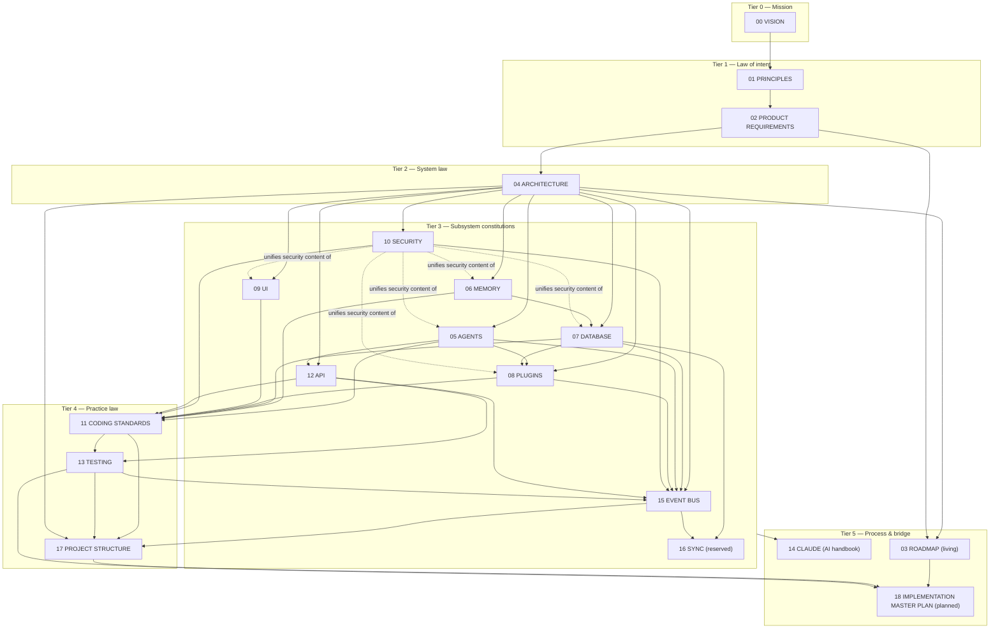

# KANG — Documentation Index & Governance Registry

**Document:** `docs/INDEX.md` — deliberately unnumbered (§2.4)
**Version:** 0.1
**Author:** Kang, with Claude (Founding Architect)
**Status:** Living registry — updated in the same PR as any documentation change it records; RFC-2119 throughout
**Last updated:** 2026-07-12
**Mandated by:** `17_PROJECT_STRUCTURE.md` §12.4 (this artifact discharges that delta)

---

## 1. What This Document Is — and Is Emphatically Not

This is the **canonical index of the KANG architecture constitution**: every document, its number, its status, its purpose, its governance relationships, and the rules by which the documentation set itself evolves.

**Normative limits (the first and most important rules):**

1. The INDEX **MUST NOT** override, amend, reinterpret, or summarize-with-authority any constitutional document. It exists for **discoverability and governance only**.
2. Where the INDEX and any numbered document disagree — a status, a dependency, a one-liner — **the numbered document wins**, the divergence is an INDEX bug, and it is fixed in the INDEX.
3. Nothing in this document creates architecture. A dependency edge here is a *report* of a document's own upstream header; the header is the truth (§4.1).
4. The one thing the INDEX *does* own authoritatively: **the number space** (§2). Numbers are assigned here, and only here.

---

## 2. Numbering Policy

### 2.1 Numbers are identifiers, not order

A document number is a permanent identifier, like a UUID that humans can pronounce. It implies nothing about importance, sequence of authorship, or reading order (reading order is §7). `15_EVENT_BUS` was written after `13_TESTING` cites it conceptually; `16_SYNC` will be written years after `17_PROJECT_STRUCTURE`. This is normal and meaningless.

### 2.2 Numbers never change — here is why, permanently recorded

Constitutional documents cite each other **by number, in frozen text** (`"D009/16_SYNC"`, `"07_DATABASE Part 15"`, `"15 §11.2"`). Renumbering any document would require editing frozen constitutional text across the entire set — the highest-risk, lowest-value edit possible, guaranteed to desynchronize something. Therefore:

- A number, once assigned, is assigned **forever** — to that document, even if superseded (§3.4), even if the document is eventually hollow.
- Numbers are **never reused**. A dead number stays dead (same reasoning as plugin-id tombstones, 08 §4).
- **Gaps are legal and permanent.** The sequence is an allocation record, not an aesthetic.
- The precedent: this policy was set when `17_PROJECT_STRUCTURE` was commissioned as "16" and re-slotted at authoring time because five frozen documents already cited `16_SYNC` by name (PS-001). The registry exists so that collision is caught here, at allocation, never again in cross-references.

### 2.3 Allocation procedure

A new document claims the **next free number in §5's table, in the same PR that adds the document** (17 §12.4). Reserved numbers (§2.5) are not free. Claiming a number without the document (beyond the sanctioned reservation mechanism) is forbidden — the registry records what exists and what is *formally reserved with a trigger*, nothing speculative (PS-006's spirit applied to documents).

### 2.4 Why the INDEX itself is unnumbered

The INDEX is the registry *of* the number space; numbering it would make it a member of the set it governs, subject to the freeze/ADR rules it merely records. It is meta-documentation: living, non-normative, always subordinate. Its stable identity is its path: `docs/INDEX.md`.

### 2.5 Reserved numbers — the complete list

| Number | Reserved for | Trigger to write | Reservation source |
|---|---|---|---|
| **16** | `16_SYNC.md` | Phase 5 entry: single-device product proven; written with real single-device experience informing it | 03_ROADMAP §5/§8, D009, PS-001 |

No other numbers are reserved. Future reservations require: a citable activation trigger + an entry here + a line in 03_ROADMAP §8's consolidated trigger registry. A reservation without a trigger is speculation and is rejected.

---

## 3. Document Lifecycle

### 3.1 States

```
planned ──▶ draft ──▶ frozen (vX.Y) ──▶ frozen (vX.Y+1) …
                │                          │
                └──▶ living ◀──────────────┘        (status change by ADR)
                            │
                            ▼
                       superseded (never deleted; §3.4)

reserved ──(trigger fires)──▶ planned                (16_SYNC's path)
```

| State | Meaning | Change discipline |
|---|---|---|
| **reserved** | Number allocated, trigger recorded, zero content owed yet | Trigger firing moves it to planned |
| **planned** | Commissioned, number claimed, unwritten | Authoring PR moves it to draft/frozen |
| **draft** | Exists, not yet binding | Free iteration until freeze |
| **frozen (vX.Y)** | Binding constitutional text | **Any change to a Decision block requires an ADR** (04 §1.3, generalized set-wide). Version bumps record the ADR(s) applied |
| **living** | Binding, but expected to evolve continuously (registries, roadmaps) | Changes ride ordinary PRs; Decision-grade content inside still requires ADRs |
| **superseded** | Replaced by a successor document via ADR | §3.4 |

### 3.2 Freeze semantics

"Frozen" means *stable, not perfect*: the document is law until an ADR amends it. Kang's authoring convention (freeze at ~9.7/10, "diminishing returns — keep building") is a process fact recorded here for historians, not a rule.

### 3.3 The recurring closing line, explained once

Every constitutional document ends: *"When code and this document disagree, one of them is wrong on purpose — file the ADR."* This is the set's conflict-detection protocol: divergence is never resolved silently in either direction. The INDEX extends it: when *documents* disagree, the upstream document wins pending the ADR (§4.2).

### 3.4 Supersession, not deletion

A document is never deleted. A successor document (new number) plus an ADR marks the old one `superseded`, the old document gains a banner pointing forward, and its number dies with it (§2.2). History must remain navigable — a 2031 reader following a 2026 citation must land somewhere honest.

---

## 4. Governance: Who Governs Whom

### 4.1 Upstream/downstream — the binding rule

Every constitutional document declares its **upstream (binding)** documents in its own header. That header is the authoritative dependency claim; the graph below (§4.3) is derived from those headers and MUST be regenerated when headers change. **Upstream binds downstream:**

- A downstream document MUST NOT contradict its upstream. It cites (DECIDED), fills genuine gaps (GAP), or names and resolves conflicts explicitly (TENSION) — never silently overrides. (The working protocol of 15 and 17, made law for all future documents.)
- Amending upstream content is done **in the upstream document via ADR**, never by downstream restatement. Owed changes discovered downstream are recorded in that document's deltas table (the 15 §17 / 17 §18 pattern — now the REQUIRED mechanism) until applied.

### 4.2 Precedence chain for conflicts

1. `00_VISION` › `01_PRINCIPLES` › `02_PRODUCT_REQUIREMENTS` — mission outranks principle outranks requirement (01's own decision hierarchy).
2. Below those: **the upstream header graph** — whoever is upstream in the specific relationship wins.
3. Peer documents with no dependency relation conflicting = a constitutional bug: file the ADR, decide, record in both.
4. `14_CLAUDE` governs AI contributor *process* set-wide but creates no architecture; on process it wins over session artifacts (handoffs, prompts, this INDEX's guidance section).
5. The INDEX loses to everything (§1).

### 4.3 The dependency graph (derived; headers are truth)



Reading the graph: arrows point downstream (binder → bound). `10_SECURITY` is deliberately unusual — it declares itself "not a replacement but the constitution *of* the upstreams' security content" (10's own header); the dashed edges record that role.

### 4.4 Decision-ID namespaces (the citation system)

Inline decisions are inlined ADRs (04 §1.3). Each document owns a prefix; a decision ID is citable forever, like a number:

| Prefix | Owner | Prefix | Owner |
|---|---|---|---|
| `P*, E*, A*, U*, M*, S*, AR*` (principles) | 01 | `SEC-*` | 10 |
| `FR-*, NFR-*, R*` | 02 | (none — rules by section) | 11 |
| `D001–D016` | 04 | `API-*` | 12 |
| `AG-*, AGP-*` | 05 | (test classes 2.1–2.17) | 13 |
| `M-*` | 06 | `EB-*` | 15 |
| `DB-*` | 07 | `PS-*` | 17 |
| `PL-*` | 08 | `UI-*` | 09 |

A new document claims a fresh prefix here at allocation. Prefix collisions are rejected like number collisions.

---

## 5. The Registry (the table this document exists for)

**Status legend:** F = frozen · L = living · R = reserved · PL = planned · Version per the document's own header.

| # | Document | Status | Exists to answer | Governs | Bound by (per its header) |
|---|---|---|---|---|---|
| 00 | VISION | F v0.2 | *Why does KANG exist; what is success in 10 years?* | Everything, ultimately | — (root) |
| 01 | PRINCIPLES | F | *How do we decide, when documents don't already say?* | All decisions; the P/E/A/U/M/S/AR vocabulary | 00 |
| 02 | PRODUCT_REQUIREMENTS | F v0.2 | *What must the product do, exactly, with what acceptance?* | Capabilities, FR/NFR set, risks | 00, 01 |
| 03 | ROADMAP | **L** | *In what order, gated by what triggers?* | Phases; the **consolidated RESERVED trigger registry (§8)** — every dormant mechanism's activation lives there | 00–02, 04 |
| 04 | ARCHITECTURE | F v0.1 | *What is the system's shape and why?* (D001–D016) | Every subsystem document | 00–02 |
| 05 | AGENTS | F | *What may act, how, under whose authority?* | Agent system, Orchestrator, pipelines, catalog | 01, 02, 04, 06 |
| 06 | MEMORY | F | *What is remembered, how earned, how trusted?* (M-003 lives here) | Memory subsystem, write gate, Context Assembler | 01, 02, 04 |
| 07 | DATABASE | F | *Where does every byte of truth live and survive?* | Storage, schema, `%KANG_HOME%`, recovery | 04, 06 |
| 08 | PLUGIN_SYSTEM | F | *How does the platform extend without rotting?* | Plugin lifecycle, SDK, containment | 04, 05, 07 |
| 09 | UI_DESIGN | F | *What does Kang see, and what may screens never do?* | UI zones, screens, confirm dialog | 02, 04, 12 |
| 10 | SECURITY | F v0.1 | *What is defended, what honestly is not, and how authority works?* | Security model across all documents (§4.3 note) | 00–02, 04–09 |
| 11 | CODING_STANDARDS | F v0.1 | *What does every line of code owe the next decade?* | All code, both languages; CI contracts | 01, 04–10, 12 |
| 12 | API | F | *What is callable, by whom, with what contract?* | The operation/event/error registries' constitution | 04, 05, 08, 09, 10 |
| 13 | TESTING | F | *What is proven, how often, gating what?* | The 17 test classes, CI tiers, release gates | 11, 12, all |
| 14 | CLAUDE | F | *How does an AI contributor work on KANG safely?* | AI contribution process; root `CLAUDE.md` is its generated copy | All (process layer) |
| 15 | EVENT_BUS | F v0.1 | *How do facts move, survive crashes, and stay explainable?* (EB-001–011) | Bus semantics, envelope, three-log boundary | 01, 04–08, 10, 12, 13 |
| 16 | SYNC | **R** | *(future)* *How does truth replicate without lying?* | Sync engine, conflict surfacing, multi-device | Reserved; will bind under 04 (D009), 07, 15 |
| 17 | PROJECT_STRUCTURE | F v0.1 | *Where does every file live, and what may import what?* (PS-001–006) | Repository physicality; import constitution | 01, 04, 05, 07, 08, 10, 11, 12, 13, 15 |
| 18 | IMPLEMENTATION_MASTER_PLAN | **PL** | *How is KANG built from nothing — milestones, dependencies, success criteria?* | The bridge from constitution to Sprint 1; binds sequencing, not architecture | Will bind under 03, 13, 17 (and everything transitively) |

**Honesty note on 18:** listed because its number is hereby claimed and its commission exists (Kang's Tier-S list); it is **unwritten**. The INDEX records allocation, not aspiration beyond it.

---

## 6. ADR Interaction

1. **Location & form:** `docs/adr/NNN-title.md` — context, options, decision, consequences (04 §1.3). ADR numbers are their own space, append-only, unrelated to document numbers.
2. **When required:** any change to a Decision block or decision-ID'd rule in a frozen document; any new dependency/framework; any new top-level structure; any authority-model change (11 §28's trigger list is the operative set).
3. **Inlined ADRs:** the numbered decisions inside documents (D*, EB-*, PS-*, …) *are* ADRs, inlined for readability. Post-freeze changes to them get a standalone ADR that **cites the decision ID**, and the document text is amended to match, bumping its version.
4. **Chains:** an ADR that reverses or narrows another MUST cite it; `docs/adr/INDEX.md` (a sibling registry, per 17 §12) maintains the decision-book view: ID → status (active/superseded-by-NNN) → affected documents.
5. **Deltas tables** (15 §17, 17 §18 pattern): the sanctioned holding pen for *owed* upstream edits discovered while authoring downstream. Each delta is applied via ordinary PR (clarifying/additive) or ADR (Decision-grade), then struck from the table. An unapplied delta is open divergence — visible, tracked, honest.

---

## 7. How an AI Should Consume This Documentation

Binding guidance for AI contributors (subordinate to `14_CLAUDE`, which owns the full process; this is the INDEX's routing layer):

1. **Never start from training priors about "how projects usually work."** KANG has deliberately unusual decisions (no ORM, no shared/, no auto-updater, agents-as-data, no internal command bus). The documents are the ground truth; priors are hypotheses at best.
2. **Read by route, not by volume.** Always: `14_CLAUDE` (process) + `01_PRINCIPLES` (vocabulary + hierarchy). Then take the §5 table's "Governs" column to the documents owning the task's subject, and read their upstream headers transitively. For any file-placement or import question, `17` is the complete answer; for any "may X do Y" authority question, `10` + the owning subsystem document.
3. **Cite decision IDs, not paraphrases.** The §4.4 namespaces are the citation system. A claim about the architecture that cannot cite an ID or section is a proposal, and MUST be labeled as one.
4. **Respect the DECIDED / GAP / TENSION protocol** (§4.1) in any new design work. Reopening a DECIDED item requires naming it and arguing against its recorded rationale — silence-and-workaround is the forbidden move.
5. **The INDEX is a map.** Quoting the INDEX as authority for anything beyond numbering is a process error (§1). Summaries in §5 are door labels, not the rooms.
6. **Session artifacts (handoffs, prompts) are context, not law.** Where a session instruction conflicts with a constitutional document, say so explicitly before proceeding (the standing role: honest design review, never silent compliance).

---

## 8. Introducing a New Document — the complete procedure

1. Establish the *need*: a subsystem or concern that no existing document governs, or a trigger firing on a reserved slot. A new document that mostly restates existing law is rejected — extend the existing document by ADR instead (anti-duplication, 15's rule generalized).
2. Claim the next free number **and** a decision-ID prefix in this INDEX, in the commissioning PR.
3. Declare upstream (binding) documents in the header; regenerate §4.3's graph.
4. Author under the DECIDED/GAP/TENSION protocol; record owed upstream changes in a deltas table.
5. Freeze by Kang's acceptance; register status + version here; mirror any RESERVED items into 03 §8.
6. Root-level artifacts (`README.md`, `CLAUDE.md`) remain pointers/generated copies — new documents never spawn root content (17 §12).

---

## 9. Closing

Eighteen numbers, one reserved, one planned, zero renumbered — ever. The headers own the edges, the documents own the law, the ADRs own the changes, and this INDEX owns exactly one thing: the map stays true. A decade from now, a reader who has never met this system should open this file, follow three links, and know precisely where the truth about anything lives.

*This INDEX never overrides. When it disagrees with any numbered document, the INDEX is wrong — fix the INDEX.*
