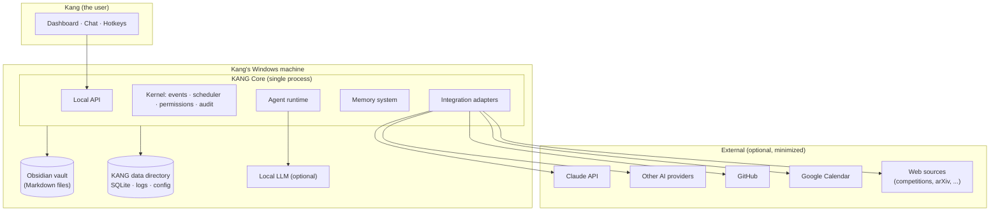
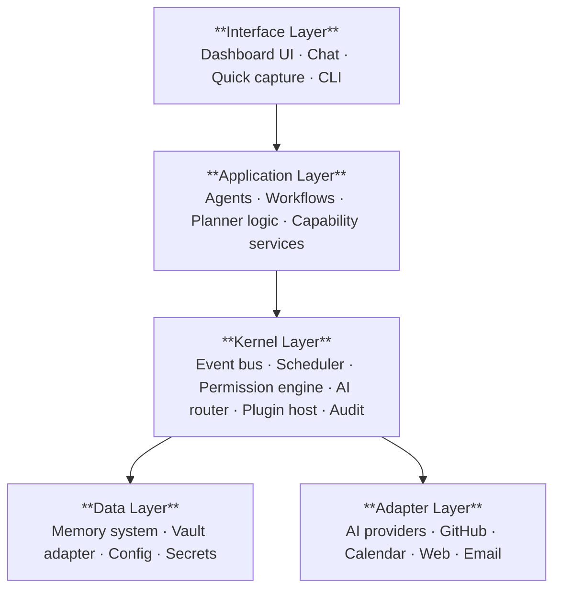
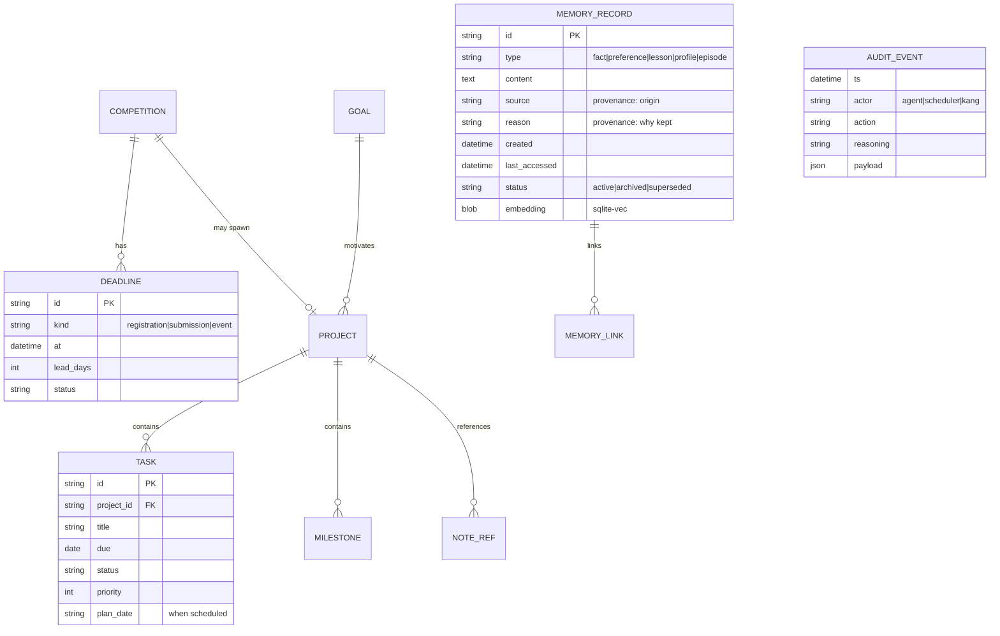
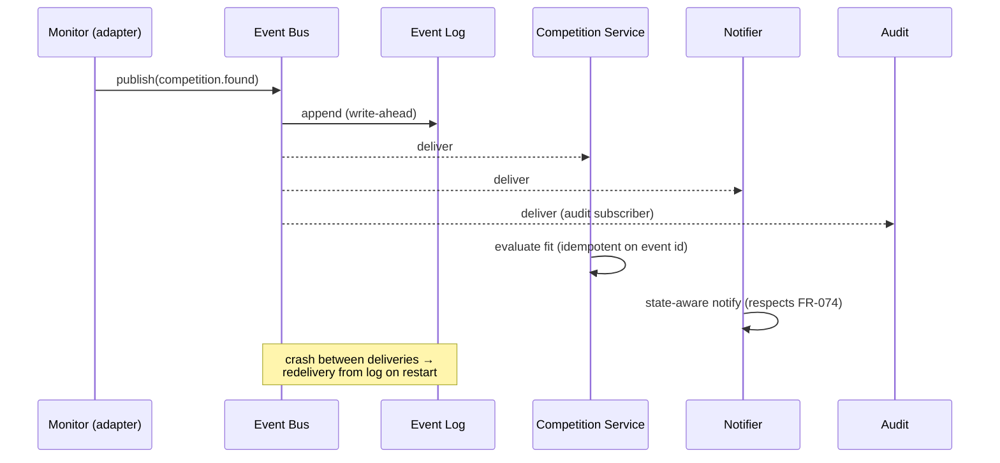
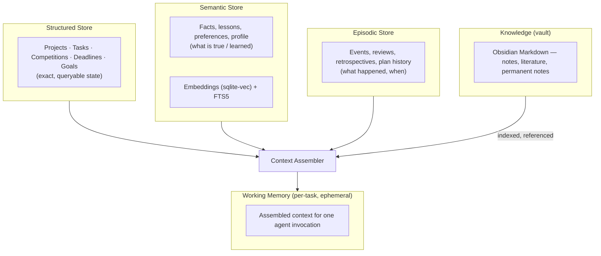
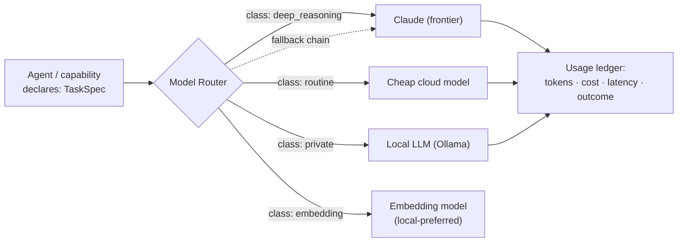
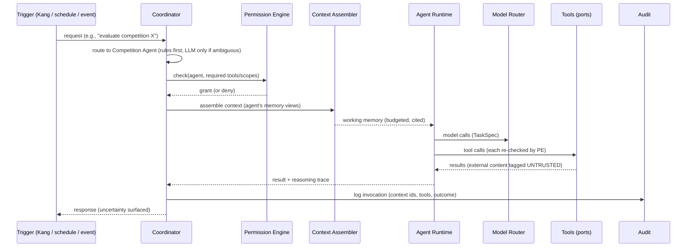

    # KANG — System Architecture

**Document:** 04_ARCHITECTURE.md
**Version:** 0.1
**Author:** Kang, with Claude (Founding Architect)
**Status:** Living — changes require an ADR (see §1.3)
**Last updated:** 2026-07-11
**Upstream:** `00_VISION.md`, `01_PRINCIPLES.md`, `02_PRODUCT_REQUIREMENTS.md`

---

## 0. The Honest Preface — Read This First

The brief said: *"Think like a principal distributed systems architect."*

A principal distributed systems architect's first duty is to tell you when you don't need a distributed system. **KANG does not need a distributed system.** It has:

- **One user.**
- **One primary machine** (Windows 11).
- **One developer, part-time.**
- **A ten-year maintainability requirement.**

Distributed architectures (microservices, message brokers, orchestrators, service meshes) exist to solve problems KANG does not have: independent team deployment, horizontal scale, fault isolation across machines. Importing them would import their costs — operational complexity, network failure modes, versioning hell — while solving nothing. That violates P9 (incremental), E1 (simplicity), E10 (boring tech), and R6/R7 (overengineering, maintenance burden).

**The architecture below is therefore a *modular monolith with distributed-systems discipline*:**

- One process, but module boundaries drawn as if they were service boundaries.
- In-process events, but with a persistent event log — so the *pattern* is distribution-ready even though the *deployment* is not.
- One database file, but every store behind an interface — so any component can be extracted or replaced if reality ever demands it.

We take the *thinking* of distributed systems (explicit contracts, message passing, single sources of truth, idempotency, failure-as-normal) without the *runtime* of distributed systems. That is what "maintainable for ten years by one person" actually requires.

Every decision below records: **Why / Alternatives considered / Trade-offs / Scaling implications.**

---

## 1. Architecture Overview

### 1.1 System context



Boundary rules (from P8, AR7):

- Everything inside **Machine** works offline. Everything in **Cloud** is an enhancement with a defined failure path (A9, NFR-012).
- The vault and the data directory are the only persistent state. Backing up one directory tree recovers the whole system (NFR-006).

### 1.2 Layered view



Dependency rule (clean architecture): **dependencies point downward only.** The kernel never imports an agent. The data layer never imports the kernel. Adapters implement interfaces *defined by* inner layers (dependency inversion, E3). This single rule is what keeps the system replaceable component-by-component for a decade (E6, AR4).

### 1.3 How this document evolves

Any change to a Decision block in this document requires an **ADR** (Architecture Decision Record) in `docs/adr/NNN-title.md`: context, options, decision, consequences. The Decision blocks below are ADRs 001–016, inlined for readability.

---

## 2. Decision 001 — System Shape: Modular Monolith

**Decision.** KANG is a single Python process (the *Core*) exposing a local HTTP/WebSocket API, plus a UI shell. Internal structure is strict modules with explicit interfaces.

**Why.**
- One developer cannot operate a service fleet. Every additional process is a thing that can be down, stale, or version-skewed.
- Debugging a monolith is a stack trace; debugging services is a murder investigation.
- Module boundaries give us 90% of the architectural benefit of services (isolation, replaceability, testability) at 5% of the cost.

**Alternatives considered.**

| Alternative | Rejected because |
|---|---|
| Microservices (per-agent processes) | Operational burden absurd for one user/one machine; IPC failure modes; violates E1, E10 |
| Actor framework (e.g., Ray, distributed actors) | Solves scale we don't have; heavy dependency; hype risk (anti-principle) |
| Serverless/cloud-hosted core | Violates P8 (local-first) outright |
| Plain script collection (no structure) | Fails ten-year maintainability; no boundaries → no replaceability |

**Trade-offs.** A crashing module can take down the process (mitigated: supervised task isolation, §14); no independent scaling (we don't need it); one language for the core (acceptable — Python is Kang's language).

**Scaling implications.** If a component ever genuinely needs isolation (e.g., an untrusted plugin, a heavy local model), it is extracted as a *sidecar process* behind its existing interface — the module boundary becomes a process boundary with no redesign. This is the deliberate escape hatch.

---

## 3. Decision 002 — Runtime & UI Stack

**Decision.**
- **Core:** Python 3.12+, `asyncio` throughout, stdlib `http.server` serving a localhost-only API (operation channel; HTTP). The event channel (streaming/WebSocket) is a separate, later binding — see ADR-009.
- **UI:** Web frontend (React + TypeScript) rendered in a lightweight desktop shell (**Tauri**), talking only to the local API.
- **CLI:** thin client on the same API (developer/power use, scriptability).

**Why.**
- Python: Kang's primary language (PRD §6); the AI ecosystem lives there; ten-year longevity is proven.
- API-first even locally: the UI, CLI, future mobile companion, and future voice interface are all *just clients*. No client ever touches the database directly. This is the single cheapest decision that keeps every future interface possible.
- Tauri over Electron: ~10× smaller footprint, native webview, Rust shell we mostly don't touch. The UI itself is ordinary web tech — boring, durable, AI-assistable.
- **Transport corrected by ADR-009** (2026-07-31): the original FastAPI choice above was never actually shipped — code adopted stdlib `http.server` on 2026-07-15 without a filed ADR. ADR-009 ratifies the as-shipped transport and records the reasoning. This line preserves that history rather than silently rewriting it.

**Alternatives considered.**

| Alternative | Rejected because |
|---|---|
| Electron | 150–300MB baseline, memory-hungry for an always-running secretary |
| PyQt/PySide native UI | Slower iteration; styling a cyberpunk dashboard in Qt is pain; smaller talent/AI-assist pool |
| Pure web app in Chrome tab | No global hotkeys, no tray presence, no capture-from-anywhere (breaks U4/NFR-011) |
| .NET/WinUI (Windows-native) | Violates NFR-010 (no architectural blockers to cross-platform); not Kang's stack |

**Trade-offs.** Two languages at the edge (TS for UI); Tauri adds a Rust toolchain for packaging only. Accepted: UI code is peripheral, replaceable, and explicitly *not* where KANG's value lives (AR8 — the UI must be deletable).

**Scaling implications.** Voice, mobile, and multi-device clients (Ten-Year Dream) plug into the same local API + future sync layer. The API contract (`12_API.md`) becomes the system's public face.

---

## 4. Decision 003 — Data Directory & Storage Topology

**Decision.** All KANG state lives under a single data directory:

```
%KANG_HOME%/                     (default: ~/kang)
├── kang.db                      # SQLite — structured state + memory + index
├── audit/
│   └── 2026-07.jsonl            # append-only audit log, monthly files
├── events/
│   └── eventlog.db              # persistent event log (SQLite, separate file)
├── config/
│   ├── kang.toml                # system configuration
│   ├── permissions.toml         # grants per agent/plugin
│   └── providers.toml           # AI routing config (no secrets)
├── plugins/                     # installed plugin packages
├── cache/                       # disposable (embeddings cache, web cache)
└── backups/                     # rotating snapshots of kang.db + config
```

The Obsidian vault lives *outside* `KANG_HOME`, owned by Kang, referenced by config.

**Why.** One directory = whole life (NFR-006). Separating disposable `cache/` from state makes backups small and restores trustworthy. Config as TOML files (not DB rows) keeps the system inspectable and diffable — Kang can read his own system with a text editor (P5, "never impossible to understand").

**Alternatives.** State scattered across AppData/registry/DB (rejected: unrecoverable, opaque); everything in the vault (rejected: structured state doesn't belong in Markdown — M7); config in DB (rejected: not diffable, not hand-editable during recovery).

**Trade-offs.** Config drift between file and runtime must be handled (watch + reload). Accepted.

**Scaling implications.** Sync (§10) operates on this directory's contents; the layout is designed so that `kang.db` (single-writer) and the vault (file-mergeable) sync by different strategies.

---

## 5. Decision 004 — Databases: SQLite Everywhere It Fits

**Decision.**
- **Primary store:** SQLite (WAL mode) — all structured state: projects, tasks, competitions, deadlines, goals, memory records, quiz history, monitor state, job schedules.
- **Vector search:** `sqlite-vec` extension for embeddings, in the same database.
- **Full-text search:** SQLite FTS5, same database.
- **Event log:** separate SQLite file (different write pattern, independent vacuum/retention).
- **Audit log:** append-only JSONL files (deliberately *not* a database — see below).
- **Notes:** Markdown files in the vault (source of truth per PRD §12).

**Why.**
- SQLite is the most deployed, most tested database on Earth; single-file; zero administration; readable by every language and tool; will exist in 2036. It is the definition of E10.
- Single-user local workloads are SQLite's home turf. A life's structured data is thousands-to-millions of rows — trivial.
- Keeping vectors and FTS *inside* SQLite avoids the classic two-store consistency problem (vector DB drifting from source records). One transaction updates a record and its index.
- Audit as JSONL: an append-only log's integrity is easier to reason about as flat files; it survives DB corruption; it's greppable at 3 a.m. (S5: human-readable).

**Alternatives considered.**

| Alternative | Rejected because |
|---|---|
| PostgreSQL | A server to install, run, upgrade, secure — for one user. Pure operational cost |
| Dedicated vector DB (Chroma, Qdrant, LanceDB) | Second store to sync/backup/version; consistency drift; heavier dependency. Revisit only if vector volume proves SQLite-vec insufficient (unlikely at personal scale) |
| Graph database (Neo4j) for knowledge | See Decision 008 — the graph is a view, not a store |
| DuckDB | Superb for analytics, weaker as a transactional app store; can be *added later* as a read-only analytics layer over exports |
| JSON files as primary store | No transactions, no queries, corruption-prone; fine for config, wrong for state |

**Trade-offs.** SQLite is single-writer (fine: one process — Decision 001 makes this safe); extensions (`sqlite-vec`) add a native dependency to pin and test. Multi-device write access is *not* solvable by SQLite alone — that is deliberately deferred to the sync design (§10), not smuggled in here.

**Scaling implications.** If any table's workload ever outgrows SQLite (it won't at personal scale), the repository interface (§6) allows per-store migration. The realistic scaling event is *sync*, and §10 handles it at a different layer.

### 5.1 Core schema (foundational entities)



(Full schema in `07_DATABASE.md`; migrations are versioned, forward-only, tested on backup copies before apply.)

---

## 6. Decision 005 — Internal Structure: Ports & Adapters

**Decision.** Hexagonal (ports-and-adapters) structure. Domain logic depends only on interfaces (*ports*); all I/O — DB, vault, AI providers, web, calendar — is an *adapter* implementing a port.

```
kang/
├── kernel/          # event bus, scheduler, permissions, audit, plugin host, ai router
├── domain/          # entities + capability services (planner, projects, memory, competitions...)
│   └── ports/       # interfaces: MemoryStore, VaultPort, ModelProvider, CalendarPort...
├── agents/          # agent definitions & orchestration (stateless — AR5)
├── adapters/        # sqlite/, obsidian/, anthropic/, openai/, ollama/, github/, gcal/, web/
├── api/             # FastAPI routes + websocket (interface layer)
└── plugins_sdk/     # public plugin interfaces (versioned)
```

**Why.** This is the mechanical enforcement of E3/E6/AR4. "Swap the provider" or "replace the DB" becomes: write one adapter, change one config line. It is also what makes the system testable without network or disk (E5): every port has an in-memory fake.

**Alternatives.** Layered-by-technical-type (models/, views/, utils/) — rejected: features smear across folders, deletion becomes impossible (violates AR8). Django-style framework coupling — rejected: framework lock-in for a ten-year system.

**Trade-offs.** More files, more indirection, some boilerplate. Accepted: the boilerplate is exactly the documentation of what can be swapped.

**Scaling implications.** Ports are the seams for every future move: sidecar extraction (D001), provider churn (D011), sync backends (D009), plugin isolation (D012).

---

## 7. Decision 006 — Event Bus: In-Process, Persistently Logged

**Decision.** A single in-process async event bus with:

1. **Typed events** (versioned schemas): `task.completed`, `deadline.approaching`, `competition.found`, `plan.generated`, `memory.saved`, `vault.note_created`, …
2. **A persistent event log** (`events/eventlog.db`): every published event is appended *before* handlers run (write-ahead), with delivery status per subscriber.
3. **At-least-once delivery + idempotent handlers**: handlers may see duplicates after crash-recovery and must tolerate them (idempotency keys).
4. **Isolation:** each handler runs as a supervised task; a failing handler is retried with backoff, then dead-lettered — it never blocks other subscribers.



**Why.**
- Events over coupling (AR3): the Planner doesn't know the Competition service exists; it reacts to `deadline.approaching`. New capabilities and plugins subscribe without touching publishers — this is the extensibility backbone.
- The persistent log turns "in-process pub/sub" into something crash-safe and *replayable*: debugging ("what happened Tuesday?"), audit (S5), and catch-up-after-neglect (NFR-008) all fall out of the same mechanism.

**Alternatives considered.**

| Alternative | Rejected because |
|---|---|
| Redis pub/sub / NATS / MQTT broker | A broker process to run forever, for one process talking to itself. Pure overhead |
| Kafka | Comically oversized; the anti-principle "never optimize for demos" applies |
| Direct method calls only (no bus) | Couples everything to everything; plugins would need core edits; kills AR2/AR3 |
| Fire-and-forget in-memory bus (no log) | Lost events on crash → missed deadline alerts → R9 trust collapse. Unacceptable for a secretary |

**Trade-offs.** At-least-once + idempotency is more design discipline than fire-and-forget (every handler declares an idempotency key). Event schema versioning is a forever-tax (schemas are append-only: add fields, never repurpose). Accepted: this discipline *is* the distributed-systems thinking we're keeping.

**Scaling implications.** If a subscriber ever moves out-of-process (sidecar plugin), the event log already provides the durable handoff — the bus grows a socket transport, subscribers don't change. Retention policy: events compact after 90 days (configurable); audit log is the permanent record, not the event log.

---

## 8. Decision 007 — Memory System

The most important subsystem (PRD: Memory is the root; P4: memory is sacred).

### 8.1 Layered memory model



Four persistent layers + one ephemeral:

| Layer | Contents | Store | Truth |
|---|---|---|---|
| **Structured** | projects, tasks, deadlines, goals | SQLite tables | KANG DB |
| **Semantic** | facts, lessons, preferences, profile | `memory_record` + vectors + FTS | KANG DB |
| **Episodic** | plan history, reviews, retrospectives | SQLite (time-indexed) | KANG DB |
| **Knowledge** | notes, research, permanent notes | Markdown | **Vault** (M7) |
| **Working** | context for one invocation | RAM only | — (never persisted) |

### 8.2 Memory lifecycle

```
candidate → (gate) → active → (review/decay) → archived → (explicit) → deleted
```

- **Write gate (M1, FR-014):** memory is *earned*. Writers are: explicit save by Kang; capability rules (project archived → retrospective lesson); nothing else. Chat never leaks into memory silently.
- **Provenance mandatory (M4, FR-012):** every record stores `source`, `created`, `reason`. A record without provenance is rejected at the store layer — enforced in code, not convention.
- **No fabrication (A4):** retrieval returns records verbatim + IDs. Agents receive memory as *quoted context with citations*; the answer layer must attribute. "I don't have that in memory" is a first-class response.
- **Decay by policy (M3):** superseded records are marked, not silently overwritten (history preserved); stale candidates expire; archives compress into lessons during weekly review. Deletion is Kang-only and real.

### 8.3 Retrieval: the Context Assembler

One component owns "what does this agent invocation get to see":

1. **Structured pull** — deterministic queries (today's tasks, active competitions) — always exact.
2. **Semantic pull** — hybrid search (vector + FTS + recency/importance weighting) over semantic + episodic stores, k-limited.
3. **Vault pull** — indexed note chunks, returned as *references + excerpts*, never whole-vault dumps.
4. **Budgeting** — assembles within the model's context budget by priority class; logs exactly what was included (P5: "why did you say that?" is answerable — the context is reproducible).

**Alternatives considered.**

| Alternative | Rejected because |
|---|---|
| One flat vector store for everything ("RAG all the things") | Exact state (deadlines!) must never be *approximately* retrieved. Structured data needs structured queries. Vectors are for meaning, not truth |
| LLM-managed memory (model decides what to remember) | Violates M1/FR-014; unbounded, unauditable, hoarding by default |
| Memory frameworks (LangChain memory, MemGPT-style) | Framework lock-in on the most critical subsystem; opaque behavior; hype risk. Memory is exactly the thing KANG must own outright |
| Fine-tuning models on personal data | Not editable, not deletable, not inspectable — violates M2 categorically |

**Trade-offs.** Hybrid retrieval + budgeting is real engineering effort — the Context Assembler is plausibly the most complex single component in KANG. Accepted: it is also the moat (Vision §8 — years of calibrated memory).

**Scaling implications.** Ten years ≈ tens of thousands of memory records, hundreds of thousands of vault chunks — comfortably within SQLite+vec. The real scaling axis is *quality*: consolidation jobs (weekly: merge duplicates, extract patterns like "report time underestimated 2×") keep the store curated rather than merely large. Pattern extraction is v0.4+, but the schema (episodic layer, lesson type) is shaped for it now.

---

## 9. Decision 008 — Knowledge Graph: A View, Not a Database

**Decision.** KANG maintains a **link index**, not a graph database:

- Edges live where they naturally occur: Obsidian wikilinks (vault truth), foreign keys (structured truth), `memory_link` rows (semantic truth: `relates_to`, `supersedes`, `derived_from`, `contradicts`).
- A background indexer merges these into one queryable `link_index` table (typed edges: `src, dst, type, origin`).
- Graph *queries* (neighborhood, path, "what connects X and Y") run as recursive CTEs over the index. Graph *visualization* is a UI view.

**Why.** The graph KANG needs is: "given this note/project/memory, what's related, and why?" — 1–3 hop neighborhood queries over at most ~10⁵–10⁶ edges. SQLite recursive CTEs handle this in milliseconds. Meanwhile the *authoritative* links must stay in their sources of truth (wikilinks belong to the vault — the vault must stay fully usable without KANG, PRD §10.10).

**Alternatives.** Neo4j/Memgraph (a JVM/server dependency for millisecond-scale queries we can already do — rejected, E10); NetworkX in-memory graph (fine as a *computation* utility over the index for analytics like centrality — allowed as a library, not a store); RDF/triple stores (ontology ceremony with no user for it).

**Trade-offs.** Recursive CTEs are less expressive than Cypher for exotic queries. Accepted: if a genuinely graph-heavy feature emerges (unlikely), the link index exports to any graph engine trivially — it's just edges.

**Scaling implications.** Link inference ("these two notes should connect" — FR-063) is an AI/embedding job that *proposes* edges; Kang confirms; confirmed edges are written back to the *source of truth* (a wikilink in the vault, a link row in the DB) — never only to the index. The index stays rebuildable-from-scratch, forever (AR6: derived and disposable).

---

## 10. Decision 009 — Synchronization: Designed Now, Built Later

**Decision.** v0.x is **single-machine, single-writer** — explicitly. Sync ships no earlier than v0.5. But the architecture commits *now* to the following, so sync is an addition rather than a rewrite:

1. **All entities carry:** UUIDv7 ids, `updated_at`, `device_id`, and a per-record `revision` counter — from v0.1. (Cheap now, impossible to retrofit later.)
2. **Two sync strategies by data class:**
   - **Vault (Markdown):** file sync — Kang's choice of Syncthing/Git/cloud drive; KANG stays agnostic and merge-tolerant (the vault is plain files by design).
   - **Structured/memory (SQLite):** *log-shipped state sync* — a `changes` table (outbox pattern) records row-level mutations; a sync engine exchanges encrypted change-sets; conflicts resolve **last-writer-wins per field + conflict record surfaced to Kang** (never silent — PRD §12 conflict rule).
3. **End-to-end encryption:** change-sets encrypted client-side (age/libsodium); the relay — whether a dumb cloud bucket or Kang's own server — never sees plaintext (P8, S3). Relay is a replaceable adapter (SyncTransport port).

**Why deferred.** Sync is the highest-complexity, highest-risk subsystem (silent data corruption = R9 trust collapse), and Year-1 value is entirely single-machine (Vision §8). Building it before the product proves itself violates P9 and R6.

**Why designed now.** ID scheme, revision columns, and the outbox pattern cost near-zero in v0.1 but are brutal to retrofit. This is the correct way to "think distributed" — pay for the *properties*, defer the *machinery*.

**Alternatives considered.**

| Alternative | Rejected because |
|---|---|
| CRDTs everywhere (Automerge/Yjs) | Beautiful theory; heavy machinery; per-field LWW + human conflict surfacing is sufficient for a *single human* who is rarely writing on two devices in the same second |
| Cloud-primary DB (Supabase/Firebase) | Violates P8 structurally |
| Syncing the SQLite file itself (Dropbox the .db) | Guaranteed corruption under concurrent access; the classic amateur mistake |
| Turso/LiteFS replicated SQLite | Promising, vendor-young; revisit at v0.5 with fresh eyes — the outbox design doesn't preclude it |

**Trade-offs.** LWW-per-field can lose a concurrent edit (surfaced, recoverable via episodic history). Accepted for a one-human system.

**Scaling implications.** The same change-log later powers: mobile companion (read-mostly client), backup verification, and point-in-time recovery. One mechanism, three futures.

---

## 11. Decision 010 — AI Routing

**Decision.** A kernel-level **Model Router** behind a single `ModelProvider` port:



- **Callers declare intent, not models:** a `TaskSpec` = task class (`deep_reasoning | routine | classification | embedding | private`), context size, latency tolerance, privacy tier. The router maps spec → provider via `providers.toml`.
- **Privacy tiers (S4):** data marked `private` (prayer journal is the extreme: *never* leaves the machine — PRD §10.14) routes local-only or fails closed. Default tier sends minimum-necessary context.
- **Fallback chains + circuit breakers (A9):** provider down → next in chain → degraded-mode response, never a silent hang. Non-AI functionality is unaffected by design (NFR-012).
- **Budget ledger:** every call logged (cost, tokens, purpose). Monthly budget caps per task class; the router downgrades or defers when caps approach.
- **Structured-output discipline:** all machine-consumed outputs are schema-validated (Pydantic); invalid output → bounded retry → typed failure. No regex-scraping of prose.

**Why.** A7 (model-agnostic) and A8 (right-sized intelligence) as *mechanism*, not aspiration. Over ten years, providers **will** change pricing, deprecate models, and be leapfrogged — routing must be config, not surgery.

**Alternatives.** Direct SDK calls per agent (rejected: N×M coupling, violates A7); LiteLLM/OpenRouter as the abstraction (viable — but the port stays ours; LiteLLM may *implement* the adapter internally, so even the abstraction layer is replaceable); LangChain (framework gravity on a core seam — rejected).

**Trade-offs.** The lowest-common-denominator problem: a portable interface can lag provider-specific features (caching, tool-use variants). Mitigation: adapters may expose *capability flags*; the router prefers-but-never-requires them.

**Scaling implications.** Local models improve yearly; the `private`/`routine` classes migrate local over time with zero caller changes — the Ten-Year Dream's "local when practical" is a config drift, not a milestone.

---

## 12. Decision 011 — Agents: Stateless Orchestrations over Shared Memory

**Decision.** An **agent is data, not a process**: a versioned definition (persona/prompt, allowed tools, permissions, task classes, workflows) executed by one shared **Agent Runtime**.



Key rules:

- **Stateless (AR5):** agents persist nothing privately. Everything durable goes through the memory system's write gate. Any agent can be rewritten, re-prompted, or deleted without data loss — agents are *disposable*, memory is *sacred*.
- **The Coordinator is a router, not a god:** it classifies requests (cheap rules → cheap model → escalate), enforces the permission handshake, and composes multi-agent workflows. It contains *no domain logic* — the moment it does, it becomes the monolith-inside-the-monolith.
- **Multi-agent = workflow, not free-for-all:** important outputs route through the Critic agent as a *pipeline step* (A6): `generate → critique → revise`. No open-ended agent-to-agent chatter — bounded, inspectable graphs only (explainability, P5; cost control).
- **Specialists are configurations first:** Competition, Learning, Research, Critic, etc. differ in prompt, tools, memory views, and permissions — not in code, until a specialist genuinely needs bespoke logic (Competition timeline back-planning will; most won't). This keeps the 13-agent roster from becoming 13 codebases.

**Alternatives.** Autonomous agent frameworks (AutoGen/CrewAI-style free dialogue — rejected: unbounded cost, unexplainable outcomes, hype); one mega-agent with all tools (rejected: violates least privilege S2, prompt bloat, no separation of concerns); agents as separate processes (rejected per D001).

**Trade-offs.** Config-first agents constrain exotic behaviors; pipelines are less "magical" than swarms. Accepted gladly — a secretary must be predictable (Product Principle: calm; R9: trust).

**Scaling implications.** New agents (plugin-provided included) are new definition files + permission grants. The runtime, router, assembler, and audit are shared infrastructure that improves every agent at once.

---

## 13. Decision 012 — Plugins

**Decision.** Phased trust model:

- **Phase 1 (v0.4):** in-process Python plugins, **manifest-declared**: extension points implemented, permissions requested, event subscriptions, config schema. Installed explicitly by Kang; granted least-privilege scopes (S2); every capability access flows through the same Permission Engine and audit as agents. *Honest statement: in-process Python cannot be sandboxed — Phase 1 trust is "Kang wrote or read it."* The manifest is a contract and an audit aid, not a security boundary.
- **Phase 2 (when needed):** untrusted plugins run **out-of-process** (the D001 sidecar escape hatch) speaking the plugin protocol over local IPC — the same interfaces, a real isolation boundary.

Extension points (versioned, in `plugins_sdk/`): `IntegrationAdapter`, `Monitor`, `AgentDefinition`, `Tool`, `DashboardPanel`, `Workflow`.

**Why.** AR1/AR2 (platform, plugins over forks) with honest security sequencing: Kang is the only plugin author for the foreseeable future; building process isolation before any third-party plugin exists is textbook overengineering (R6). But the *interfaces* are drawn now, because retrofitting extension points into a closed core is a rewrite.

**Alternatives.** WASM plugin sandbox (real isolation, but Python-in-WASM is immature and hostile to the ecosystem plugins need — revisit Phase 2); scripting-language plugins (Lua) (sandboxable but useless for the Python-ecosystem integrations plugins exist to provide); everything-in-core (rejected: core bloat, AR8 violated).

**Trade-offs.** In-process plugins can crash or slow the core (mitigated: supervised execution, timeouts, health quarantine — a repeatedly-failing plugin is auto-disabled and reported).

**Scaling implications.** The SDK is a **versioned public API** (semver; deprecation windows ≥ 2 minor versions). Discipline here is what makes a plugin written in year 3 still load in year 8.

---

## 14. Decision 013 — Permissions & Security Architecture

### 14.1 Permission engine

- **Capability-based scopes:** `memory.read:{views}`, `memory.write:{types}`, `vault.read`, `vault.write:{folders}`, `web.fetch:{domains}`, `calendar.write`, `email.draft`, `fs.read:{paths}`, … Grants live in `permissions.toml` per principal (agent/plugin), default-deny.
- **Enforcement at the tool layer** (the only layer that touches the world): every tool call carries the principal; the engine checks scope; denials are logged and surfaced, never silent.
- **Consequential-action gate (S1/FR-073):** actions classed `consequential` (send, delete, publish, spend, calendar-write, vault-delete) require an interactive confirmation token from Kang — *architecturally unreachable* without it: the confirmation is checked inside the tool executor, not left to agent good manners.

### 14.2 Threat model (what we actually defend against)

| Threat | Defense |
|---|---|
| **Prompt injection** via web/email/notes content (S6 — the permanent one) | All external content enters the context wrapped in untrusted-data framing; tools treat it as data; **no consequential action can be triggered by untrusted content** because the confirmation gate is out-of-band (UI), not in-band (text). Monitors that read the web hold no consequential scopes at all — separation of read-agents and act-agents |
| **Secret leakage** | Secrets only in OS keychain (Windows Credential Manager, S7); a log/memory scrubber redacts key patterns defense-in-depth; secrets never enter model context |
| **Data-at-rest exposure** | Sensitive stores (prayer journal, credentials cache) encrypted (SQLCipher partition or app-level age encryption); full-disk encryption recommended for the rest — threat honesty: local malware with user privileges defeats app-level measures; we do not pretend otherwise |
| **Runaway automation** | Budget caps (D010), rate limits per monitor, kill-switch (one command pauses all automation), audit trail |
| **Model manipulation of memory** | Write gate (D007) — models *propose* memory writes; the gate validates provenance and type; consequential memory ops (delete) are Kang-only |

**Alternatives.** OS-level sandboxing per component (rejected v0: single-user desktop, complexity >> threat); full zero-trust internal mTLS (parody of the context); no permission system, "it's all my code anyway" (rejected: the permission system is primarily *defense against KANG's own AI-driven mistakes*, and secondarily the audit substrate — it earns its keep even with zero attackers).

**Trade-offs.** Confirmation friction (P6 — accepted by principle, trade-off already recorded there). Permission config maintenance as agents grow (mitigated: permission manager UI, v0.4).

**Scaling implications.** The same engine gates Phase-2 untrusted plugins and any future remote client — the model doesn't change, the principals multiply.

---

## 15. Decision 014 — Scheduler & Automation Kernel

**Decision.** A DB-backed job scheduler in the kernel:

- Jobs are rows (`job`, `schedule`, `catch_up_policy`); schedules are cron-like + event-triggered. Last-processed-slot and next-run are derived from `job_run.started`, not stored as columns on `job` — see 07_DATABASE §5.5 for the authoritative schema (built M3).
- **Catch-up semantics (NFR-008):** on startup after downtime, each job's policy decides: `run_once_latest` (morning plan: generate today's, skip missed days), `run_all_missed` (repetition reviews: queue them), `skip` (news digest: stale is worthless). *This is the "survives weeks of neglect" requirement made concrete.*
- Jobs execute as supervised tasks: timeout, retry-with-backoff, failure quarantine, health status on the dashboard.
- Monitors (competition sources, deadlines, GitHub trending) are just recurring jobs that publish events; the relevance filter (FR-071) sits between monitor events and notifications.

**Why in-kernel, not OS-level (Task Scheduler/cron):** the scheduler must be portable (NFR-010), introspectable from the dashboard ("what will KANG do next and why" — P5), transactional with app state, and testable (E5). OS schedulers are none of these. The OS's only job: start KANG at login.

**Alternatives.** Celery/RQ (require a broker — rejected per D006 reasoning); APScheduler (viable library — may be used *inside* the adapter, behind our `Scheduler` port, same rule as LiteLLM).

**Scaling implications.** Workflow automation (v0.5+, user-defined if-this-then-that) composes the same primitives: triggers (events/schedules) → conditions → actions (permission-checked tools). No new engine needed — the automation feature is a UI over the kernel.

---

## 16. Decision 015 — Observability

**Decision.** Three signals, all local, all lightweight:

1. **Structured logs** (JSON lines, rotating; levels; correlation id per request/job — one id traces Kang's click through coordinator, agent, model calls, tools, and back).
2. **The audit log** (S5) — the *semantic* record: who did what, why, with what context ids. Distinct from debug logs; permanent; human-readable; append-only.
3. **Health & metrics surface** — a dashboard panel + `kang doctor` CLI: job statuses, event-log lag, dead-letter count, provider latency/error rates, token spend vs. budget, DB size, last-backup age.

**Why.** The operator is Kang, at 11 p.m., with fifteen minutes. Observability's job is to answer three questions fast: *Is it healthy? What did it do? Why did it do that?* — mapping to metrics, audit, and correlation traces respectively. P5 (explainability) makes observability a product feature, not just ops.

**Alternatives.** Prometheus+Grafana / OpenTelemetry stack (rejected: an ops burden bigger than the app; nothing to federate to); no observability ("it's local, I'll debug") (rejected: a proactive system acting overnight *must* be able to account for itself — trust, R9).

**Trade-offs.** Custom health panel is work Grafana would give free. Accepted: one panel vs. one stack.

**Scaling implications.** Correlation ids and structured logs are OpenTelemetry-shaped; if KANG ever grows sidecars, exporting is an adapter, not a redesign.

---

## 17. Decision 016 — Deployment, Backup & Lifecycle

**Decision.**
- **Install:** single installer (core + UI shell); Python runtime bundled (no "install Python 3.12 first" — the system must not depend on machine state).
- **Run model:** KANG core starts at login, lives in the tray; UI opens on demand; kernel (scheduler, monitors, bus) runs whenever the core runs.
- **Updates:** manual-trigger, staged: back up → migrate on a copy → verify → swap. Schema migrations are versioned, forward-only, with a tested downgrade note per release. *An auto-updater that can brick the secretary overnight is a trust weapon pointed at ourselves — updates are deliberate.*
- **Backups:** automatic daily snapshot of `kang.db` + `config/` to `backups/` (rotating, 30 days) + strong recommendation of an external backup of `%KANG_HOME%` + vault. **Restore is tested by KANG itself** monthly (open snapshot, integrity-check, report) — an untested backup is a superstition (NFR-006).
- **Uninstall/eject:** `kang export` produces the full open-format export (FR-103): Markdown + JSON + the SQLite file itself. The exit door stays open (P2) — and is tested in CI.

**Alternatives.** Docker deployment (rejected on Windows desktop: WSL2 friction, tray/hotkey/filesystem integration pain — containers solve server problems); Microsoft Store distribution (sandboxing conflicts with vault/filesystem integration); always-on cloud instance (P8 violation).

**Scaling implications.** The staged-update + migration discipline is what allows fearless refactoring for ten years. The monthly restore-test is the cheapest insurance in the entire architecture.

---

## 18. Cross-Cutting Scenario Walkthroughs

Proof the pieces compose. Two end-to-end traces:

### 18.1 "Competition found while Kang sleeps"

```
02:00 Scheduler fires competition-monitor job (D014)
    → adapter fetches sources (web content tagged UNTRUSTED, D013)
    → publishes competition.found ×3 (event log persisted, D006)
02:01 Relevance filter (FR-071): 1 of 3 passes interest profile
    → Competition service evaluates (Agent Runtime: context assembled from
      profile + capacity + calendar, D007/D011; model call class=routine, D010)
    → evaluation brief stored (structured store) + memory candidate (write gate)
02:02 Notifier: state = Sleeping → no notification (FR-074). Brief queued.
06:30 Morning-plan job (catch_up: run_once_latest) generates today's plan
    → brief attached to plan; deadline provisionally tracked
07:10 Kang reads brief on dashboard. Decides: enter. Confirms.
    → registration deadline becomes hard-tracked; timeline back-planned;
      tasks flow to Planner; audit trail shows the entire chain, each step
      with reasoning and context ids (P5, S5)
```

No step required a broker, a second process, or a cloud service. Every step is replayable from the event log and explainable from the audit log.

### 18.2 "Provider outage during morning plan"

```
06:30 Plan job → Model Router: frontier provider timeout ×2
    → circuit opens → fallback chain → cheap provider degraded-summary
    → plan generated with visible notice: "generated in degraded mode"
    → non-AI content (tasks, deadlines, calendar) complete and exact
      regardless (structured pull is deterministic — D007)
    → health panel shows provider incident; audit notes degraded generation
```

Failure is a normal operating condition (A9), and the secretary still showed up for work.

---

## 19. What We Are Deliberately NOT Building (and When That Changes)

| Not building | Trigger to revisit |
|---|---|
| Microservices / brokers | A component with genuinely conflicting runtime needs (GPU-heavy local model host is the likely first) → sidecar, not services |
| Vector database server | sqlite-vec measurably failing at Kang-scale retrieval quality/latency |
| Graph database | A feature whose queries provably exceed recursive-CTE ergonomics |
| CRDT sync engine | Real multi-writer concurrency pain after sync v1 ships |
| Plugin sandboxing | First third-party (non-Kang) plugin |
| Multi-user anything | A deliberate mission change at Vision level — not a feature request |
| Auto-updater | Never, probably. Deliberate updates are a feature |

This table is the anti-overengineering contract. Each row cites its trigger so future debates are short.

---

## 20. Open Questions (tracked, not forgotten)

1. **Embedding model choice** (local-first candidate vs. API quality) — needs a small evaluation on Kang's real vault before v0.2. Decision by benchmark, not vibes.
2. **UI shell final call** (Tauri assumed; validate global-hotkey + tray behavior on Windows 11 in a spike before committing v0.1 UI work).
3. **SQLCipher vs. app-level encryption** for sensitive partitions — decide with `07_DATABASE.md`.
4. ~~**Kang's actual morning routine**~~ — **Resolved** per `docs/guides/user-profile-intake-2026-07.md` (2026-07-19 intake). Trigger times seeded in `config/defaults/kang.toml` `[planner.triggers]`; plan shape is no longer a guess (05_AGENTS Appendix E).

---

*Upstream: `02_PRODUCT_REQUIREMENTS.md` — what this architecture must serve.*
*Downstream: `06_MEMORY.md`, `07_DATABASE.md`, `08_PLUGIN_SYSTEM.md`, `05_AGENTS.md`, `12_API.md` — each expands one subsystem under the decisions fixed here.*
