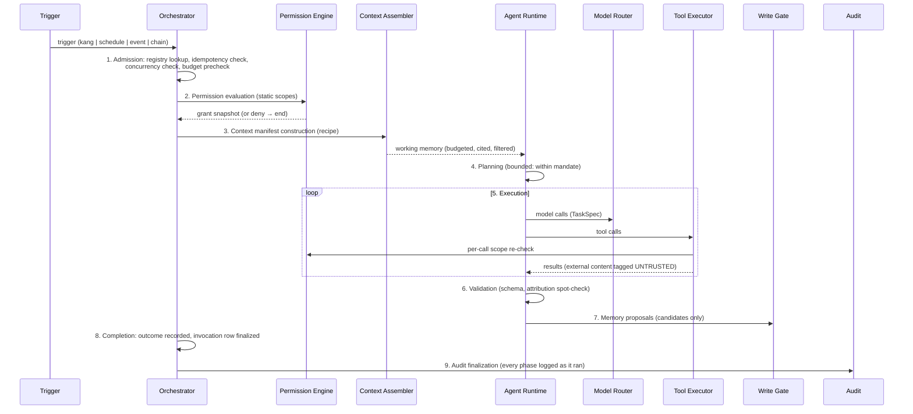
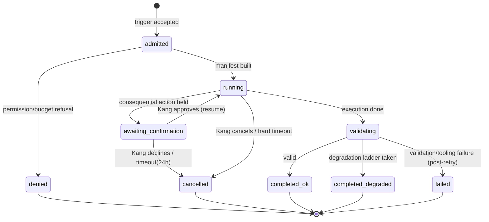

# KANG — Agent System Specification

**Document:** 05_AGENTS.md
**Version:** 0.1
**Author:** Kang, with Claude (Founding Architect)
**Status:** Normative — every agent-related component MUST conform; changes require an ADR
**Last updated:** 2026-07-11
**Upstream (binding):** `00_VISION.md`, `01_PRINCIPLES.md`, `02_PRODUCT_REQUIREMENTS.md`, `04_ARCHITECTURE.md` (D010, D011, D013, D014, D015), `06_MEMORY.md`, `07_DATABASE.md`
**Downstream:** `08_PLUGIN_SYSTEM.md`, `12_API.md`, `16_SYNC.md`

> RFC-2119 language throughout. No TODOs. Terminology note: this document fixes the canonical name **Orchestrator** for the component called "Coordinator" in `04_ARCHITECTURE.md` D011. One component, one name from here forward.

---

## 1. Philosophy

### 1.1 Why specialized agents, not one general AI

A single general AI with all tools and all memory is the obvious design and the wrong one:

1. **Least privilege becomes impossible (S2).** One mind holding email drafting, vault writes, web fetching, and sensitive memory reads is one prompt-injection away from combining them. Specialization is a *security* architecture before it is a cognitive one.
2. **Explainability collapses (P5).** "Why did KANG do that?" must resolve to a bounded actor with a bounded mandate. "The general AI decided" is not an answer that sustains ten years of trust.
3. **Context quality degrades.** A prompt that must be simultaneously a tutor, a critic, a scout, and a secretary is mediocre at all four. Small mandates get small, sharp contexts (06_MEMORY Part XI recipes).
4. **Right-sized intelligence (A8).** A deadline sweep does not need a frontier model. Specialization lets the Model Router match cost to task.

### 1.2 Two kinds of agents — one envelope

Not everything intelligent-seeming needs a model, and pretending otherwise wastes money and adds nondeterminism. KANG recognizes two agent kinds:

| Kind | Definition | Examples |
|---|---|---|
| **Cognitive** | Requires model calls; output is generated | Planner, Researcher, Critic, Tutor |
| **Mechanical** | Fully deterministic code; no model calls in the happy path | Vault Indexer, Backup Monitor, Health Monitor, Deadline Sweep |

Both kinds run in the **same invocation envelope**: registered definition, permission grants, tool allowlist, correlation id, audit trail, timeout, retry policy. This unification is deliberate: *everything KANG does autonomously is inspectable the same way*, whether or not a model was involved.

A mechanical agent MAY escalate to a cognitive step (e.g., the Web Monitor asking a cheap model to classify relevance) — the escalation is a declared capability in its definition, never an improvisation.

### 1.3 Separation of concerns (normative)

- **Agents reason and act. They never own state.** All persistence flows through the memory system's write gate (06_MEMORY Part IV) or the structured store's service layer. An agent MUST NOT hold private durable state of any kind (AR5). Anything worth keeping is worth gating.
- **Memory belongs to the memory system. The database belongs to the store layer.** Agents consume context manifests; they never query tables directly and never become a source of truth. An agent's output is a *proposal or an action*, never a *fact* — facts are what survives the gate.
- **Planning, execution, and orchestration are different components.** The Orchestrator routes and supervises; agents plan-within-mandate and execute tools; the kernel (scheduler, bus, permissions, router) provides the substrate. No component does two of these jobs.

### 1.4 Agents are bounded, not autonomous

KANG agents are **deterministic systems with bounded responsibilities**: fixed mandate, fixed tools, fixed context recipe, fixed failure behavior. Within the bounds, a cognitive agent's outputs vary (models are stochastic); the *bounds themselves* never vary at runtime. There is no open-ended autonomy, no self-directed goal selection, no agent-to-agent negotiation. A secretary must be predictable (Product Principle: calm; R9).

---

## 2. Core Principles (normative for every agent)

| # | Principle | Meaning |
|---|---|---|
| AGP-1 | **Single responsibility** | One mandate per agent. An agent needing a second mandate is two agents (E7). |
| AGP-2 | **Stateless execution** | No durable private state; everything durable passes the gate (AR5, AG-003). |
| AGP-3 | **Idempotency** | Every invocation carries an idempotency key (trigger-derived). Re-delivery after crash MUST NOT duplicate effects (D006 at-least-once). |
| AGP-4 | **Explainability** | Every invocation is reconstructible: trigger → manifest → model/tool calls → outcome, via correlation id (P5, D015). |
| AGP-5 | **Small context** | Agents receive the minimum context their recipe defines. Bigger context is a cost and an attack surface, not a favor. |
| AGP-6 | **Tool-first** | If deterministic code or a tool can do it, the model MUST NOT. Models decide and generate; tools compute and act. Arithmetic, dates, lookups, and state changes are tool work. |
| AGP-7 | **Human override** | Kang can cancel, override, or reverse any agent behavior. No agent output is binding on Kang (P6). |
| AGP-8 | **Graceful degradation** | Every agent defines what it produces when models, network, or budget are unavailable (A9). "Nothing, silently" is never a valid degradation. |

---

## 3. Agent Lifecycle

Every invocation — cognitive or mechanical — passes through the same nine phases. Phases MUST execute in order; skipping is forbidden (mechanical agents pass trivially through model-related phases).

**Phase contracts:**

1. **Trigger & admission.** The Orchestrator resolves the trigger to a registered agent + version, computes the idempotency key, rejects duplicates (completed key = return prior outcome), checks concurrency caps (AG-006) and budget headroom (AG-008).
2. **Permission evaluation.** Static grant snapshot taken *once* per invocation; the snapshot is what tool calls are checked against (a mid-invocation grant change does not affect running invocations — predictability over freshness; the change applies from the next invocation).
3. **Context manifest.** Built per the agent's recipe (§7); logged before the first model call. No agent constructs its own context.
4. **Planning.** Cognitive agents MAY produce an internal step plan; it is bounded by the mandate and the tool allowlist. Plans requesting out-of-scope actions fail validation *at plan time*, not at execution time.
5. **Tool execution.** Every call re-checked against the snapshot; consequential actions require a live confirmation token (S1) — there is no batch pre-approval of consequential actions.
6. **Validation.** Machine-consumed outputs are schema-validated (D010); memory-derived claims are attribution-spot-checked (06_MEMORY §5.4); tool outputs feeding further steps are type-checked.
7. **Memory proposal.** Anything durable becomes a *candidate* via the write gate (AG-010). Direct writes to memory or truth tables from agent code are architecturally absent — the agent runtime has no store handle, only the gate client and the domain service APIs.
8. **Completion.** `invocation` row finalized (outcome ∈ ok | degraded | failed | denied | cancelled); chained successors enqueued by the Orchestrator if the pipeline defines them.
9. **Audit finalization.** Every phase logged as it ran; the invocation's audit trail closes with the outcome.

**Failure handling (cross-cutting).** Any phase may fail; §10 governs. Failures are outcomes, not exceptions to the lifecycle.

---

## 4. The Orchestrator

### Decision AG-001 — Exactly one Orchestrator

**Decision.** A single kernel-level Orchestrator is the only component that MAY start, stop, schedule, chain, retry, or cancel agents; enforce budgets; and assign correlation ids.

**Why.** Concurrency caps, budget accounting, idempotency, and audit completeness are global invariants. Global invariants need a single enforcement point; two orchestrators means two half-truths about system state. This is also the explainability anchor: every autonomous action in KANG traces to one component's log.

**Alternatives.** Per-domain orchestrators (competition pipeline manager, learning pipeline manager — rejected: budget/concurrency fragmentation; domains express themselves as *pipeline definitions*, not orchestrator forks); choreography (agents react to each other's events without a supervisor — rejected: emergent chains are unexplainable and unbudgetable; events remain the *transport*, the Orchestrator remains the *authority* on what runs).

**Trade-offs.** The Orchestrator is a singleton and therefore a bottleneck-shaped component. Mitigation: it does no heavy work itself — admission, bookkeeping, and dispatch only (D011: "router, not god"). Domain logic in the Orchestrator is a severity-1 review rejection.

**Scaling implications.** Sidecar processes (D001 escape hatch) register with the same Orchestrator over local IPC; the singleton survives process topology changes.

### Decision AG-002 — No direct agent-to-agent invocation

**Decision.** Agents MUST NOT invoke other agents. Multi-agent behavior exists only as **pipelines**: named, versioned, bounded DAGs of agent steps, defined in the registry and executed by the Orchestrator (e.g., `competition_prep: generate → critique → revise`, per A6).

**Why.** Direct invocation creates hidden call graphs — unbounded cost, unauditable causality, and privilege confusion (whose grants apply?). A pipeline makes the chain a *declared artifact*: inspectable before it runs, budgeted as a unit, explainable after.

**Alternatives.** Free agent-to-agent messaging (AutoGen-style — rejected in D011 and re-rejected here: unbounded, unexplainable); allowing "read-only" direct calls (rejected: today's read-only convenience is tomorrow's privilege tunnel).

**Trade-offs.** Novel agent combinations require defining a pipeline first. That friction is the point: composition is a design act, not a runtime accident.

**Scaling implications.** Pipelines are data (registry entries) — plugins MAY ship pipelines referencing their own agents; the Orchestrator's execution semantics never change.

---

## 5. Agent Registry

### Decision AG-004 — Fixed, declarative registry; no dynamically generated agents

**Decision.** Agents exist only as **registered definitions**: versioned declarative documents (`agents/*.toml` + prompt files) loaded at startup, listing mandate, kind, triggers, recipe, tool allowlist, scopes, timeouts, retry, degradation, and pipeline memberships. KANG MUST NOT synthesize new agents, modify definitions, or grant scopes at runtime. New agents arrive by: Kang editing definitions, or plugins declaring them in manifests (installed and granted explicitly — D012).

**Why.** A system that can mint its own actors can mint its own privileges — the definition set is the security perimeter and the explainability contract. "What can KANG do?" MUST be answerable by reading a directory (P5; DB-P6's spirit applied to behavior).

**Alternatives.** LLM-generated ephemeral agents per task (rejected: perimeter dissolves); user-scriptable runtime agents (deferred: this is the workflow-automation feature, v0.5+, which composes *existing* agents/tools under the same gates — not new principals).

**Trade-offs.** Less runtime flexibility. Accepted without regret.

**Scaling implications.** Registry entries are sync-able, diffable, and reviewable — agent changes get code review like everything else.

The complete catalog with all required fields is **Appendix A** (normative). Registry curation notes — three items from the working list are deliberately *not* agents:

- **"Scheduler"** is the kernel scheduler (D014). It triggers agents; making it an agent would put the trigger source inside the permission system it feeds. Kernel, not agent.
- **"Retriever"** is the Context Assembler (06_MEMORY §5) — kernel infrastructure invoked in phase 3 of *every* lifecycle. Not independently triggerable, therefore not an agent.
- **Orchestrator** is the kernel component defined in §4.

---

## 6. Invocation Model

Six invocation modes, all normalized to the same lifecycle:

| Mode | Trigger source | Response contract |
|---|---|---|
| **User-initiated (sync)** | Kang via chat/UI/CLI | Streamed response; UI-facing latency budgets apply |
| **User-initiated (async)** | Kang launches a long task ("research X deeply") | Immediate acknowledgment + task card; completion surfaces per notification rules (§13) |
| **Scheduled** | Kernel scheduler (job table, D014) | Runs in state-appropriate windows; catch-up per job policy |
| **Event-driven** | Event bus subscription (D006) | Idempotent on event id; at-least-once tolerated |
| **Chained** | Orchestrator executing a pipeline step | Inherits pipeline correlation id; budgeted as pipeline |
| **Confirmation-resume** | Kang approves a held consequential action | Resumes the *held invocation*, same correlation id — approval is a lifecycle event, not a new invocation |

Rules: every mode produces an `invocation` row (07 §5.5); synchronous modes MAY stream partial output but MUST still complete validation before any consequential effect; scheduled and event modes MUST NOT assume UI presence (headless-safe by construction).

**Event-trigger idempotency key is derived from `event_id`** (making AGP-3's "trigger-derived" concrete for this mode).

---

## 7. Context Manifest Construction

### Decision AG-009 — Manifests are built by the kernel, deterministically, per recipe

**Decision.** The Context Assembler builds every manifest per the agent's versioned recipe (06_MEMORY Part XI). Construction is deterministic given (recipe version, query, store snapshot): candidate retrieval, scoring per 06_MEMORY §5.2, priority-class budgeting (P0–P4), **deterministic ordering** (score desc, then `id` asc as tiebreak — reproducibility requires total order), truncation bottom-up with truncation records.

Normative filters applied in order: `status=active` → sensitivity ≤ clearance (§8) → type ∈ recipe views → tier ≥ recipe floor → confidence ≥ recipe floor (default 0; the Critic sets 0 deliberately — it wants contested material, ⚠-tagged) → scoring → budget.

Freshness: the manifest records the store snapshot timestamp; recipes MAY declare `max_staleness` for cached inputs (calendar cache, web cache) — stale inputs beyond bound are refreshed or *flagged in the manifest*, never silently used.

**Why kernel-owned.** An agent assembling its own context can (a) exceed its memory scopes by clever querying and (b) make its behavior irreproducible. Centralizing assembly makes scopes enforceable and every answer reconstructible (the manifest *is* the explanation substrate — P5).

**Alternatives.** Agent-side retrieval with scope-checked store APIs (rejected: reproducibility lost, prompt-injection can steer retrieval); fully static contexts (rejected: kills relevance). 

**Trade-offs.** Recipe changes require definition edits (versioned) rather than runtime adaptation. Accepted: context is behavior; behavior changes get reviewed.

**Scaling implications.** Manifest logs are the training substrate for the year-2+ learned reranker (06_MEMORY Part XV) — determinism now is dataset quality later.

---

## 8. Permission Model

Implements D013 for agents; normative specifics:

- **Principals:** `kang`, `agent:{id}`, `plugin:{id}`, `rule:{id}`. Every tool call, gate proposal, and store-service call carries exactly one principal.
- **Grants:** `(principal, scope)` rows (07_DATABASE `grant_`), loaded from `permissions.toml` (file is truth; drift reported, file wins). Default-deny; wildcard scopes are forbidden in agent grants (`*` MAY exist only for principal `kang`).
- **Scopes** are capability strings with qualifiers: `memory.read:{view}`, `memory.propose:{types}`, `vault.read`, `vault.write:{folder-prefix}`, `web.fetch:{domain-list|any}`, `calendar.read`, `calendar.write` (consequential), `email.draft` (consequential to send — send is not grantable to any agent), `fs.read:{path-prefix}`, `model.call:{task-classes}`, `notify.{priority-max}`.
- **Pairing constraints (linted at load, from 06_MEMORY §12.2):** no principal combines `web.fetch` with `memory.read:sensitive`; no principal combines any Tier-0-input tool with `vault.write` outside a quarantined inbox folder; `memory.propose:rule|profile` is grantable to no one (gate enforces independently — defense in depth).
- **Temporary elevation:** does not exist for agents. If a task needs more scope, that is a different agent or a pipeline step running under a differently-scoped agent, or it needs Kang acting directly. (Elevation mechanisms become elevation attacks under prompt injection; the feature's absence is the defense.)
- **Denial behavior:** a denied tool call returns a typed `PermissionDenied` to the agent (which MUST degrade per its definition, and MUST NOT retry the same call), is audit-logged, and increments a per-agent denial metric — a *spike* in denials quarantines the agent pending review (it usually means a prompt or an injection is probing).
- **Audit:** every grant load, every denial, every consequential confirmation, every sensitive-memory access: audited with principal + correlation id (06_MEMORY §12.3).

---

## 9. Tool Access

### Decision AG-005 — Allowlists, enumerated, closed

**Decision.** Every agent definition MUST enumerate its allowed tools. There is no "all tools" grant, no default toolset, and no runtime tool discovery for agents. The tool catalog itself is closed and versioned; tools are kernel- or plugin-provided implementations behind ports (D005).

**Tool families and their standing rules:**

| Family | Rules |
|---|---|
| `fs.*` | Path-prefix-scoped reads; writes only within `%KANG_HOME%` staging + granted vault folders. No agent holds general filesystem write. |
| `vault.*` | Reads scoped by folder; writes per-folder; deletes are consequential (confirmation). Tier-0-input agents write only to the inbox quarantine (§8 pairing). |
| `web.*` | Fetch + search; all returned content wrapped UNTRUSTED (S6); domain allowlists per agent where the mandate permits (monitors get source lists, the Researcher gets `any`). |
| `db.*` | **Does not exist as a tool.** Agents touch structured state only via domain service tools (`tasks.complete`, `projects.create`, `deadlines.set`, `deadlines.mark_alerted`) — verbs with validation, not table access (AGP-6; DB-002's spirit). |
| `calendar.*` | Read free; write consequential. |
| `email.*` | `email.read:{folders}` and `email.draft` only. `email.send` is not a tool. Kang sends from his mail client — permanently (P6; PRD §15). |
| `clipboard.*` | Write-only (`clipboard.put`), user-initiated modes only. Clipboard *read* is not a tool (it is a surveillance primitive; nothing in the mission needs it). |
| `shell.*` | **Not a tool in v0.x.** Arbitrary shell execution under prompt-injection threat is unjustifiable for a secretary. Revisit trigger: a concrete engineering-agent feature with a sandboxed executor design (its own ADR). |
| `model.*` | Via Model Router only (D010); task classes per grant; direct provider SDK access is architecturally absent from the runtime. |
| `notify.*` | Priority-capped per agent (§13). |

**Why.** The tool layer is where words become actions — it is the entire blast radius of a compromised or confused model. Enumerated allowlists make the blast radius a reviewable artifact (Appendix D is that review).

**Alternatives.** Capability negotiation at runtime (rejected: negotiation is elevation with extra steps); trusting the model to self-restrict (not an alternative, listed for completeness and ridicule).

**Trade-offs.** New capabilities require definition edits. Correct.

---

## 10. Failure Handling

Normative behavior for every failure class:

- **Retries:** only for *transient* failures (timeout, 5xx, rate-limit, provider outage): exponential backoff with jitter, base 2s, max 3 attempts inside one invocation for tool/model calls; invocation-level retries only if the agent is idempotent (all are, by AGP-3) and only per its definition (default 1 re-run for scheduled agents, 0 for user-sync).
- **Non-retryable:** permission denials, validation failures, gate rejections, cancellations, budget exhaustion. Retrying a denial is treated as probing (§8).
- **Timeouts (AG-007):** every invocation has a hard timeout from its definition (defaults: user-sync 60s, user-async 15min, scheduled 10min, mechanical 5min; pipelines sum steps + 20% overhead cap). Timeout ⇒ cooperative cancellation signal ⇒ 10s grace ⇒ hard task kill. Partial effects: consequential actions are all-or-nothing behind confirmations; store writes are transactional (DB-003); therefore a killed invocation leaves *no partial truth* — at worst, orphaned candidates, which the janitor expires.
- **Cancellation (AG-007):** Kang MAY cancel any running invocation from the UI; cancellation is a first-class outcome, audited, never an error.
- **Partial failures in pipelines:** a failed step fails the pipeline forward (successors do not run); completed steps' proposals remain (they are candidates — harmless); the pipeline reports which steps completed. Pipelines MUST NOT auto-restart from the top (idempotency keys make resume-from-failed-step the only re-run mode).
- **Degraded execution:** each definition declares its degradation ladder (e.g., Planner: frontier → cheap model → **deterministic plan** from structured data alone — the plan MUST exist every morning even with zero model availability; FR-001 does not have a model-availability clause).
- **User notification:** failures notify per §13 priorities — a failed morning plan is `attention`; a failed news digest is a health-panel line, not a notification.
- **Audit:** every failure records class, phase, attempt count, and degradation taken.

---

## 11. Scheduling

Binding to D014; agent-specific rules:

- Scheduled agents run under jobs (`job` table); the job's `catch_up` policy governs missed executions (`run_once_latest` | `run_all_missed` | `skip`), chosen in the definition and listed in Appendix E.
- **Overlap:** a job whose previous invocation is still running MUST NOT start a second (per-agent concurrency default 1); the skip is logged. Agents where parallel instances are meaningful (Researcher on different questions) declare `max_concurrent > 1` explicitly (AG-006).
- **Quarantine:** `failure_count ≥ 3` consecutive ⇒ job `status=quarantined`, agent stops being scheduled, health panel alert; re-enable is a Kang action after the cause is addressed (mirrors 06_MEMORY XIV-3).
- **State windows:** jobs declare allowed product states (FR-074): heavy maintenance in `Sleeping`, digests never in `Building`, morning plan at wake boundary. The scheduler, not the agent, enforces windows.

---

## 12. Cost Control

### Decision AG-008 — Hierarchical budgets with an emergency reserve and a degradation ladder

**Decision.**
- **Hierarchy:** monthly global cap → per-task-class caps → per-invocation caps (tokens + calls), all in `providers.toml`, all enforced by the Model Router with the Orchestrator's admission precheck.
- **Escalation policy (A8):** agents request the *class*, never the model. Class defaults: `routine` = cheap/local; `deep_reasoning` = frontier; escalation from routine to deep within one invocation is permitted only if the definition declares it (e.g., Researcher on synthesis steps) and budget headroom exists.
- **Thresholds:** at 80% of monthly cap: router downgrades all `deep_reasoning` to confirmation-required; at 95%: only user-sync invocations get models, scheduled cognitive work degrades to deterministic paths; at 100%: **emergency reserve** (10% extra, separate line) serves exactly two things — deadline-critical competition work and Kang's explicit "spend it" override. The reserve exists so that budget exhaustion can never cause a missed deadline (R9 beats frugality).
- **Caching:** provider prompt-caching used where available (capability flag, D010); KANG-side response cache for idempotent cognitive calls (classification of identical content) keyed by content hash, 7-day TTL.
- **Batching:** monitors batch classification calls (N items per call where the task allows); embedding jobs batch by design (07_DATABASE §8).
- Every call lands in `model_call` (cost ledger); the health panel shows spend vs. caps daily.

**Why hierarchical + reserve.** Flat budgets fail in both directions: too tight starves the mission-critical, too loose normalizes waste. The reserve encodes the priority order (deadlines > everything) in money, where it is unambiguous.

**Alternatives.** Unlimited-with-monitoring (rejected: monitoring without enforcement is a graph of regret); per-agent budgets (rejected as primary: agents vary wildly by month — task classes are the stable unit; per-agent *alerting* exists in metrics).

---

## 13. Human Interaction Rules

- **Interruption ladder (U2/U7 + FR-074):**

| Priority | May interrupt | Examples |
|---|---|---|
| `critical` | Any state except none | Deadline in danger *today*; data-integrity incident |
| `attention` | Idle, Planning, Reviewing | Approaching deadlines; failed morning plan; approval queue > threshold |
| `digest` | Batched to plan/review surfaces | Opportunities, news, research findings |
| `silent` | Never interrupts; health panel / logs only | Job completions, routine successes |

  Each agent's definition caps its maximum priority (`notify.{priority-max}` scope). Only the Deadline Sweep and Health Monitor hold `critical`.
- **Approval required (S1, closed list, restated):** send-adjacent actions (none exist — send is not a tool), calendar writes, vault deletes, publishing, spending, permission changes, memory deletions, plugin installs. Approval is per-action, live, with full context shown; there is no "approve all," no standing approval, no approval expiry longer than the invocation.
- **Silence is preferred** wherever the ladder allows. The system's default answer to "should this notify?" is no. Agents MUST NOT re-notify the same item within 24h unless its urgency class increased.
- **Refusal behavior:** when KANG declines to act (permission, budget, principle), it states which constraint applied, in one sentence, with a pointer — never a lecture, never silence (P3 + calm).
- **No engagement farming:** agents MUST NOT ask questions to appear helpful, manufacture urgency, or guilt (anti-principles). A quiet day produces a quiet KANG.

---

## 14. Observability

Extends D015 with agent-level normative requirements:

- **Every invocation:** correlation id (= `invocation.id`), agent + version, trigger, manifest reference, phase timings, model calls (via `model_call` FK), tool calls with scopes checked, outcome, degradation taken. Pipelines share a pipeline id; steps keep their own correlation ids.
- **Metrics per agent (health panel):** success rate (7/30-day), p50/p95 latency, denial count, quarantine events, cost (7/30-day), degraded-run ratio, notification counts by priority.
- **Cross-agent:** budget burn-down, scheduler adherence (planned vs. actual runs), approval-queue age, event-bus dead-letter count.
- **The reconstruction test (normative):** for any invocation in the last 180 days, `kang explain <correlation-id>` MUST render the full causal chain (trigger → manifest ids → calls → outcome) from persisted data alone. If it cannot, observability has failed CI.

---

## 15. Security

Agent-specific consolidation of D013 + 06_MEMORY Part XII:

- **Sandboxing:** cognitive agents are sandboxed by *capability*, not by process, in v0.x (D012 honesty): no store handles, no provider SDKs, no filesystem — only the tool executor and gate client. Process isolation arrives with untrusted plugins (Phase 2) via the same interfaces.
- **Prompt injection defense in depth:** (1) UNTRUSTED wrapping of all external content (S6); (2) read/act separation — Tier-0-input agents hold no consequential scopes (§8 pairing rules); (3) out-of-band confirmations — no text can approve an action, only the UI can; (4) instruction-hierarchy prompts (system > definition > Kang > data; data instructions are quoted, never followed); (5) denial-spike quarantine (§8). Injection is assumed *permanent and eventually successful at influencing text* — the design goal is that influenced text still cannot act.
- **Tool validation:** every tool validates its inputs as hostile (path traversal, URL schemes, size limits) regardless of caller — agents are not trusted callers, they are the threat model.
- **Output validation:** schema validation for machine-consumed output (D010); attribution spot-checks for memory-derived claims (06_MEMORY §5.4); generated content destined for the vault passes the filing conventions validator (no vault pollution).
- **Secret handling:** secrets never enter manifests, prompts, logs, or memory (S7 + scrubber); agents have no secret-reading tool; adapters use keychain-held credentials internally.
- **Enforcement locus:** all of the above enforced in kernel components (executor, assembler, gate, router) — never delegated to agent prompts. Prompts are behavior *shaping*; kernels are behavior *bounding*.

---

## 16. Testing

Normative suites (CI; definition-of-done for any agent change):

| Suite | Contents |
|---|---|
| **Orchestration** | Admission dedup (idempotency keys); concurrency caps; pipeline forward-failure and resume-from-step; chained correlation integrity |
| **Permissions** | Property-based: every registered agent × every tool outside its allowlist ⇒ denied + audited; pairing-constraint linter on all definitions; denial-spike quarantine trigger |
| **Lifecycle** | Phase-order enforcement; grant-snapshot immutability mid-invocation; validation-rejects-out-of-scope-plans |
| **Failure/retry** | Fault-injected adapters (timeouts, 5xx, garbage output): backoff schedules, non-retry of denials, timeout → cancel → no partial truth (transactional check) |
| **Scheduling** | Catch-up policies against simulated downtime (2h, 3 days, 3 weeks — NFR-008); overlap suppression; state-window enforcement; quarantine at 3 failures |
| **Context** | Recipe determinism (same snapshot ⇒ byte-identical manifest); budget-class truncation order; privacy filters (sensitive/private exclusion proofs); staleness flags |
| **Cost** | Cap enforcement at 80/95/100%; reserve accessibility rules; ledger accuracy vs. injected known costs |
| **Degradation** | Every cognitive agent runs its zero-model path in CI (the Planner's deterministic morning plan is a **release-blocking** test — FR-001) |
| **Injection (red team)** | Fixture corpus of hostile web/email/vault content through every Tier-0-input agent: zero consequential-action attempts may succeed; influenced-output cases documented as expected-and-contained |

---

## 17. Future Compatibility

- **New agents:** definition + grants + (optionally) pipeline entries. No kernel changes. The envelope is the contract.
- **Plugin agents (D012):** manifests declare definitions in the plugin namespace (`agent:plugin.{id}.{name}`); identical envelope, grants from Kang at install; Phase-2 isolation swaps the execution transport, not the contract.
- **MCP servers:** MCP is a *tool transport*, not an agent model — MCP servers surface as tool families in the catalog (each tool allowlisted per agent like any other), behind an adapter implementing the tool port. Agents never know whether a tool is native or MCP.
- **Local models (Ten-Year Dream):** task-class routing config drift (D010); the `private` class already assumes it; no agent definition changes.
- **Multi-device (16_SYNC):** the registry, grants, and pipelines are files + tables under the sync quartet — they replicate like all truth. Scheduled agents gain a `runs_on` device affinity field (reserved in the definition schema now, unused until sync).
- **Model generational leaps:** definitions pin *task classes*, prompts are versioned files — upgrading intelligence is a prompt/routing change reviewed like code, never an emergent behavior shift.

---

## Appendix A — Built-in Agent Catalog (normative)

Legend: kind C=cognitive, M=mechanical. Timeouts = hard invocation timeout. Retry = invocation-level. All agents implicitly hold `model.call:{their classes}` per column; "—" = none.

| Agent | Kind | Purpose | Triggers | Inputs → Outputs | Allowed tools | Forbidden (highlights) | Timeout | Retry | Degradation | Key scopes |
|---|---|---|---|---|---|---|---|---|---|---|
| **planner** | C | Generate/adapt daily plan; evening & weekly reviews (FR-001..004) | sched (morning, evening, weekly); kang | structured state, calendar, lessons → plan, reviews | tasks.*, deadlines.read, calendar.read, notify≤attention | web, vault.write, email | 10m | 1 | **deterministic plan** from P0 data | memory.read:planner-view; memory.propose:observation |
| **competition_strategist** | C | Evaluate competitions; timelines; prep support; judge sim (FR-033..037) | kang; event: competition.found (via pipeline); sched (weekly outlook) | competition entity, retrospectives, profile → briefs, timelines, prep | projects.*, deadlines.*, notify≤attention; vault.write:Competitions/ | web (separation: consumes scout's stored briefs), email | 15m | 1 | brief from cached research; timeline deterministic | memory.read:competition-view; memory.propose:fact,lesson,observation |
| **competition_scout** | M→C | Monitor sources; classify relevance (FR-032) | sched (daily) | source list → competition.found events + stored briefs | web.fetch:{sources}, notify≤digest | vault.write, calendar, projects.write | 5m | 1 | store raw finds unclassified, flag for review | model.call:classification only |
| **researcher** | C | Multi-source research briefs (FR-050..052) | kang; chained | question → cited brief, literature notes (inbox) | web.fetch:any, vault.write:Inbox/ only, notify≤digest | calendar, email, projects.write, memory.read:sensitive (pairing rule) | 15m | 0 | partial brief with coverage statement | memory.read:research-view; memory.propose:fact,observation |
| **tutor** | C | Teaching, study plans, quizzes, repetition (FR-040..043) | kang; sched (repetition due) | goals, quiz history → lessons, quizzes, schedules | quiz.*, repetition.*, notify≤attention | web (uses researcher via pipeline for sources), vault.write outside Learning/ | 10m | 0 | repetition scheduling is deterministic; teaching requires model (reports unavailability) | memory.read:learning-view; memory.propose:observation |
| **critic** | C | Adversarial review: strengths/weaknesses/risks/blind spots (A6) | chained (pipelines); kang | artifact + evidence links → structured critique | notify≤digest | ALL world-touching tools (critic reads and writes nothing external — by design) | 10m | 0 | unavailable (a degraded critique is worse than none; pipeline marks step skipped, visibly) | memory.read:critic-view (tier≥1, contested included) |
| **memory_steward** | M→C | Janitor, dedup, weekly consolidation, pattern extraction (06_MEMORY Part VI) | sched (nightly/weekly/monthly) | stores → transitions, merge products, queued proposals | gate client, notify≤digest | web, vault.write, calendar, email | 30m (Sleeping) | 1 | mechanical passes always run; cognitive extraction skips | memory.propose:lesson,preference,observation (promotions queued) |
| **vault_indexer** | M | Chunk/embed/index vault; link_index merge; broken-link detection | sched (sweep) + fs watcher events | vault files → derived indexes | fs.read:vault, vault.read | ALL writes except derived tables (via indexer service) | 10m | 1 | FTS-only indexing if embedder down | — |
| **vault_organizer** | C | File inbox captures into conventions; propose links (FR-062, FR-063) | sched (daily); kang | inbox items → filed notes, link proposals | vault.read, vault.write:{conventions}, notify≤digest | web, calendar, email | 10m | 1 | leaves items in inbox, flags backlog | memory.read:vault-view; memory.propose:observation |
| **deadline_sweep** | M | Lead-time alerts; missed-deadline detection (FR-031) | sched (hourly) | deadline table → alerts, status transitions | deadlines.read, deadlines.mark_alerted, notify≤**critical** | everything else | 2m | 2 | none needed (pure SQL); its failure is itself critical-alerted | — |
| **web_monitor** | M→C | Configured monitors: news, GitHub trending, scholarships (FR-070/071) | sched (per-monitor) | sources → filtered digest items | web.fetch:{sources}, notify≤digest | vault.write, calendar, email, projects | 5m | 1 | skip cycle (stale news worthless — `skip` catch-up) | model.call:classification |
| **notifier** | M | Deliver notifications per state ladder (§13, FR-074) | event: notification.requested | queued items → delivered/batched/suppressed | OS notification port | everything else | 30s | 2 | queue for next allowed window | — |
| **backup_monitor** | M | Snapshot execution + verification (07_DATABASE Part 12) | sched (daily, Sleeping; monthly verify) | kang.db → snapshots, verification reports | fs (backup dirs), db admin port, notify≤attention | web, vault, calendar, email | 20m | 1 | alert on any failure — no silent skip, ever | — |
| **health_monitor** | M | Metrics collection; threshold alerts; `kang doctor` backend | sched (5m tick) | system metrics → health panel, alerts | metrics ports, notify≤**critical** | world-touching tools | 1m | 0 | its absence is detected by watchdog (dead-man switch) | — |
| **faith_companion** | C | Reading plans, memorization scheduling, journal support (FR-090..092) | kang; sched (daily prompt, repetition) | plans, queue → prompts, reviews | repetition.*, vault.read/write:Faith/, notify≤attention | web, email, calendar.write; **local-model-only for journal contexts (fail-closed)** | 5m | 0 | scheduling deterministic; journal features offline-capable by construction | memory.read:faith-view incl. private (sole holder) |
| **sync_agent** *(reserved, v0.5)* | M | Change-set exchange (D009/16_SYNC) | sched | change_log → encrypted sets | sync transport port | all others | — | — | — | defined in 16_SYNC |
| **plugin_runner** | M | Supervised execution envelope for plugin-declared agents (D012) | per plugin definition | plugin manifest scope | plugin's granted allowlist ONLY | anything not granted | per manifest ≤ 10m | per manifest | disable-on-repeat-failure (quarantine) | plugin's grants |

Pipelines (initial set): `competition_intake: scout → strategist(evaluate) → notify`; `competition_prep: strategist(ideas) → critic → strategist(revise)`; `deep_research: researcher → critic → researcher(revise)`; `weekly_close: planner(review) → memory_steward(weekly) → notifier`.

## Appendix B — Invocation state diagram

## Appendix C — Permission matrix (summary; `permissions.toml` is operative)

| Scope ↓ / Agent → | planner | strategist | scout | researcher | tutor | critic | steward | organizer | sweep | monitor | faith |
|---|---|---|---|---|---|---|---|---|---|---|---|
| memory.read (own view) | ✓ | ✓ | — | ✓ | ✓ | ✓(contested) | ✓(all normal) | ✓ | — | — | ✓(+private) |
| memory.read:sensitive | — | — | — | ✗(paired) | — | ✓ | ✓ | — | — | ✗(paired) | ✓ |
| memory.propose | obs | fact,lesson,obs | — | fact,obs | obs | — | lesson,pref,obs | obs | — | — | obs |
| web.fetch | — | — | sources | any | — | — | — | — | — | sources | — |
| vault.write | — | Competitions/ | — | Inbox/ | Learning/ | — | — | conventions | — | — | Faith/ |
| calendar.write (conseq.) | ✓ | — | — | — | — | — | — | — | — | — | — |
| notify max | attn | attn | digest | digest | attn | digest | digest | digest | **crit** | digest | attn |

## Appendix D — Tool matrix: consequential actions (closed list)

`calendar.write` · `vault.delete` · `email.draft→(send does not exist)` · `projects.delete` · `memory.delete` · `plugin.install/enable` · `grant.modify` · any `fs.write` outside staging/vault-granted · `job.enable`/`job.disable` (core jobs) · `restore.run` · `export.key_backup` · `private.unlock` · `held_action.approve` · `held_action.cancel`. Each requires live per-action confirmation; each is audited with full context; none is grantable as auto-approved.

`held_action.approve` and `held_action.cancel` are additionally **`first_party_only`** (ADR 002): out-of-band confirmation for every other item in this list is enforced by requiring a `held_action` record and a distinct approval step; for these two items specifically, the *approval step itself* is the consequential action, so the first-party channel check (not a permission scope — §8) is what stands in for that second layer. A plugin session cannot approve, decline, or drain Kang's approval queue regardless of its grants.

## Appendix E — Scheduling table

| Job | Cadence | Window (state) | Catch-up |
|---|---|---|---|
| morning_plan | daily 06:00* | wake boundary | run_once_latest |
| evening_review | daily 21:30* | Idle/Reviewing | run_once_latest |
| weekly_close | Sun 20:00* | Reviewing | run_once_latest |
| deadline_sweep | hourly | any | run_once_latest |
| competition_scout | daily | Sleeping/Idle | run_once_latest |
| web_monitor.* | per-monitor | Sleeping/Idle | skip |
| repetition_due | daily | Idle | run_all_missed |
| memory_steward.nightly | daily | Sleeping | run_once_latest |
| memory_steward.weekly | weekly | Reviewing | run_once_latest |
| memory_steward.monthly | monthly | Sleeping | run_once_latest |
| vault_indexer.sweep | 6h + fs events | Sleeping/Idle | run_once_latest |
| backup.snapshot / verify | daily / monthly | Sleeping | run_all_missed |
| health.tick | 5m | any | skip |

\* Times are placeholders pending Kang's actual routine (04_ARCHITECTURE §20.4 — still open) and are config, not spec.

## Appendix F — Event trigger table

| Event | Subscribing agents |
|---|---|
| competition.found | pipeline competition_intake |
| deadline.approaching | notifier; planner (plan adaptation) |
| vault.note_changed | vault_indexer |
| capture.created | vault_organizer (batched) |
| memory.contested | steward (next weekly); critic (context flag) |
| plan.generated | notifier |
| provider.circuit_open | health_monitor |
| notification.requested | notifier |

---

### Remaining mandatory decisions, recorded inline above

AG-001 §4 · AG-002 §4 · **AG-003** §1.3/AGP-2 (stateless — restated as decision: persistent agent state rejected because state fragments truth, breaks replaceability (AR5), and turns agent bugs into data corruption; the alternative "agent scratchpads" is subsumed by episodic memory through the gate) · AG-004 §5 · AG-005 §9 · **AG-006** §11 (parallel execution permitted, per-agent `max_concurrent` default 1, global cap 4 concurrent cognitive invocations — enough for pipelines + a user task; single-writer DB discipline (DB-003) makes parallelism safe by construction; the alternative, strict serial execution, was rejected because a slow research task must not block the deadline sweep) · AG-007 §10 · AG-008 §12 · AG-009 §7 · AG-010 §3 phase 7 + 06_MEMORY M-003 (agents propose, never write; no confidence bypass — the gate is the constitution).

*When code and this document disagree, one of them is wrong on purpose — file the ADR.*
