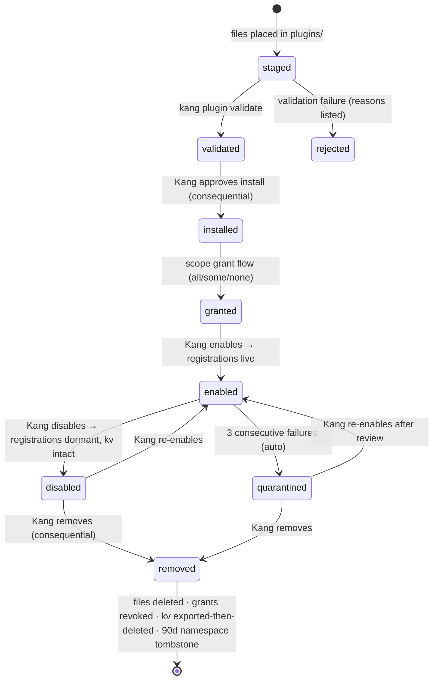

    # KANG — Plugin System Specification

**Document:** 08_PLUGIN_SYSTEM.md
**Version:** 0.1
**Author:** Kang, with Claude (Founding Architect)
**Status:** Normative — every extension mechanism MUST conform; changes require an ADR
**Last updated:** 2026-07-11
**Upstream (binding):** `00_VISION.md`, `01_PRINCIPLES.md`, `02_PRODUCT_REQUIREMENTS.md`, `04_ARCHITECTURE.md` (D001, D005, D012, D013), `05_AGENTS.md`, `06_MEMORY.md`, `07_DATABASE.md`
**Downstream:** `12_API.md` (plugin API surface), `09_UI_DESIGN.md` (panel slots), `03_ROADMAP.md`

> RFC-2119 language throughout. No TODOs. Reserved interfaces are explicitly labeled **RESERVED** with their activation trigger.

---

## 1. Philosophy

### 1.1 Why plugins exist

KANG's core must stay small enough for one person to hold in his head for a decade (AR1, R7). Every capability that *can* live outside the core *must* live outside the core (AR2: plugins over forks; AR8: design for deletion). Plugins are how KANG grows for ten years without the core growing with it.

The plugin system is therefore not a feature — it is the **enforcement mechanism of the core's smallness**.

### 1.2 The honest Phase-0 framing

For the foreseeable future there is exactly one plugin author: **Kang**. This truth shapes everything:

- The Phase-1 trust model is *authorship*, not sandboxing (D012, restated in PL-001). We do not build isolation theater for an attacker who doesn't exist.
- What we DO build now, rigorously, is the **contract**: manifests, namespaces, capability grants, kernel-only interfaces, audit. Contracts are cheap now and impossible to retrofit; isolation is expensive now and straightforward to add later behind the same contracts.
- Every rule in this document is written so that flipping to untrusted third-party plugins (Phase 2) changes the *execution transport*, never the *interface*.

### 1.3 The constitutional rules (restated from upstream, enforced here)

Plugins MUST NOT, ever, in any phase:

1. Access `kang.db`, `eventlog.db`, or any store file directly (07_DATABASE DB-P6).
2. Access memory except through the write gate and scoped read APIs (06_MEMORY Part IV).
3. Bypass the Permission Engine, the tool executor, or the Model Router (D013, AG-005).
4. Modify core behavior, core definitions, other plugins' namespaces, or grants.
5. Execute without an explicit Kang-approved installation and grant set.
6. Perform any action that is not audit-attributable to `plugin:{id}`.

These are not guidelines. Violation of any is a severity-1 defect.

---

## 2. Goals and Non-Goals

**Goals (Phase 1, v0.4):**
- New integrations, monitors, tools, agents, pipelines, and dashboard panels installable without core changes.
- Explicit, inspectable, least-privilege capability grants per plugin.
- Full lifecycle: install → validate → grant → enable → run → disable → upgrade → remove — each state visible and reversible.
- Failure containment: a broken plugin degrades itself, never KANG.
- Complete auditability of every plugin action.

**Non-goals (Phase 1):**
- ❌ Marketplace, discovery, ratings, or any remote distribution.
- ❌ Auto-update of plugins (mirrors D016: deliberate updates only).
- ❌ Process/memory isolation (Phase 2; trigger: first non-Kang-authored plugin).
- ❌ Non-Python plugins.
- ❌ Plugins extending core table schemas (plugins get `plugin_kv`, nothing else).
- ❌ Plugin-to-plugin dependencies (PL-005).
- ❌ Monetization, licensing, DRM — contrary to P2 and absurd for one user.

---

## 3. Mandatory Decisions

### PL-001 — Isolation & trust model: in-process trusted-author now; sidecar contract later

**Decision.** Phase 1 plugins run **in-process** in the KANG core's interpreter. Trust basis: *Kang wrote it or read it before installing* — installation requires Kang to acknowledge the code-review responsibility. The manifest and kernel interfaces are contracts and audit aids, **not security boundaries** (stated per D012's honesty requirement). **RESERVED:** the `sidecar` execution transport (same SDK interfaces over local IPC, OS-restricted process) — activation trigger: first third-party plugin, or first plugin needing non-blessed dependencies (PL-005). The manifest gains one field (`execution = "sidecar"`); nothing else changes for a compliant plugin author.

**Why.** Python in-process cannot be meaningfully sandboxed; pretending otherwise is security theater that costs complexity and buys lies. Real isolation = process boundary = the D001 escape hatch, already designed. Building it before any untrusted code exists violates R6.

**Alternatives.** WASM (immature for Python-ecosystem plugins); subprocess-per-plugin now (real isolation, but IPC serialization tax on every tool call for zero present threat); RestrictedPython/exec sandboxes (historically bypassable; worse than honest trust).

**Trade-offs.** A malicious Phase-1 plugin owns the process. Accepted and documented: the mitigation is the trust basis, plus containment of *accidents* (PL-009), which are the actual Phase-1 threat.

**Scaling implications.** Because plugins already speak only kernel interfaces (§1.3), the sidecar transport slots behind the SDK with zero plugin-code changes for compliant plugins.

### PL-002 — Capability-based permissions; grants at install; default-deny

**Decision.** A plugin's manifest **requests** scopes (same scope language as agents, 05_AGENTS §8). Installation presents every requested scope with a plain-language consequence line; Kang grants all, some, or none. Granted scopes land in `permissions.toml` + `grant_` under principal `plugin:{id}` (and `agent:plugin.{id}.{name}` for plugin agents). Runtime requests for ungranted scopes are denials (audited, spike-quarantined per 05_AGENTS §8). Pairing constraints (web ⊄ sensitive-memory, etc.) are linted against the **union** of a plugin's principals at install — a plugin MUST NOT assemble a forbidden pairing across its own agents.

**Why.** One permission system (D013) with one enforcement point. Plugins are just more principals; a second model would create the gap that bugs and attackers live in.

**Alternatives.** All-or-nothing install grants (rejected: violates least privilege); runtime permission prompts (rejected as primary: prompt fatigue trains blind approval; runtime prompts exist only for consequential-action confirmations, which are per-action anyway).

### PL-003 — Static manifests; no runtime generation

**Decision.** A plugin is defined by a static `plugin.toml` manifest, written by hand, validated at install. Plugins MUST NOT generate, modify, or extend manifests, capabilities, tools, agents, or pipelines at runtime. What is registered at enable-time is everything the plugin will ever be, until an upgrade.

**Why.** AG-004's reasoning, extended: the manifest set answers "what can KANG do and touch?" by reading files. Runtime registration dissolves that answer.

**Alternatives.** Dynamic capability discovery (rejected: perimeter dissolution); code-annotation-derived manifests (rejected: the manifest must be reviewable *before* code executes — a manifest computed by running the code inverts the trust sequence).

### PL-004 — Version compatibility: SDK semver, declared ranges, refusal on mismatch

**Decision.** The plugin SDK (`plugins_sdk/`) carries semver `sdk_version`. Manifests declare `requires_sdk = ">=1.2,<2"`. At load: incompatible ⇒ the plugin refuses to enable, with a clear message — **never** best-effort loading. SDK deprecations: marked for ≥ 2 minor versions with runtime warnings before removal (D012). Breaking SDK changes (major bump) ship with a written migration note per extension point.

**Why.** A plugin written in year 3 must either work in year 8 or *fail loudly and explainably* in year 8. Silent partial compatibility is the worst outcome.

**Alternatives.** Eternal backward compatibility (rejected: fossilizes the core's interfaces); no versioning, "fix plugins when they break" (rejected: works for one plugin, rots at ten).

### PL-005 — Dependency policy: blessed set only, in-process; sidecar for everything else

**Decision.** Phase-1 (in-process) plugins MAY import: Python stdlib + the **blessed dependency set** — exactly the packages KANG core already ships, pinned, published per release as `sdk_compat.toml` and `kang.sdk.BLESSED`. Plugins MUST NOT declare, vendor, or pip-install additional packages. Plugin-to-plugin dependencies MUST NOT exist (manifests cannot require other plugins). A plugin needing anything beyond the blessed set is, by definition, a **sidecar plugin** (PL-001 RESERVED path), where it owns its own interpreter and environment.

**Why.** Python's import system is process-global: `sys.modules` is shared, so two in-process plugins carrying different versions of the same package collide in the *common* case, not the edge case — vendored directories with path precedence only disguise this until the first duplicate module name. The blessed set makes the in-process contract honest: light plugins are trivially safe; heavy plugins pay the honest price (a process) instead of a hidden one (core instability landing on the single maintainer, R7). Inter-plugin dependencies are separately fatal to "removal = drop the namespace" and are banned outright.

**Alternatives.** Vendored pinned deps with per-plugin path precedence (rejected: false isolation per above — this was seriously considered and is the strongest competitor; it fails on `sys.modules` reality); shared site-packages pip-at-install (rejected: version roulette + install becomes core-environment mutation); forbidding all third-party code paths permanently (rejected: the sidecar path exists precisely so the integration use-case survives).

**Trade-offs.** Some plugin ideas hit the wall early. Correct: the wall is a signpost to the sidecar, not a prohibition.

**Scaling implications.** The blessed set grows only when the *core* needs a package; plugins never drive core dependencies. Sidecars scale dependency freedom without ever touching core stability.

### PL-006 — Upgrade strategy: manual, staged, snapshot-backed

**Decision.** Upgrades are Kang-initiated, never automatic. Protocol (mirrors 07_DATABASE Part 13): (1) snapshot the plugin's `plugin_kv` rows + config; (2) validate the new manifest (schema, SDK range, scope diff); (3) **scope diff is re-consented** — any *new* scope requires explicit grant; removed scopes are revoked; (4) disable old → swap files → enable new; (5) the plugin's `on_upgrade(old_version)` hook runs (migrating its own kv data — its responsibility, its namespace); (6) failure at any step rolls back to the snapshot + old version. Version history is recorded in the `plugin` table.

### PL-007 — Namespace ownership: plugin id is the namespace, unique, immutable

**Decision.** `plugin_id` (lowercase, `[a-z0-9_]{3,32}`) is the namespace for everything the plugin registers: tools (`plugin.{id}.{tool}`), agents (`agent:plugin.{id}.{name}`), pipelines, events (`plugin.{id}.{event}`), kv keys, config section, panel slots, log/audit attribution. First-installed-first-owned on the machine; collision at install ⇒ rejection. Ids MUST NOT be reused for 90 days after removal (tombstone window — prevents grant/audit identity confusion). Core namespaces (`kang.*`, unprefixed names) are unregisterable by plugins.

### PL-008 — Conflict resolution: no overrides, period

**Decision.** Plugins MUST NOT: shadow core tools/agents/events; register into another plugin's namespace; claim an existing event name; or alter pipeline definitions they don't own. All collisions are install-time rejections naming the conflicting owner. Plugins MAY *subscribe* to any event they're scoped for and MAY be *composed* into pipelines by Kang — composition is additive, never substitutive. Core components never depend on plugin events, tools, or agents (dependency direction is strictly core→never-plugin, per 04_ARCHITECTURE §1.2 layering).

**Why.** Override chains (filter stacks, monkey-patching) are how extension systems become undebuggable. In a ten-year single-maintainer system, "who changed this behavior?" MUST have a one-step answer.

**Alternatives.** Priority-ordered override chains (rejected above); override-with-consent (rejected: the consent memory fades, the confusion remains).

### PL-009 — Failure containment: supervised, quarantined, never fatal

**Decision.** Every plugin entry point (tool call, agent run, hook, monitor tick, panel provider, event handler) executes under kernel supervision: timeout (per manifest, capped per Appendix A), exception capture (a plugin exception is a *plugin failure result*, never a core exception), result-size caps, log-flood caps. **RESERVED:** CPU/memory quotas (meaningful only with the sidecar transport). Failure accounting: 3 consecutive failures of any entry point ⇒ `plugin.status = quarantined` (07_DATABASE), all registrations dormant, health-panel alert, Kang-only re-enable (mirrors 05_AGENTS §11). KANG core MUST pass CI with every plugin simultaneously quarantined — the core has zero hard plugin dependencies.

### PL-010 — Trust model summary

**Decision.** Trust chain: Kang reviews source + manifest → installs (consequential action) → grants scopes individually → plugin runs under kernel enforcement + audit → misbehavior quarantines → removal is complete and verified. No remote code, no eval of fetched content, no plugin-initiated network except through granted `web.fetch` scopes via the tool executor (which tags everything UNTRUSTED, S6). A plugin that fetches instructions from the web and follows them has exactly the same (in)ability to act as any injected agent: none, absent granted consequential scopes — which require live per-action confirmation anyway.

---

## 4. Plugin Lifecycle & State Machine



Semantics (normative):

- **Validate** executes zero plugin code: manifest schema, SDK range, namespace availability, scope syntax, pairing lint, entry-point resolution check, blessed-import static scan (AST-level; blocking).
- **Install** is the consequential action (extends 05_AGENTS Appendix D: `plugin.install/enable`). The approval screen contents are normative — Appendix B.
- **Enable** loads code, calls `on_enable()`, registers declared extension points. Registration is all-or-nothing: any conflict ⇒ enable fails cleanly, nothing half-registered.
- **Disable** unregisters everything, calls `on_disable()`, preserves `plugin_kv`, config, and grants (dormant). Disable MUST succeed even if the plugin's own hook fails — the kernel owns teardown; hook failure is logged and teardown proceeds.
- **Remove:** `plugin_kv` exported to `exports/plugin-{id}-{ts}.json` (P2: it is Kang's data), then deleted; grants revoked; files deleted; namespace tombstoned 90 days; full removal audited.
- Every transition is audited with actor + reason.

---

## 5. Directory Layout & Manifest

### 5.1 Layout

```
%KANG_HOME%/plugins/
└── {plugin_id}/
    ├── plugin.toml          # manifest (REQUIRED)
    ├── README.md            # human documentation (REQUIRED — Kang reviews this)
    ├── src/kang_plugin_{id}/
    │   ├── __init__.py      # exposes entry points named in the manifest
    │   ├── agents/          # prompt files for declared cognitive agents
    │   └── ...
    ├── config.schema.toml   # plugin config schema (OPTIONAL)
    └── tests/               # plugin's own tests (STRONGLY RECOMMENDED; run via `kang plugin test`)
```

Config *values* live with all other config: `config/plugins/{id}.toml` (diffable, backed up — D003). The plugin directory is code, not state: reinstallable from source at any time; all state is `plugin_kv` + config.

### 5.2 Manifest schema (`plugin.toml`, normative)

```toml
[plugin]
id           = "weather"                # REQUIRED [a-z0-9_]{3,32}
name         = "Weather Panel"          # REQUIRED
version      = "1.2.0"                  # REQUIRED semver
author       = "Kang"                   # REQUIRED
description  = "Morning-plan weather context and a dashboard panel."  # REQUIRED
requires_sdk = ">=1.0,<2"               # REQUIRED
# execution = "sidecar"                 # RESERVED (PL-001)

[capabilities]                          # REQUIRED (tables may be empty)
scopes = ["web.fetch:api.met.no", "notify.digest"]   # requested, not granted

[[tools]]                               # 0..n → registered as plugin.{id}.{name}
name          = "today"
entry         = "kang_plugin_weather:today_tool"
description   = "Returns today's forecast for the configured location."
timeout_s     = 20                      # ≤ Appendix A cap
consequential = false                   # true requires scope AND live confirmation

[[agents]]                              # 0..n — 05_AGENTS definition shape, plugin-namespaced
name        = "weather_brief"
kind        = "mechanical"              # or "cognitive" (+ task_classes)
triggers    = ["schedule"]
tools       = ["plugin.weather.today", "notify"]
timeout_s   = 60
retry       = 1
degradation = "skip cycle; stale weather is worthless"
notify_max  = "digest"

[[pipelines]]                           # 0..n — steps: own agents + core agents (composition)
name  = "morning_weather"
steps = ["agent:plugin.weather.weather_brief"]

[[subscriptions]]                       # 0..n
event     = "plan.generated"
handler   = "kang_plugin_weather:on_plan"
timeout_s = 10

[[panels]]                              # 0..n — data-only contract; §6
name          = "weather_card"
slot          = "dashboard.sidebar"
data_provider = "kang_plugin_weather:panel_data"
refresh_s     = 1800

[hooks]                                 # lifecycle-only — the ONLY hooks that exist (§7)
on_enable  = "kang_plugin_weather:enable"
on_disable = "kang_plugin_weather:disable"
on_upgrade = "kang_plugin_weather:upgrade"

[[jobs]]                                # scheduler entries for own agents only
agent    = "weather_brief"
schedule = "cron:0 6 * * *"
window   = ["Sleeping","Idle"]
catch_up = "skip"
```

Validation beyond schema: every `entry` MUST resolve inside the plugin's own package; every tool an agent lists MUST be grantable-core or own-namespace; jobs MUST reference own agents only; declared events MUST carry payload schemas.

---

## 6. Extension Points (closed set; finalizes D012)

| Extension point | Registers | Kernel counterpart | Notes |
|---|---|---|---|
| **Tool** | Callable in the tool catalog | Tool executor (05_AGENTS §9): validation, scopes, UNTRUSTED tagging all apply | |
| **Agent** | A definition (AG-004 shape) | Agent registry + Orchestrator — identical envelope | |
| **Pipeline** | Bounded DAG of own+core agents | Orchestrator registry | Core pipelines never reference plugin agents (PL-008 direction rule) |
| **Monitor** | Sugar: mechanical agent + job + namespaced events | Scheduler + bus | |
| **Panel** | Dashboard card: slot + data provider | UI shell (09_UI_DESIGN owns slots) | **Data-only:** plugin returns JSON in a fixed card vocabulary (metric/list/text/chart); core renders. Plugin UI code in-process would be script injection by invitation — Phase-2 conversation |
| **Event subscription** | Handler for core/plugin events | Bus (D006): at-least-once; handlers MUST be idempotent | |
| **RESERVED: Integration adapter** | Full implementation of a core port (e.g., alternate calendar) | Ports (D005) | Trigger: first real need; own ADR — port implementations are trust-heavier |
| **RESERVED: Sync transport** | D009 relay implementation | 16_SYNC | Trigger: sync v0.5 |

---

## 7. Events & Hooks — deliberately minimal

- The hook system is exactly three lifecycle hooks: `on_enable`, `on_disable`, `on_upgrade`. There are **no filter hooks, no behavior-modification hooks, no interception hooks** (PL-008). "Run my code when core does X" is an *event subscription*: observational, after-the-fact, incapable of altering the observed action.
- Plugins MAY publish only namespaced events (`plugin.{id}.*`), schemas declared in the manifest. Core never subscribes to plugin events (dependency direction). Other plugins subscribing to plugin events is **RESERVED-dormant** (it is a soft inter-plugin dependency; trigger: ADR with real cases).
- Ordering: multiple subscribers to one event run in plugin-id lexical order — deterministic, documented, and deliberately *not* configurable (priority systems are conflict systems).

---

## 8. Kernel Interface Surface (the only doors)

What plugin code may import and call (`kang.sdk.*`, versioned per PL-004):

| SDK module | Provides | Enforcement behind it |
|---|---|---|
| `sdk.tools` | Invoke granted tools (incl. own) | Tool executor: scopes, confirmation gates, UNTRUSTED tagging |
| `sdk.memory` | `propose()` → gate candidates; `read(view)` → scoped queries | Write gate (M-003: **no plugin proposal auto-commits**); assembler-backed scoped reads; no raw queries. Plugin-proposable types: `fact`, `observation` only (narrower than agents; widening requires an ADR) |
| `sdk.state` | Domain service verbs within scope (`tasks.create`, …) | Domain services: validation, transactions, change capture |
| `sdk.kv` | get/set/delete/list in own namespace | `plugin_kv` (07_DATABASE): JSON values; quotas per Appendix A; included in export |
| `sdk.events` | publish own events; subscription decorators | Bus: persisted, at-least-once |
| `sdk.models` | `call(TaskSpec)` within granted task classes | Model Router: routing, budgets, privacy tiers; spend attributed + per-plugin sub-cap (default 5% of global/month) in the same `model_call` ledger |
| `sdk.config` | Read own validated config section | Config loader + plugin schema |
| `sdk.log` | Structured logging under `plugin.{id}` | Log pipeline + correlation ids; flood caps |
| `sdk.notify` | Notifications ≤ granted priority | Notifier ladder (05_AGENTS §13) |

**Absent by design:** database handles; filesystem primitives (use scoped `fs.*`/`vault.*` *tools* if granted); network primitives (use `web.fetch` tool); provider SDKs; other plugins' anything; UI rendering; scheduler mutation (jobs come from the manifest only); grant/permission APIs; keychain. **RESERVED:** `credential:{name}` scopes — core stores and injects credentials at the tool-adapter level; plugin code never sees raw secrets (trigger: first credentialed integration).

Import enforcement: an import-hook guard denies non-blessed imports and raw primitives (`sqlite3`, `socket`, `requests`, `open` outside plugin-dir reads) at load and at runtime. Phase-1 honesty: the guard is tamper-*evident*, not tamper-*proof* (PL-001) — its job is catching accidents and making violations visible in review, not stopping a determined author, who is Kang.

---

## 9. Security Restrictions (consolidated checklist)

1. Blessed imports only (AST lint at validate, blocking; import-hook guard at runtime).
2. Kernel doors only (§8); no raw file/DB/network primitives.
3. All external content arrives UNTRUSTED-tagged by construction (tool executor).
4. Consequential confirmations are core-side UI; a plugin cannot render, intercept, or answer its own confirmation (panels are data-only).
5. Pairing constraints across the plugin's principal union (PL-002).
6. Namespace prefixing on every registrable artifact (PL-007).
7. Quarantine on failure spikes AND denial spikes (05_AGENTS §8 applies identically to plugin principals).
8. No secrets in plugin code, config, kv, or logs (scrubber applies; credential scope is the sanctioned path when activated).

---

## 10. Observability, Testing, Ops

- **Logging:** every plugin line carries `plugin.{id}` + correlation id; per-plugin log level; flood cap breach = failure event (PL-009 accounting).
- **Metrics (health panel, per plugin):** invocations, success rate, p95 latency per entry point, denials, model spend vs. sub-cap, kv size vs. quota, quarantine history.
- **Audit:** install/grant/enable/disable/upgrade/remove with scope diffs; every consequential attempt; every gate proposal. `kang explain <correlation-id>` works identically for plugin invocations (05_AGENTS §14 reconstruction test includes plugin fixtures).
- **Testing (normative):**
  - **Plugin conformance suite** in core CI: a fixture plugin exercising every extension point, every SDK door, and every containment path (timeout, exception, quarantine, disable-during-run, upgrade rollback, removal export). This suite *is* the SDK compatibility contract; it runs on every core commit.
  - `kang plugin test {id}`: runs a plugin's own tests inside the supervised envelope against an ephemeral KANG instance (synthetic corpus, 07_DATABASE Part 16) — plugins are testable without real data.
  - Release gate: core MUST pass CI with (a) no plugins, (b) all fixture plugins enabled, (c) all quarantined — the zero-hard-dependency proof (PL-009).

---

## 11. Future Compatibility

| Future | Prepared by | Activates via |
|---|---|---|
| Untrusted third-party plugins | Kernel-only interfaces; sidecar reservation (PL-001); PL-005 pressure valve | Sidecar transport ADR + process supervisor |
| Marketplace/distribution | Nothing, deliberately — distribution is out of scope until a Vision-level multi-user change | Vision amendment first |
| MCP servers as backends | Tools are transport-agnostic (05_AGENTS §17) | MCP adapter implementing the tool port; manifests unchanged |
| Credentialed integrations | RESERVED `credential:{name}` + core-side injection | First credentialed plugin |
| Plugin data sync | `plugin_kv` already carries the sync quartet (07_DATABASE Part X) | 16_SYNC |
| Inter-plugin events/deps | Namespaced events exist; coupling deliberately dormant | ADR revising PL-005/§7 with real cases |
| UI-rendering plugins | Panel slots + data contract isolate today's plugins from tomorrow's renderer | Phase-2 sandbox ADR |

---

## Appendix A — Caps table (normative)

| Point | Timeout cap | Size cap | Rate cap |
|---|---|---|---|
| Tool | 60 s | 1 MB result | — |
| Agent | 10 min | — | max_concurrent 1 default |
| Pipeline | Σ steps + 20% | ≤ 6 steps | — |
| Monitor tick | 5 min | — | interval ≥ 15 min |
| Panel provider | 5 s | 256 KB | refresh ≥ 60 s |
| Event handler | 30 s | — | 100 events/min flood cap |
| Lifecycle hook | 30 s | — | — |
| kv | — | 50 MB/plugin, 1 MB/value | — |
| Model spend | — | — | 5% of global monthly cap (config) |

**Dead-lettered plugin deliveries count toward the 3-failure quarantine accounting.**

## Appendix B — Install approval screen (normative contents)

id · name · version · author · SDK range · rendered README · **each requested scope with a consequence sentence** (e.g., "`web.fetch:api.met.no` — this plugin can retrieve content from api.met.no; retrieved content is treated as untrusted") · entry-point inventory (n tools, n agents, n panels, n subscriptions, n jobs) · static-scan report (imports, entry resolution) · the sentence: *"In this version of KANG, installed plugins run inside KANG itself. Only install code you wrote or have read."* · per-scope Approve/Deny · Install/Cancel.

## Appendix C — Scope grantability for plugins (excerpt; permissions.toml is operative)

| Scope | Grantable to plugins? |
|---|---|
| web.fetch:{domains} | ✓ (domain-listed; `any` requires explicit justification line in README) |
| vault.write:{folder} | ✓ own-purpose folders; ✗ conventions root |
| memory.read:{view} | ✓ normal views; ✗ sensitive (until pairing-clean + ADR); ✗ private (never — Faith holds the sole grant, 06_MEMORY §12) |
| memory.propose | ✓ fact, observation only |
| calendar.write / vault.delete / any consequential | ✓ grantable, always per-action confirmed (no plugin bypasses Appendix D of 05_AGENTS) |
| email.* | ✗ Phase 1 (trigger: credentialed-integration ADR) |
| model.call:{classes} | ✓ within sub-cap |
| grant.modify / plugin.install | ✗ never |

## Appendix D — Core events visible to plugins (subscription subset)

`plan.generated` · `task.completed` · `deadline.approaching` · `competition.found` · `capture.created` · `vault.note_changed` · `memory.saved` (id + type only; content requires read scope) · `provider.circuit_open` · product-state transitions. Sensitive-context events (`memory.contested` details, private-anything) are not published to plugin subscribers.

---

*Constitutional summary: plugins extend KANG through declared, granted, supervised, namespaced, auditable doors — and through nothing else. When code and this document disagree, one of them is wrong on purpose — file the ADR.*
