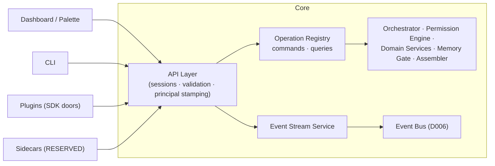

# KANG — Core API Contract

**Document:** 12_API.md
**Version:** 0.1
**Author:** Kang, with Claude (Founding Architect)
**Status:** Normative — the definitive contract between the Core and every client, forever; changes require an ADR
**Last updated:** 2026-07-11
**Upstream (binding):** all prior documents; especially `04_ARCHITECTURE.md` (D002), `05_AGENTS.md`, `06_MEMORY.md`, `07_DATABASE.md`, `08_PLUGIN_SYSTEM.md`, `09_UI_DESIGN.md` (UI-P1), `10_SECURITY.md`
**Downstream:** every frontend, CLI, plugin SDK, sidecar, and future client ever written.

> RFC-2119 throughout. This document defines the **contract** — operations, semantics, guarantees — not wire syntax. It is transport- and framework-independent: any concrete binding (the local HTTP+stream binding of D002, a future IPC binding for sidecars) MUST implement exactly this contract and MAY implement nothing more.

---

## 1. API Philosophy

1. **One brain, many faces.** The Core owns all truth and all logic. Every interface — dashboard, palette, CLI, voice someday, mobile someday — is a *client of this contract* and nothing else (UI-P1). If two clients could disagree about what an operation means, the contract has failed.
2. **The API is the product's spine, not its skin.** Features do not ship "in the UI"; they ship as Core operations, then surfaces render them. A capability without an API operation does not exist.
3. **Local-only, by constitution.** The API binds to the local machine exclusively. There is no remote mode, no listen-on-LAN flag, no tunnel affordance (10_SECURITY §13: remote execution deliberately unreserved). **RESERVED:** the sync protocol (16_SYNC) is a *peer* protocol, not an exposure of this API — trigger: v0.5.
4. **Commands change, queries observe, events inform — never any mixture.** (API-001.)
5. **Explainable at the contract level.** Explainability is not a UI feature backed by scraping; it is an API surface (§12) with the same stability guarantees as everything else.
6. **Boring and slow-moving.** This contract is the second-hardest thing to change after the database (clients accumulate against it for a decade). It earns the same conservatism (E10): additive evolution, loud deprecation, no cleverness.

---

## 2. API Architecture

- The API layer is **thin**: session handling, schema validation, principal stamping, and dispatch. Zero domain logic (a rule enforced by review: if the API layer contains an `if` about tasks or memory, it is a defect).
- All operations live in a single **Operation Registry**: name, kind (command|query), required scopes, idempotency class, version-introduced, deprecation status. Request/response schemas are Pydantic models attached per operation (ADR-009 Part B) — a constitutional requirement, not yet fully populated across all registered operations as of this writing. The registry is machine-readable and served by the API itself (§16) — clients and tests are generated/verified against it, never against documentation prose.
- The plugin SDK (08_PLUGIN §8) is a *binding* of this same contract with the plugin's principal pre-stamped — plugins do not have a second, different API.

---

## 3. Constitutional API Decisions

### API-001 — Strict command/query separation

**Decision.** Every operation is exactly one of: **command** (changes state; returns an acknowledgment + identifiers + resulting revision; MUST carry an idempotency key) or **query** (reads state; MUST NOT change anything observable; freely retryable). No operation does both. Reads needed after a command are follow-up queries or arrive via events.

**Why.** Retry-safety, caching, audit clarity, and sync-readiness all fall out of this one rule. Mixed operations ("get-or-create", "read-and-mark-seen") are where idempotency and explainability go to die.

**Alternatives.** REST-style resource verbs with mixed semantics (rejected: PATCH-that-also-triggers-things is the classic trap); full event-sourced command bus with projections (rejected: ceremony beyond one-user scale; the change_log already gives the useful half).

**Trade-offs.** Some flows take two calls where one felt natural. Accepted: "felt natural" is how contracts rot.

### API-002 — Transport-agnostic contract; two channels

**Decision.** The contract defines two channels: the **operation channel** (request/response) and the **event channel** (server→client push of event envelopes + streaming operation output). Concrete bindings map these to transports (local HTTP + socket stream today; IPC for sidecars later). Contract semantics MUST NOT depend on transport features.

**Why.** D002 chose today's transport; this document must outlive that choice. Binding semantics to HTTP verbs or WebSocket frames would weld the decade to 2026.

### API-003 — Local sessions, capability principals

**Decision.** Authentication = **local session establishment**: a client obtains a session token via a local handshake (first-party clients: OS-user-bound token from the Core's session file, readable only by Kang's OS account; plugins: sessions minted by the Core at enable-time, bound to `plugin:{id}`). Every request carries the session token; the Core resolves it to a **principal** and stamps every downstream call with it (SEC-006). Authorization is entirely the Permission Engine's (D013) — the API layer adds *no* second authorization vocabulary; it only refuses requests with no valid session.

**Why.** Local-first authentication means proving "you are code running as Kang's OS user (or a registered plugin)" — the OS account boundary is the honest perimeter (10_SECURITY §2). Passwords/OAuth locally would be theater.

**Alternatives.** No auth at all on localhost (rejected: any local process could drive KANG — browser-borne localhost attacks and careless software exist); mTLS (rejected: certificate ceremony for a loopback).

**Trade-offs.** Malware as Kang's user defeats this — stated, accepted, out of scope (§2.2 of 10_SECURITY).

### API-004 — Idempotency keys on every command

**Decision.** Every command carries a client-generated idempotency key (UUIDv7). The Core MUST return the original outcome for a repeated key (retention: 7 days) rather than re-executing. Commands wrapping agent invocations reuse the invocation idempotency machinery (05_AGENTS §3.1).

**Why.** Local transports still fail mid-flight (crash, restart). "Did my capture save?" must have a safe answer: resend and see.

### API-005 — Versioning: one live contract version, additive evolution

**Decision.** The contract carries a single version (`v1`). Evolution is **additive-only** within a major: new operations, new *optional* request fields, new response fields (clients MUST ignore unknown response fields — enforced in the conformance suite). Breaking changes require: a `v2` operation *alongside* `v1`, deprecation marked in the registry, ≥ 2 minor releases of dual service with runtime deprecation warnings (mirrors PL-004), then removal in the next major. Deprecations and removals are ADR-gated.

**Why.** Clients (including plugins Kang wrote in year 2 and forgot) must fail loudly-and-explainably or keep working — never break silently (the PL-004 principle, applied to the contract that plugins are built on).

**Alternatives.** Per-operation versioning (rejected: matrix explosion); calendar versioning with breaking windows (rejected: "scheduled breakage" is still breakage).

### API-006 — One error model, everywhere

**Decision.** Every failure returns the same envelope: `{ code, message, correlation_id, retryable, details?, remedy? }`. `code` is a closed, registry-published enum (initial set: `invalid_request`, `not_found`, `conflict` (revision mismatch), `permission_denied`, `first_party_required` (channel denial, ADR 002 Amendment §3), `confirmation_required`, `budget_exhausted`, `degraded_result` (success-with-marker, not an error — see below), `quarantined`, `frozen` (integrity freeze, SEC-007), `timeout`, `cancelled`, `internal`). `message` is one honest sentence (09_UI §13 renders it verbatim). `permission_denied` names the missing scope; `first_party_required` names an operation refused on channel grounds — distinct from `permission_denied` because no grant can satisfy it (§7, ADR 002); `confirmation_required` returns the held-action reference (§7); `conflict` returns current revision for client re-read.

**Why.** Ten years of clients handling one error shape versus ten years of per-endpoint snowflakes. Also: the error model *is* part of the security posture — denials and freezes must be uniform to be handleable (SEC-009).

**Alternatives.** Transport-native errors (HTTP statuses as the model — rejected: transport-coupled, semantically poor).

### API-007 — Long-running work is always a task resource

**Decision.** Any operation that cannot reliably complete in < 3 s (cognitive agent runs, pipelines, research, rebuilds, restores) MUST be modeled as: command → returns `task_id` immediately → progress/output via the event channel (`task.updated`, streamed chunks) → outcome as a queryable task resource. Blocking long calls MUST NOT exist. Chat streaming is this same mechanism with a text-chunk stream.

**Why.** 09_UI §14's task cards, cancellability (AG-007: cancel is `task.cancel`, a command), crash-survivability (task state persists as `invocation` rows), and headless clients (CLI, scheduler) all require work-as-resource.

### API-008 — Cursor pagination only; deterministic order

**Decision.** All list queries paginate by opaque cursor (encoding `(order_key, id)` position), with a declared total-order per query (default: `updated_at desc, id desc`). Offset pagination MUST NOT exist. Cursors survive inserts/deletes without skips or duplicates.

**Why.** Offset pagination over changing data lies (skips/dups); a memory browser that silently skips records violates the ownership covenant (06_MEMORY §1.5).

---

## 4. Resource Model

Resources mirror the truth schema (07_DATABASE) — the API invents no parallel ontology:

`project · task · milestone · goal · competition · deadline · memory_record · episode · memory_link · candidate (approval-queue item) · conversation · invocation · task (async work) · job · grant · plugin · notification · audit_entry · health_metric · setting · export`

Rules: every resource carries `id` (UUIDv7) and `updated_at`. Synchronizable resources additionally carry `revision` (optimistic concurrency, per the sync quartet). Per-device operational resources (`invocation`, `notification` — see 07_DATABASE §1.4 / ADR-005) do not carry `revision`, since they never replicate and have no concurrent-writer conflict to detect. Clients treat resources as **snapshots** — mutation is by command referencing `id` + expected `revision` (optimistic concurrency; mismatch ⇒ `conflict`); resource representations MUST include provenance fields where the schema has them (a memory record without its provenance is not a valid representation — 06_MEMORY §8.1); `sensitivity=private` content is never returned by any operation except the explicit unlock flow (§10).

---

## 5. Request Lifecycle (operation channel)

Every request: **session → principal resolution → schema validation → registry dispatch → (commands) idempotency check → permission check (engine) → execution through kernel → response**, with a `correlation_id` minted at ingress and returned on every response, success or failure. The correlation id is the same one that threads audit, invocation, and `explain` (SEC-006, SEC-010) — one id, end to end, forever.

Commands additionally guarantee: transactional execution (DB-003 — the response's `revision` reflects committed truth), change-capture (sync quartet), and audit emission before the response returns.

---
## 6. Event Model (event channel)

- Clients subscribe with a filter (event types, entity ids). The Core pushes **event envelopes**: `{ event_id (UUIDv7), type, occurred_at, principal, entity_refs[], payload, correlation_id, causation_id, type_version, provenance }`.
- Delivery to connected clients is at-least-once with client-side dedup by `event_id`; disconnected clients MAY resume from a cursor (`after event_id`) within the event-log retention window (90 days, D006) — the UI's "what changed?" zone is literally this resume.
- The event vocabulary is the bus vocabulary (D006, 08_PLUGIN Appendix D) — the API adds no second event language. Plugin subscribers receive only the plugin-visible subset; sensitive-context events are filtered per principal (08_PLUGIN Appendix D rule).
- Events are **facts, not commands**: receiving an event grants no authority and demands no action (SEC-002's spirit applied to clients).

| Field | Type | Semantics |
|---|---|---|
| `event_id` | UUIDv7 | Global identity; dedup key for every consumer |
| `type` | text | Registry-closed enum |
| `occurred_at` | ISO-8601 | When the fact became true |
| `principal` | text | Publisher identity |
| `entity_refs[]` | array | Typed refs for filtering |
| `payload` | JSON | Schema-validated per type |
| `correlation_id` | UUIDv7 | Thread: click → invocation → audit |
| `causation_id` | UUIDv7, nullable | `event_id` of the direct parent event, if this event exists because a handler/job reacted to another event |
| `type_version` | integer | Payload schema version. Schemas are append-only: add optional fields, never repurpose |
| `provenance` | enum | `kang` \| `derived` \| `external_untrusted`. UNTRUSTED propagates transitively into event payloads |
---

## 7. Commands, Confirmations, Held Actions

- Command names are verb-first, domain-scoped: `task.create`, `task.complete`, `capture.create`, `memory.propose`, `memory.approve`, `memory.delete`, `competition.decide`, `plan.adapt`, `agent.invoke`, `pipeline.run`, `task.cancel`, `plugin.enable`, `grant.modify`, `export.run`, `restore.run` …the registry is exhaustive; this list is illustrative.
- **Consequential commands** (05_AGENTS Appendix D) follow the two-step contract: the command returns `confirmation_required` + a `held_action` resource (what/who/why/reversibility — exactly the 09_UI §7 dialog contents, as data); the client renders the unique dialog; Kang's approval is a distinct command `held_action.approve {id}` valid only from first-party UI sessions (**plugin sessions MUST NOT approve held actions** — out-of-band enforcement at the contract level, 10_SECURITY §5.4); expiry 24h ⇒ `cancelled`.
- **Held-action lifecycle** (docs/adr/001-held-action-crash-semantics.md): `approved` records Kang's intent only — it does not mean the effect committed. A terminal `executed` state marks completion. Every consequential operation declares a registry-level `commit_mode`: `transactional` (approval-flip and effect commit in one `kang.db` transaction — the default for effects fully representable as a DB write) or `redrive` (the effect crosses into `adapters/`; on restart, every `approved`-but-not-`executed` action of this mode is re-driven through its effect's idempotent path). An operation MUST NOT register as `redrive` until its target adapter has a proven idempotency contract + conformance test (enforced at registration time, not runtime).
- **The approval channel** (docs/adr/002-approval-channel.md): `first_party_only` is a declared per-operation registry property, **not a permission scope** — it is a channel control, orthogonal to the Permission Engine's authorization (API-003: the engine answers "may this principal?"; the dispatcher's channel check answers "did this arrive out-of-band?"; a consequential approval requires both to pass). The dispatcher enforces it centrally, after the scope check. `held_action.approve` and `held_action.cancel` are both `first_party_only`. A `first_party_only` refusal returns a distinct error code (`first_party_required`, ADR 002 Amendment §3), never `permission_denied`, so an audit reader can tell which gate refused.
- Commands from plugin principals traverse identical semantics — the SDK's `sdk.state.tasks.create(...)` *is* `task.create` with the principal pre-stamped (§2).

## 8. Queries

Verb `get`/`list`/`search`, side-effect-free: `task.list`, `plan.get {date}`, `memory.search` (Kang-facing hybrid, 06_MEMORY Part X), `memory.get`, `link.neighborhood {node, depth≤2}`, `invocation.get`, `audit.list`, `ledger.get`, `health.get`, `registry.get` (§16)… Queries respect scopes identically to commands (a plugin without `memory.read:{view}` gets `permission_denied` on `memory.search` over that view). Query results carry the store snapshot timestamp where staleness matters (assembler parity, AG-009).

## 9. Streaming

Streaming output (chat tokens, task progress, log tails) rides the event channel as ordered chunk events under the operation's `correlation_id`, terminated by an outcome event. Streams are cancellable (`task.cancel`); a dropped client reconnects and resumes by cursor or re-queries the finished resource — **no output exists only in flight** (crash-survivability: the outcome is always also a resource).

---

## 10. Memory & Knowledge APIs (contract highlights)

- `memory.propose` → always creates a *candidate* (gate semantics, M-003 — the API physically has no operation that writes an active memory except `memory.approve` of an existing candidate by a first-party session, or Kang-principal explicit saves which auto-pass the gate).
- `memory.approve | reject | edit_approve` — first-party sessions only; single-keystroke UX contract (06_MEMORY §4.3) is backed by these being one command each.
- `memory.update` (revision-checked; creates revision history), `memory.pin`, `memory.archive`, `memory.restore`, `memory.delete` (consequential; response includes the 30-day recovery note as data).
- `memory.search` (modes: default | deep | structured), `memory.explain_retrieval {correlation_id}` → the manifest with per-term scores (§12).
- **Private unlock:** `private.unlock {record_id}` — first-party only, consequential-style explicit action, returns decrypted content once, never cached by the Core in plaintext, audited (06_MEMORY §12.1; DB-005).
- `knowledge.ask {question}` → task resource implementing FR-064 ("what do I know about X?") with citations.

## 11. Planning, Agent, Plugin APIs (contract highlights)

- `plan.get {date}` (P0-deterministic: MUST succeed offline/model-less), `plan.adapt {changes}`, `plan.review.submit` (evening/weekly flows), `quest.complete/defer`.
- `agent.invoke {agent, input}` / `pipeline.run {pipeline, input}` → task resources; admission, permissions, budgets all downstream (the API adds nothing and removes nothing from 05_AGENTS semantics).
- `job.list/get`, `job.enable/disable` (consequential for core jobs), `job.run_now {job}` (respects windows unless Kang overrides — override is itself the confirmation).
- Plugin lifecycle: `plugin.validate/install/grant/enable/disable/remove` mapping 1:1 to the 08_PLUGIN state machine, install/enable/remove consequential.

## 12. Explainability Endpoints

First-class, versioned, stability-guaranteed:

- `explain.invocation {correlation_id}` → the full reconstruction (trigger → manifest ids+scores+truncations → model/tool calls → outcome) — the API form of `kang explain`; MUST work for ≥ 180 days of history (05_AGENTS §14's CI test runs against *this operation*).
- `explain.plan_item {item_id}` · `explain.notification {id}` · `explain.suggestion {id}` — the 09_UI §11 table, one operation per row class, each returning `{ one_sentence, full_reference }` (the two-level contract).
- `explain.memory {record_id}` → the six provenance answers, structured.
- If reconstruction is impossible: `internal` error with the mandated honesty (`explanation unavailable — this is a bug`) — the API MUST NOT synthesize a narrative (A4).
- explain.invocation MUST NOT depend on the event log — its ≥180-day guarantee would silently break at day 91 (the event log's compaction boundary); it reconstructs from invocation rows, manifests, and audit in permanent storage.

## 13. Health, Audit, Notification, Export

- `health.get` → the D015/07_DATABASE Part 17 metric set, typed; `health.doctor` → task resource running the full check suite.
- `audit.list {filters, cursor}` — read-only *by contract*: no write/edit/delete operations exist on audit resources at the registry level (09_UI §12's absent-affordances, enforced below the UI).
- `notification.list/ack` — acking is a command (it changes beacon state); acks never delete history.
- `export.run {scope}` → task resource producing the open-format export (FR-103); `export.key_backup` → the DB-005 recovery-phrase flow (first-party, consequential).
- `backup.snapshot_now`, `restore.run {snapshot}` (consequential; freeze-aware).

---

## 14. Background Jobs & Notifications over the API

Scheduled/event work is *observable* through the same surfaces (jobs, invocations, tasks, events) and *controllable* only through the registry-listed commands — there is no API path to create arbitrary scheduled execution (SEC-005: schedules come from definitions/manifests; the sole exception is `job.run_now` on existing jobs). Notifications originate exclusively from core `notification.requested` events (09_UI §9); clients render, ack, and deep-link — they MUST NOT mint notifications.

---

## 15. Pagination, Limits, Quotas

Cursor rules per API-008. Standing limits (registry-published per operation): default page 50, max 500; request payloads ≤ 1 MB (captures/notes above this are files, not payloads); per-session rate limits generous for first-party, per-plugin caps aligned with Appendix A of 08_PLUGIN. Limit breaches return `invalid_request`/`budget_exhausted` with `remedy` set — never silent truncation (DB-P7's spirit).

---

## 16. Registry, Conformance, Future Extension

- `registry.get` serves the machine-readable Operation Registry (operations, scopes, idempotency class, version/deprecation, and schemas per ADR-009 Part B once populated) and the error-code and event-type enums. **The registry is the contract's source of truth; this document is its constitution.**
- A **conformance suite** (core CI) exercises every registered operation against its declared schema, idempotency class, scope requirements, and error surfaces; clients (UI, CLI, SDK) are tested against the registry, not against prose. Unknown-field tolerance (API-005) is a tested client requirement.
- **RESERVED extension points:** sidecar IPC binding (trigger: PL-001 Phase 2) · sync peer protocol (trigger: 16_SYNC — a separate contract document, not an extension of this one) · voice client sessions (trigger: voice ADR; voice is a client of *this* API, palette-register semantics, 09_UI §18) · mobile companion sessions (trigger: 16_SYNC era; read-mostly + capture subset, already expressible — no new operations required by design).

**Document-integrity note (2026-07-31):** prior versions of §2 and §16 asserted schema-backed registry entries as present-tense constitutional fact before any schema-authoring mechanism existed in code. This was a false claim independent of ADR-009's transport ruling — flagged and corrected here as its own finding, not merely superseded by ADR-009.

---

## Constitutional summary

One contract, one registry, one error shape, one correlation thread from click to audit. Commands change, queries observe, events inform. Nothing long blocks, nothing breaking lands silently, nothing consequential passes without a held action and a human hand, and nothing exists in the product that does not exist here first. The API is where the constitution becomes callable.

*When a client, a binding, or the registry disagrees with this document, one of them is wrong on purpose — file the ADR.*
