# KANG — Project Structure Constitution

**Document:** 17_PROJECT_STRUCTURE.md
**Version:** 0.1
**Author:** Kang, with Claude (Founding Architect)
**Status:** Normative — RFC-2119 throughout; changes require an ADR; RESERVED items carry activation triggers
**Last updated:** 2026-07-12
**Upstream (binding):** `01_PRINCIPLES.md` (E1–E10, AR1–AR8), `04_ARCHITECTURE.md` (D001, D002, D003, D005, D012), `05_AGENTS.md` (AG-002 registered definitions, AR5), `07_DATABASE.md` (Part I data directory), `08_PLUGIN_SYSTEM.md` (§4, §5), `10_SECURITY.md` (SEC-005, SEC-011), `11_CODING_STANDARDS.md` (§1, §2, §3, §5, §25), `12_API.md` (API-002, §16), `13_TESTING.md` (§2 taxonomy), `15_EVENT_BUS.md` (§6.3 registry)
**Role:** 11_CODING §1 froze the repository's top level and D005 froze the core's layer packages. This document is their authoritative expansion: the complete physical map, the dependency constitution in full, and the growth rules that keep the map true for a decade. Where 11_CODING §1 is the summary, this document is the detail; **they MUST never disagree** — if they do, file the ADR.

> **The test this document must pass.** "Where does this file go?" — exactly one answer. "May this module import that one?" — exactly one answer. "Where do future features belong?" — exactly one answer. Any question with two defensible answers is a defect in this document, not a matter of taste.

---

## 0. PS-001 — Document Numbering: This Is 17, Not 16

**Decision.** This document takes slot **17**. Slot **16 remains reserved for `16_SYNC.md`**, deliberately unwritten until Phase 5 (03_ROADMAP §5/§8).

**Why.** `16_SYNC` is already cited by name in five frozen documents (03_ROADMAP, 05_AGENTS ×3, 07_DATABASE, 08_PLUGIN_SYSTEM). Renumbering sync would require editing frozen constitutional text for zero benefit; constitution numbering is an identifier space, not an ordering claim.

**Implication.** The docs index (§12.4) becomes the single registry of numbers; future documents claim the next free slot there. Gaps in the sequence are normal and meaningless.

---

## 1. Repository Philosophy

### 1.1 Organized by architectural boundary, not by feature

The repository's directories are the architecture's layers made physical (D005). A feature — "competition tracking," "spaced repetition" — is not a folder; it is a *thin vertical slice* across the constitutional layers: a domain service, its ports, an adapter or two, an agent definition, registry entries, tests, and a documented file list (11_CODING §5, AR8).

**Why not feature folders (package-by-feature).** Considered seriously — it is the mainstream recommendation and optimizes for feature deletion. Rejected for KANG because:

1. **The layers are load-bearing law.** Dependency direction (11 §2), the ports firewall, kernel-only doors (08), and SQL confinement (DB-002) are all *per-layer* rules enforced by per-layer lint contracts. Feature folders would smear every contract across every folder, turning mechanical enforcement into judgment calls.
2. **Deletion is already solved without it.** AR8's deletability is enforced by the feature file manifest (11 §5: every feature's doc header lists its files; `git rm` of the list leaves a green build) — the *benefit* of feature folders without dissolving the layer boundaries.
3. **One developer, one vocabulary.** The constitution's vocabulary is layers and subsystems (kernel, domain, ports, adapters, agents). A repository that speaks a second vocabulary makes every doc↔code lookup a translation (violates 11 §3: one concept, one name).

Inside `domain/`, however, code IS grouped by domain area (§6) — boundary-first at the top, domain-first within the domain layer. Both, each where it earns its place.

### 1.2 The five properties every placement decision serves

| Property | Meaning here |
|---|---|
| **Separation of concerns** | A directory holds one architectural responsibility; a file that plausibly belongs to two layers is a design smell to fix in the design, not a filing decision (11 §1) |
| **Ownership** | Every directory has exactly one owning subsystem (§3); overlapping ownership is where "someone else's problem" lives |
| **Scalability** | Growth adds files to existing homes and subpackages to existing layers; it MUST NOT add new top-level concepts (§15) |
| **Discoverability** | The path *is* documentation: `adapters/sqlite/` can only contain SQLite adapter code. A contributor (human or AI — 14_CLAUDE) navigates by constitution vocabulary alone |
| **Determinism** | Placement follows rules, not taste. Two contributors filing the same code MUST choose the same path (§17's decision procedure) |

### 1.3 PS-002 — Two trees, never confused

**Decision.** KANG occupies exactly two directory trees with disjoint purposes:

1. **The repository** (this document): source, docs, tests, tooling, *default* config. Versioned in git. Contains **zero runtime state and zero secrets**.
2. **The data directory** `%KANG_HOME%` (07_DATABASE Part I, D003): all runtime state — databases, event log, audit, live config, installed plugins, cache, backups. **Never inside the repository; never under version control.**

**Why.** The classic decay is state leaking into the working tree ("just a local test.db") and repo files being read at runtime ("just import the default config"). Both destroy the recovery story (back up one directory = whole life, NFR-006) and the install story (D016: the system must not depend on machine state — nor on a checkout).

**Implications.** CI includes a tree-hygiene lint: no `.db`, no `.jsonl` audit patterns, no secrets patterns anywhere in the repo (extends 11 §25's banned list). The runtime MUST resolve all state through `%KANG_HOME%` — a path into the repository appearing in runtime config is a defect. §9 answers the prompt-level questions about data directories entirely by citation to 07, plus three small rulings.

---

## 2. The Complete Repository Tree

Top level is constitutional (11 §1: adding a top-level directory requires an ADR; nothing lives at root that isn't listed). This section expands each entry to its architectural depth — **subsystem-complete, not file-complete**: files come and go; this map's directories are the stable homes.

```
kang/                                  # the monorepo (one repo — D001: parts version together)
│
├── docs/                              # THE CONSTITUTION + its machinery        (§12)
│   ├── 00..17_*.md                    #   numbered constitutional documents
│   ├── adr/                           #   NNN-title.md — every post-freeze decision
│   ├── guides/                        #   operational how-tos (non-normative)
│   └── generated/                     #   registry/API/schema docs built by tools/ (never hand-edited)
│
├── src/kang/                          # THE CORE — one Python package, D005 layers, frozen
│   │
│   ├── kernel/                        # authority & machinery (no domain knowledge)
│   │   ├── bus/                       #   event bus: publish path, cursors, delivery,
│   │   │                              #     reconciliation (15_EVENT_BUS §4 — one module, caged)
│   │   ├── scheduler/                 #   jobs, catch-up policies, event-triggered admission (D014)
│   │   ├── orchestrator/              #   agent admission, pipelines, budgets (05 AG-001)
│   │   ├── permissions/               #   engine, grants, pairing lints (D013, SEC-004)
│   │   ├── audit/                     #   the only writer of audit truth (S5, SEC-013)
│   │   ├── router/                    #   model router, TaskSpec mapping, budget ledger (D010)
│   │   ├── plugin_host/               #   loading, supervision, quarantine, the kernel doors (08)
│   │   ├── context/                   #   Context Assembler (06 §5 — kernel infrastructure, not an agent)
│   │   └── runtime/                   #   supervised tasks, injected clock/rng ports' wiring,
│   │                                  #     health/metrics surface (D015), startup/shutdown lifecycle
│   │
│   ├── domain/                        # entities + capability services (§6) — imports NOTHING outer
│   │   ├── ports/                     #   ALL interfaces — the dependency firewall (D005)
│   │   ├── planner/                   #   plans, capacity, the deterministic path (05 §16)
│   │   ├── projects/                  #   projects, milestones, goals
│   │   ├── tasks/                     #   tasks, statuses, priorities
│   │   ├── competitions/              #   competitions, deadlines, timeline back-planning
│   │   ├── learning/                  #   quizzes, spaced repetition
│   │   ├── memory/                    #   write gate, lifecycle, scoring, taxonomy (06)
│   │   ├── vault/                     #   note/chunk/link domain logic (indexing POLICY, not I/O)
│   │   ├── calendar/                  #   schedule domain logic over the calendar port
│   │   └── notifications/             #   ladder policy, queue semantics (09_UI §9, 15 §6.2)
│   │
│   ├── agents/                        # definitions + the shared runtime (AR5: agents are data)
│   │   ├── definitions/               #   one folder per agent: {name}.toml + prompts/ (05 AG-002)
│   │   ├── pipelines/                 #   pipeline definitions (bounded DAGs — AG-001)
│   │   └── runtime/                   #   the ONE executor: lifecycle phases 1–9 (05 §3)
│   │
│   ├── adapters/                      # all I/O, implementing ports; one folder per technology
│   │   ├── sqlite/                    #   stores/repositories — the ONLY home of SQL (DB-002)
│   │   ├── eventlog/                  #   eventlog.db access (15 §5.2 DDL)
│   │   ├── obsidian/                  #   vault I/O, fs-watcher + debounce (15 §11.2)
│   │   ├── anthropic/ openai/ ollama/ #   ModelProvider implementations (D010)
│   │   ├── github/ gcal/ web/         #   integration adapters (UNTRUSTED tagging at ingress, SEC-001)
│   │   ├── os_windows/                #   tray, notifications port, credential manager (SEC-011)
│   │   └── fakes/                     #   in-memory port fakes — shipped, versioned, contract-tested
│   │                                  #     against real adapters (13 §2.3: fakes that lie are red)
│   │
│   ├── api/                           # thin interface layer (12_API): operation registry,
│   │   │                              #   sessions, dispatch, event channel; NO logic (API thinness
│   │   │                              #   is a lint budget: handlers ≤ orchestration glue)
│   │   └── registry/                  #   operation + event-type + error-code registries (single
│   │                                  #     source of truth — 12 §16, 15 §6.3)
│   │
│   └── plugins_sdk/                   # the versioned public SDK (08 §6): semver, deprecation
│                                      #   windows ≥ 2 minors; the ONLY import surface for plugins
│
├── plugins/                     # FIRST-PARTY plugin source (PS-005, §10) — built and
   │                                #   installed into %KANG_HOME%/plugins like any plugin
   │   └── {plugin_id}/             #   manifest.toml + src/ + tests/ per 08 §5
│
├── ui/                                # Tauri + React/TS client — PURE API client (UI-P1)
│   ├── src/                           #   zones, screens per 09_UI; generated API client only
│   └── shell/                         #   Tauri (Rust) packaging — "we mostly don't touch" (D002)
│
├── cli/                               # thin client of the same API (D002); no core imports
│
├── migrations/                        # NNNN_description.sql — versioned, forward-only (07 Part 13)
│
├── tests/                             # mirrors src/ + normative suites (§11)
│   ├── unit/                          #   mirrors src/kang/ package-for-package
│   ├── integration/                   #   per adapter technology
│   ├── suites/                        #   the 17 normative classes of 13_TESTING §2 (§11.2 map)
│   └── fixtures/                      #   scenario scripts, fixture vaults, synthetic corpus,
│                                      #     the fixture plugin (08 §10), golden files
│
├── config/                            # DEFAULTS + EXAMPLES only (§8) — runtime truth lives in
│                                      #   %KANG_HOME%/config; nothing here is read in production
│
└── tools/                             # dev-only: linters/contracts, corpus generator, docs
                                       #   builder, release scripts. NEVER imported by src/ (§4)
```

**What is deliberately absent:** `shared/`, `utils/`, `common/`, `lib/`, `core/` (§7); `scripts/` at root (lives in `tools/`); empty reserved folders (§16, PS-007); any directory named after a person, a date, or a version.

### 2.1 Root Tooling Allowlist

The following root-level files are permitted without an ADR — they are
   project metadata/tooling config, not architecture, and every Python
   repository requires them:
   
   - pyproject.toml
   - .gitignore
   - .github/            (CI workflow definitions)
   
   A new entry to this list requires no ADR; a new entry that is NOT
   tooling config (i.e. anything with runtime behavior) does.

---

## 3. Ownership Rules

**Every directory has exactly one owner: the subsystem whose constitution governs it.** Ownership means: that subsystem's document is the law of the directory, its tests gate changes to it, and questions about its contents have that document as the answer.

| Directory | Owner (subsystem) | Governing law |
|---|---|---|
| `docs/` | The constitution itself | 14_CLAUDE (process), this doc §12 |
| `src/kang/kernel/*` | Kernel — per subfolder: bus→15, scheduler→D014, orchestrator→05, permissions→D013/10, audit→10 SEC-013, router→D010, plugin_host→08, context→06 §5, runtime→D015/D016 |
| `src/kang/domain/*` | The named domain area | 02_PRD capability sections + 06/07 for memory |
| `src/kang/domain/ports/` | Architecture | D005 — the firewall belongs to no feature |
| `src/kang/agents/*` | Agent system | 05_AGENTS |
| `src/kang/adapters/*` | The named technology's adapter | Port contracts + source doc (07 for sqlite, D010 for providers…) |
| `src/kang/api/` | API contract | 12_API |
| `src/kang/plugins_sdk/` | Plugin system | 08 §6 (public, semver) |
| `plugins/{id}/` | That plugin's author (Kang) | 08 — a plugin owns only its namespace |
| `ui/`, `cli/` | Interface layer | 09_UI, 12_API (clients of the registry) |
| `migrations/` | Database | 07 Part 13 |
| `tests/` | Testing | 13 — structure mirrors, never invents |
| `config/` | Deployment defaults | D003/D016 + §8 |
| `tools/` | Dev tooling | 11 (the contracts it enforces) |

**No overlapping responsibility, mechanically:** if a change requires touching two owners' directories, that is *normal* (a vertical feature slice) — but each touched file answers to exactly one owner's law. A file answering to two laws (e.g., "domain logic that does I/O") is mis-designed, not mis-filed.

---

## 4. The Dependency Constitution

11_CODING §2 stated the rule ("imports point inward only") and made it a CI contract. This section is the complete legal graph. **Anything not explicitly legal is illegal** — default-deny, like permissions (SEC-004's spirit applied to imports).

### 4.1 The graph

```mermaid
flowchart TB
    UI["ui/ (TS)"] -.->|"generated API client only"| API
    CLI["cli/"] -.->|"API client only"| API
    PLG["plugins/ (installed)"] -->|"SDK only"| SDK["plugins_sdk/"]

    API["api/"] --> KERNEL["kernel/"]
    API --> DOMAIN["domain/"]
    KERNEL --> PORTS["domain/ports/"]
    KERNEL --> DOMAIN
    AGENTS["agents/"] --> DOMAIN
    AGENTS --> SDK2["SDK-visible kernel surfaces"]
    SDK --> PORTS
    ADPT["adapters/"] --> PORTS
    DOMAIN --> PORTS
    PORTS --> STDLIB["stdlib + pinned pure libs (pydantic)"]
    DOMAIN --> STDLIB

    TESTS["tests/"] -->|"may import everything"| API & KERNEL & DOMAIN & ADPT
    TOOLS["tools/"] -.->|"imports nothing from src at runtime"| X[" "]

    style PORTS fill:#1a1a2e,stroke:#e94560,stroke-width:3px
```



### 4.2 The legality matrix (rows import columns)

| may import → | domain/ports | domain | kernel | agents | adapters | api | plugins_sdk | 3rd-party I/O |
|---|---|---|---|---|---|---|---|---|
| **domain/ports** | ✅ (within) | ❌ | ❌ | ❌ | ❌ | ❌ | ❌ | ❌ (pure-model libs only) |
| **domain** | ✅ | ✅ (within, no cycles) | ❌ | ❌ | ❌ | ❌ | ❌ | ❌ |
| **kernel** | ✅ | ✅ | ✅ (within) | ❌ (loads *definitions* as data, never imports agent code) | ❌ (receives instances via injection) | ❌ | ❌ | only what kernel machinery itself needs (asyncio et al.) |
| **agents/runtime** | ✅ | ✅ (services) | SDK-visible surfaces only | ✅ (within) | ❌ | ❌ | ✅ | ❌ |
| **adapters** | ✅ | ❌ (translate at the port boundary, don't reach into services) | ❌ | ❌ | ✅ (own tech folder only) | ❌ | ❌ | ✅ (their whole purpose; pinned per E10) |
| **api** | ✅ | ✅ | ✅ | ❌ | ❌ | ✅ (within) | ❌ | FastAPI et al. (its adapter role) |
| **plugins_sdk** | ✅ | ❌ | ❌ | ❌ | ❌ | ❌ | ✅ | ❌ |
| **plugins** | via SDK | via SDK | ❌ | ❌ | ❌ | ❌ | ✅ | blessed set only (PL-005) |
| **ui / cli** | — (other language / process) | — | — | — | — | generated client | — | idiomatic |
| **tests** | ✅ everything (the one omnivore, and the reason production code never imports `tests/`) |
| **tools** | ❌ src imports at runtime; MAY parse/inspect the tree as text (linters) |

### 4.3 Forbidden imports, named (the lint contract's deny-list)

Each is a known rot vector, hence named rather than left to inference:

1. `domain → kernel` — domain asking the machinery for favors inverts the entire architecture.
2. `domain → adapters` or any third-party I/O library — the firewall breach; the reason ports exist.
3. `kernel → agents` — the kernel executes agent *definitions* (data); importing agent code makes the kernel domain-aware and agents undeleteable.
4. `kernel → adapters` — kernel receives port implementations by constructor injection at composition time (11 §12); it never chooses concretions.
5. `adapters → domain services` — adapters translate at the port line; an adapter calling a service is a hidden control-flow inversion.
6. `adapter → other adapter's tech folder` — cross-tech coupling (`obsidian → sqlite`) welds recovery domains together; compose in kernel/domain instead.
7. `plugins → anything but plugins_sdk + blessed deps` — 08 §3/PL-005, restated as an import rule because that is how it's enforced.
8. `api → agents` — the API triggers agents through the Orchestrator, never directly (05 §6).
9. Anything → `tests/` or `tools/`.
10. `ui →` anything but the generated client (different language makes it structural; *reimplementing* core logic in TS is the review-fatal equivalent — 11 §2).

**Composition root exception (the one place wiring is legal).** Exactly one module — `src/kang/kernel/runtime/composition.py` (the startup assembler) — MAY import adapters and everything else, because *something* must instantiate concretions and inject them. It is the only file in `src/` exempt from rows above, it contains wiring only (lint: no logic, no branching beyond config), and it is named here so the exemption cannot spread.

### 4.4 Enforcement

Import-linter contracts in CI, red build, no `noqa` (11 §2 — cite). This document is the contracts' specification: the §4.2 matrix and §4.3 list translate 1:1 into contract definitions in `tools/`, and 13 §2.1's architectural test class runs them on every commit. A new package = a new contract entry in the same PR, or the build is red by omission.

---

## 5. Layer Boundaries: What Belongs, What Never Does

The prompt asked for layers named Core/Services/Infrastructure/Shared/etc. Those names are **not adopted**: the constitution already has a vocabulary (11 §3: one concept, one name), and this table maps each requested concept onto it once, so the mapping question never recurs.

| Requested name | KANG name | Belongs there | MUST NEVER contain |
|---|---|---|---|
| "Core" | `kernel/` | Authority + machinery: bus, scheduler, orchestrator, permissions, audit, router, plugin host, context assembler, runtime | Domain knowledge ("what is a competition"), SQL, provider SDKs, UI concerns. The Orchestrator contains no domain logic (05: "router, not a god") |
| "Services" | `domain/{area}/` capability services | Entities, invariants, domain policies, deterministic algorithms (planner path, scoring math, ladder policy) | I/O of any kind, framework types, model calls (services *request* via ports/TaskSpec), knowledge of scheduling/permissions machinery |
| "Repositories" | `adapters/sqlite/` (stores implementing ports) | SQL, mapping rows↔entities | Business decisions; SQL anywhere else is a red build (DB-002) |
| "Infrastructure" / "Adapters" | `adapters/{tech}/` | All world-touching code; UNTRUSTED tagging at ingress; debouncing (15 §11.2) | Domain policy; cross-adapter imports |
| "Models" (AI) | `kernel/router/` + provider adapters | TaskSpec routing, budget ledger; SDK calls inside provider adapters only | Provider SDKs anywhere else (10 §7: "models are reached only through the Router") |
| "Plugins" | `plugins_sdk/` (surface) + `plugins/` (first-party source) + `%KANG_HOME%/plugins/` (installed) | §10 | Core importing plugin code — ever (08: zero hard plugin dependencies) |
| "Frontend" | `ui/` | Rendering the API's truth (09_UI) | State authority, direct DB/file access, notification minting (12 §11), logic copied from core |
| "CLI" | `cli/` | Thin scriptable client | Core imports; it speaks HTTP/socket like every client |
| "Shared" | **does not exist** | — | §7 |
| "Testing" | `tests/` | §11 | Production imports of test code |

---

## 6. Domain Organization

### 6.1 Where domain logic lives — and where it never does

All domain logic lives in `domain/{area}/` as capability services + entities. The areas (§2's tree: planner, projects, tasks, competitions, learning, memory, vault, calendar, notifications) map 1:1 to 02_PRD's capability clusters — a new capability cluster in a future PRD revision is what justifies a new area subpackage, nothing else does.

**Agents do not own domain logic — constitutional, twice over:**

1. **AR5 / 05 AG-002:** an agent is *data* — a versioned definition (TOML + prompts) executed by one shared runtime. Data cannot own logic. When a specialist genuinely needs bespoke computation (05 names Competition timeline back-planning), that computation is a **domain service** the agent's tools call — it lands in `domain/competitions/`, testable without any model, reusable by the deterministic paths (05 §16's zero-model degradation *requires* the logic to exist outside the agent).
2. **Explainability + degradation:** logic inside prompt-space is logic that cannot be unit-tested, cannot run in degraded mode, and cannot be cited by `kang explain` as code. The architecture's promise that "non-AI content is complete and exact regardless" (D007, 04 §18.2) holds only while algorithms live in `domain/`.

The rule in one line: **agents decide *when* and *whether* with judgment; domain services compute *what* with algorithms.** A PR moving computation into a prompt, or judgment into a service, fails review in both directions.

### 6.2 Growth inside a domain area

An area grows files (entities, services, policies) freely within size limits (11 §4). When an area exceeds ~10 modules it MAY grow internal subpackages — but never a `utils/` (11 §3). Cross-area domain composition (planner reading competitions) happens through each area's public service surface (`__all__`, 11 §5) — never by importing another area's internals (lint: cross-area imports go through the area's `__init__` surface).

---

## 7. PS-003 — There Is No `shared/`

**Decision.** The repository contains no `shared/`, `common/`, `utils/`, `lib/`, or `helpers/` package — at top level or anywhere else. This extends 11 §3's module-level ban ("a name that says nothing hides anything") to the directory level, permanently.

**Why.** "Shared" is where architecture goes to die, by a known mechanism: it starts with one innocent date helper, becomes an import magnet (everything may import shared, so everything does), grows hidden coupling between layers that the dependency matrix can no longer see, and ends as the junk drawer that makes deletion (AR8) impossible. The junk drawer is not a risk to manage; it is a structure to ban.

**Where "shared-shaped" code actually goes (the decision procedure):**

| The code is… | Its home | Because |
|---|---|---|
| Domain vocabulary used by many areas (ids, revisions, provenance types, result envelopes) | `domain/` root modules (e.g., `domain/identity.py`, `domain/provenance.py`) | It *is* domain — the constitution's own vocabulary, importable by everything per §4.2 |
| Port-level types (TaskSpec, event envelope model, tool result shapes) | `domain/ports/` | Interfaces own their datatypes; both sides of the firewall may import them |
| Machinery used by kernel components (supervised task helper, backoff) | `kernel/runtime/` | Infrastructure belongs to the kernel; domain never needs it (if domain "needs" it, the design is wrong) |
| Adapter-side convenience shared across adapters | It isn't shared — duplicate it per adapter or promote it to a **port** | Cross-adapter sharing is coupling (§4.3 rule 6); a real abstraction earns interface status, a fake one earns duplication |
| Test conveniences | `tests/fixtures/` + fakes in `adapters/fakes/` | Tests are the sanctioned omnivore |
| Truly generic, truly stable (a slugifier) | A pinned third-party dependency, or 30 duplicated lines | E10: boring tech; duplication is cheaper than a coupling point. **Duplication is not the enemy; hidden coupling is** |

**Trade-offs.** Occasional duplication; occasional "this doesn't feel domain-y" placement debates resolved by the table. Accepted — every alternative is worse in year 7.

---

## 8. Configuration Structure

Truth already assigned: **runtime config lives in `%KANG_HOME%/config/*.toml`** (D003 — inspectable, diffable, hand-editable during recovery); **secrets live in the OS keychain, never in any file, either tree** (SEC-011, 11 §25).

The repository's `config/` therefore contains only:

| File | Purpose |
|---|---|
| `defaults/*.toml` | The shipped defaults the installer copies to a fresh `%KANG_HOME%/config/` (D016 install). One file per runtime config file, same names: `kang.toml`, `permissions.toml`, `providers.toml`, `database.toml`, `memory.toml`, `retention.toml`, `backup.toml`, `performance.toml` (the 07 §1 set) |
| `examples/*.toml` | Annotated exemplars for docs/guides — never read by any code path |

**Rules.** (1) Production code MUST NOT read repository `config/` — the config port resolves `%KANG_HOME%` only; tests inject config objects, not paths into the repo. (2) A new runtime config file requires: its default here, its schema validation in the config adapter, and a line in 07 §1's registry — three-place discipline or red build. (3) Secrets patterns in any TOML in either tree are a lint failure and (per 10 §6) a scrubber incident at runtime.

---

## 9. Data Directories: Owned by 07, Three Rulings Added

The layout, ownership, retention, and recovery of `%KANG_HOME%` (kang.db, `events/`, `audit/`, `config/`, `plugins/`, `cache/`, `backups/`) are **already law in 07_DATABASE Part I and D003 — cited, not restated.** The vault lives outside both trees, owned by Kang (D003). The prompt named four directories the constitution hadn't ruled on; ruled here:

| Asked | Ruling |
|---|---|
| `indexes/` | Does not exist as a directory. Derived indexes are tables inside `kang.db` (link_index, FTS, vectors — D004/D008: one transaction, one backup) or disposable files under `cache/`. A standalone index directory would be a third store to drift |
| `temp/` | Does not exist. Disposable = `cache/` (already defined as carrying no authority, 07 §1.2). Two names for disposability would make one of them secretly load-bearing |
| `models/` (local LLM weights) | **Not KANG's to store.** Local model weights are managed by the model runtime (Ollama et al.) in its own storage; KANG holds only routing config (`providers.toml`) and the embedding cache under `cache/`. Owning multi-GB artifacts would poison the backup story (NFR-006) for state KANG doesn't author. If a future embedded runtime requires local weights, they land under `cache/models/` — disposable, re-downloadable, never backed up |
| `exports/` | `kang export` (FR-103, D016) writes to a Kang-chosen path, defaulting to `%KANG_HOME%/exports/`. Exports are *products*, not state: excluded from snapshots, excluded from retention machinery, listed in the tree as the ninth entry. **Delta owed to 07 Part I (additive)** — recorded in §18 |

---

## 10. Plugin Layout

### 10.1 PS-004 — First-party plugin source lives in the monorepo under `plugins/`

**Decision.** Kang-authored plugins are developed in-repo at `plugins/{plugin_id}/` (manifest.toml + src/ + tests/, exactly the 08 §5 package shape), built by `tools/`, and installed into `%KANG_HOME%/plugins/` through the same explicit install path as any plugin. The core never imports from `plugins/` (§4.2); CI runs core suites with all plugins absent (08 PL-009: zero hard dependencies — now mechanically guaranteed by the import contracts).

**Why.** Phase-1 trust is authorship (D012); the author is Kang; separate repos per plugin would mean version-skew between core SDK and plugins for one developer — the exact operational tax D001 rejected. In-repo, `plugins/` versions against the SDK it targets, and the SDK's semver discipline (08 §6) is tested in the same CI run that would break it.

**Alternatives.** One repo per plugin (rejected above; becomes correct the day a *third-party* author exists — that trigger already moves plugins out-of-process anyway, D012 Phase 2); plugins inside `src/kang/` (rejected: they would ride the core's import namespace and the "core has zero plugin dependencies" claim would rest on discipline instead of structure).

### 10.2 States and stages are metadata, not folders

**Official / experimental / disabled plugins are manifest + registry states** (08's install/enable/quarantine lifecycle, `plugin.status` in 07), **never directory conventions.** A `disabled/` folder is state-by-filing — invisible to the permission engine, invisible to audit, and one `mv` away from privilege confusion. The single physical distinction that exists: in the repo, under `plugins/` (source); on the machine, under `%KANG_HOME%/plugins/` (installed). Everything else is data.

### 10.3 Sidecar future

When Phase 2 arrives (first non-Kang plugin — D012), a sidecar plugin is still one `plugins/{id}/` package; what changes is its manifest transport declaration and the plugin host's execution of it (08 RESERVED transports; 15 §15.1's cursor-over-socket). **No repository reorganization is triggered by the trust-model change** — that is the test this layout was chosen to pass.

---

## 11. Test Structure

### 11.1 Two axes, one rule

Tests organize on two axes — **what they mirror** (unit/integration follow the source tree) and **what they prove** (the normative suites follow 13's taxonomy). The rule: `tests/` mirrors and maps; it never invents structure of its own. A test that has no home either belongs to a source package (mirror it) or to a normative class (13 owns the list) — a third kind of test is a taxonomy change and an ADR in 13, not a new folder here.

```
tests/
├── unit/kang/{kernel,domain,agents,adapters,api,plugins_sdk}/   # mirror, package-for-package
├── integration/{sqlite,eventlog,obsidian,providers,os_windows}/ # per real technology (13 §2.3)
├── suites/                       # the normative classes — names ARE 13 §2's numbers:
│   ├── architecture/             # 2.1  import contracts, boundary bans, schema & vocab linters
│   ├── contract/                 # 2.4  API conformance, plugin conformance, client contract
│   ├── replay/                   # 2.5  scripted-week, crash-replay, explain-replay (+15 §16.1)
│   ├── determinism/              # 2.6  manifests, planner, clock/rng, UI snapshots
│   ├── permissions/              # 2.7  property suites, pairing lints
│   ├── memory_integrity/         # 2.8
│   ├── security/                 # 2.9  injection corpus, scrubber, boundary abuse
│   ├── plugin/                   # 2.10 fixture-plugin containment
│   ├── migration/                # 2.11
│   ├── performance/              # 2.12 budgets on the 10-yr corpus (+15 §14 targets)
│   ├── stress/                   # 2.13
│   ├── recovery/                 # 2.14 corruption drills, F-code paths
│   ├── backup_restore/           # 2.15
│   ├── explainability/           # 2.16 the 180-day reconstruction test
│   └── golden/                   # 2.17 golden outputs (fixtures hold the goldens)
└── fixtures/                     # scenario scripts, fixture vaults, synthetic corpus,
                                  # the fixture plugin, recorded HTTP, golden files
```

### 11.2 Why this split (and not test-type folders like `e2e/`)

Because CI cadence and release gates are already defined **per 13's classes** (13 §3's tiers name them; §4's gates require them). A structure keyed to anything else (speed, "e2e", author whim) would need a mapping table back to the classes; keying the folders to the classes makes the CI configuration read directly off the tree. Unit tests mirror source because that is what makes "this package's tests" a deterministic path — the same discoverability rule as everything else (§1.2). Suite membership is by directory, cadence markers by CI config — the tree states *what is proven*, CI states *when*.

---

## 12. Documentation Structure

| Path | Contents | Rules |
|---|---|---|
| `docs/NN_*.md` | The constitution (00–17 + future slots) | Frozen per status headers; changes via ADR; numbering per §12.4 |
| `docs/adr/NNN-title.md` | Every post-freeze decision: context, options, decision, consequences (04 §1.3) | Append-only numbering; an ADR that reverses another cites it; the ADR index (Kang's Tier-S list item) lives here as `docs/adr/INDEX.md` |
| `docs/guides/` | Operational how-tos: dev setup, release runbook, restore drill, plugin authoring | **Non-normative by definition** — a guide contradicting the constitution is a guide bug |
| `docs/generated/` | Registry docs, API reference, schema docs — built by `tools/` from the registries (12 §16: generated from truth, never hand-written) | Hand-editing is a defect; CI rebuilds and diffs |
| repo root | `README.md` (orientation + pointers only), `CLAUDE.md` (a *generated copy* of 14_CLAUDE — 1st-class rule from 14) | Root files are pointers, not content — content that lives in two places disagrees in two places |

### 12.4 The numbering registry

`docs/INDEX.md` is the single registry of constitutional numbers: number, title, status (frozen/living/reserved/unwritten), one-liner. **Slot 16 = SYNC, reserved (PS-001). Slot 13_TESTING, 14_CLAUDE, 15_EVENT_BUS, 17 = this.** Future documents claim the next free number in the registry in the same PR that adds them. The registry exists so "what number is free?" has one answer and prompt-side typos (this document was commissioned as "16") get caught at the registry, not in cross-references.

---

## 13. Naming Conventions (extending 11 §3 to paths)

11 §3 owns identifier naming (snake_case modules, PascalCase classes, domain-language names, one concept one name, no blessed-nothing names) — cited, not restated. Path-level rules added:

1. **Directories are constitutional vocabulary.** Every directory name appears in a constitution document. A directory name that requires explanation is wrong (`kernel/bus/`, not `kernel/messaging_infra/`).
2. **Singular for subsystems and layers** (`kernel`, `domain`, `api`, `plugin_host`); **plural for uniform collections** (`adapters`, `agents/definitions`, `plugins`, `tests`, `docs`, `migrations`, `tools`). The test: does the folder hold *one subsystem* or *many peers of one kind*? No third case exists.
3. **Files name their single responsibility** in domain language: `write_gate.py`, `context_assembler.py`, `held_action.py`. A file needing "and" in an honest description of itself violates 11 §5 before it violates naming.
4. **Adapter folders are technology names** (`sqlite/`, `obsidian/`, `anthropic/`); **adapter classes are tech+port** (`SqliteMemoryStore` — 11 §3). The folder says where I/O goes; the class says which contract it honors.
5. **Test files:** `test_{module}.py` mirroring the module under test; suite tests name the property proven (`test_no_partial_truth_after_crash.py`), not the mechanism used.
6. **No versions, dates, or people in paths.** Versioning belongs to git, registries, and semver — a `v2/` directory is an admission the module boundary failed.

---

## 14. The Import Constitution (summary of §4, binding form)

1. One direction: **inward**, toward `domain/ports/`. No cycles at package or module level (lint).
2. The legality matrix (§4.2) is exhaustive: **unlisted = illegal**.
3. The named forbidden list (§4.3) exists so the ten known rot vectors are individually red, individually testable, individually named in CI output.
4. One composition root, named (§4.3), wiring-only, lint-guarded.
5. Enforcement is the existing CI import-linter contract (11 §2) + the architecture suite (13 §2.1); this document is those contracts' specification of record. **"Future CI enforcement" is rejected as a concept — enforcement ships in the same PR as the first package**, because a dependency rule that was ever optional has already been violated.

---

## 15. Scaling Rules: How the Repository Grows Without Reorganizing

Each recipe is the *complete* answer; if a growth event seems to need more than its recipe, the event is mis-classified or the architecture has a gap — file the ADR, don't improvise structure.

| Growth event | Recipe (exhaustive) | New top-level? |
|---|---|---|
| **New feature** (within existing capability) | Vertical slice: service code in its `domain/{area}/` + port additions if new I/O + adapter methods + agent definition/pipeline entries if agentic + registry entries (operations/events) + mirrored tests + feature file manifest in its doc header (11 §5) | **Never** |
| **New domain area** | Requires a PRD capability cluster (02 revision or ADR). Then: `domain/{new_area}/` + ports + tests mirror. One folder, one law | Never |
| **New service** | A file (or few) inside its area. "Hundreds of services" (the prompt's stress case) = hundreds of files across ~10 area packages with `__all__` surfaces — the tree does not change shape; if an area's surface exceeds usability, split the *area* by ADR, which is a domain-model decision, not a filing one | Never |
| **New agent** | `agents/definitions/{name}/` (TOML + prompts) + grants + optional pipeline entries (05 §18: "no kernel changes"). Dozens of agents = dozens of data folders; at >20, group `definitions/{domain}/{name}/` — a move of *data*, no import changes, no ADR | Never |
| **New adapter/integration** | `adapters/{tech}/` + the port it implements (port first — 11 §5) + integration tests + fake parity | Never |
| **New plugin (first-party)** | `plugins/{id}/` per 08 §5 | No (lives under existing `plugins/`) |
| **New client** (mobile companion, voice) | A new top-level client directory (`mobile/`, `voice/`) — they are peers of `ui/` and `cli/`, pure API clients (12 API-002, 03 Phase 5). **ADR required** (top-level rule), expected to be short: the pattern is established | Yes — by ADR, by pattern |
| **New sidecar process** | Source lives where its subject lives (a GPU model host is `adapters/{tech}/` code + a process entry point; a Phase-2 plugin is `plugins/{id}/`). Sidecar-ness is a *deployment property*, not a *location property* | Never |
| **New constitution document** | `docs/` + registry line (§12.4) | Never |

**The ten-year claim, stated honestly:** at 500k+ lines this tree holds because growth is O(files-in-existing-homes), not O(new-concepts). The two events that would genuinely reshape it — multi-user (a Vision-level mission change, 04 §19) and abandoning the modular monolith (D001's own trigger) — are constitutional amendments, and *should* cost a reorganization. Everything short of those has a recipe above.

---

## 16. PS-006 — Future Extension Points: Reservations Are Registry Entries, Not Directories

**Decision.** The repository contains **no empty reserved folders**. A reservation is a row in the table below (mirrored into 03_ROADMAP §8's consolidated trigger registry); the directory is created by the PR that activates it.

**Why.** Empty folders are speculative structure: they invite premature content ("well, the folder exists"), they can't be lint-guarded meaningfully, and they misstate the present (§1.2 determinism: the tree describes what *is*). The registry gives futures a home without giving them a door.

| Reservation | Future home | Activation trigger (cited) |
|---|---|---|
| Sync engine | `domain/sync/` + `adapters/{transport}/` + `16_SYNC.md` | Phase 5 entry (03 §8; D009) |
| Mobile companion | `mobile/` (top-level client, §15 recipe) | 16_SYNC shipped (03 §8) |
| Voice interface | `voice/` (client) | Phase 5 objective (03) |
| Plugin sidecar transport | inside `kernel/plugin_host/` + SDK transport surface | First third-party plugin (D012 Phase 2) |
| Event bus socket transport | inside `kernel/bus/` | First sidecar (15 §15.1) |
| Analytics read layer (DuckDB over exports) | `adapters/duckdb/` | D004's stated revisit condition |
| Workflow automation UI primitives | existing layers only (D014: "a UI over the kernel") | v0.5+ (03) |

No other reservations. A future need not on this list follows §15's recipes or files an ADR — which is not a failure of foresight but the system working: **only justified reservations, and justification means a citable trigger.**

---

## 17. Constitutional Rules of the Repository

1. **The tree is law.** Top-level directories and `src/kang/` layer packages are constitutional; adding, removing, or moving one requires an ADR (11 §1, extended to layers) — except the tooling allowlist in §2.1.
2. **Two trees, never confused.** The repository holds no runtime state, no secrets, no databases; `%KANG_HOME%` holds no code (PS-002).
3. **Dependencies flow inward only**, per the exhaustive matrix; unlisted imports are illegal; enforcement is CI, not convention (§4, 11 §2).
4. **Every directory has exactly one owner** and one governing document (§3).
5. **Domain logic never lives inside agents**; agents are data; algorithms are services (§6.1, AR5).
6. **SQL lives in `adapters/sqlite/` only** (DB-002); provider SDKs live in their adapters only (10 §7); world-touching code lives in `adapters/` only.
7. **There is no shared/**. The §7 table is the complete disposition procedure for shared-shaped code (PS-003).
8. **The UI and CLI never bypass the API**; plugins never bypass the SDK; nothing bypasses the composition root's injection (UI-P1, 08, §4.3).
9. **Tests mirror architecture**: unit mirrors source, suites mirror 13's taxonomy, and no third structure exists (§11).
10. **Placement is deterministic.** Where a file goes follows from this document; a placement requiring debate is a design gap — resolve the design, then file (§1.2).
11. **Reservations are registry entries, never empty directories** (PS-006).
12. **One concept, one name, everywhere** — docs, code, DB, API, UI, and now paths (11 §3, §13).
13. **Generated artifacts are never hand-edited** (`docs/generated/`, root `CLAUDE.md`, API clients); they rebuild from their sources of truth (AR6 applied to the repo itself).
14. **Deletion is a listed operation:** every feature's file manifest keeps `git rm` + registry cleanup a green-build operation (AR8, 11 §5).
15. **New folders require architectural justification; folder moves require ADRs** — structure changes are architecture changes wearing filesystem clothes.

---

## 18. Deltas to Upstream Documents (owed, tracked, not silently applied)

| Doc | Delta | Status |
|---|---|---|
| 07_DATABASE Part I | Add `exports/` as ninth `%KANG_HOME%` entry | **Resolved** |
| 11_CODING §1 | Annotate seed tree + add `plugins/` | **Resolved** (apply per #8 above first) |
| 03_ROADMAP §8 | Mirror reservation triggers | **Resolved** (same as above) |
| docs/ | Create `docs/INDEX.md` | **Resolved** |
| 15_EVENT_BUS §17 | Its own six deltas | **Resolved** (see 15 §17) |

---

## 19. Closing

The repository is the architecture with a filesystem for a syntax. Layers at the top, domains within the domain, technologies within the adapters, data across the wall in `%KANG_HOME%` — and every path decidable by rule. Growth adds files, never concepts; futures get triggers, never folders; and the only reorganizations this tree will ever need are the ones the constitution itself would call amendments.

*When code and this document disagree, one of them is wrong on purpose — file the ADR.*
